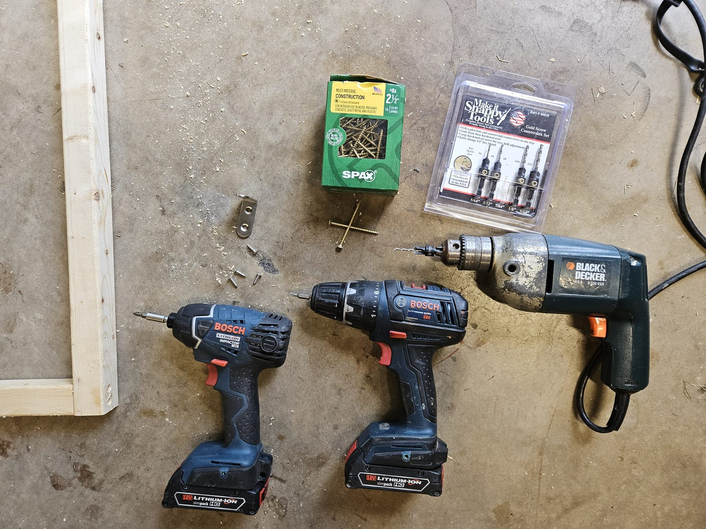
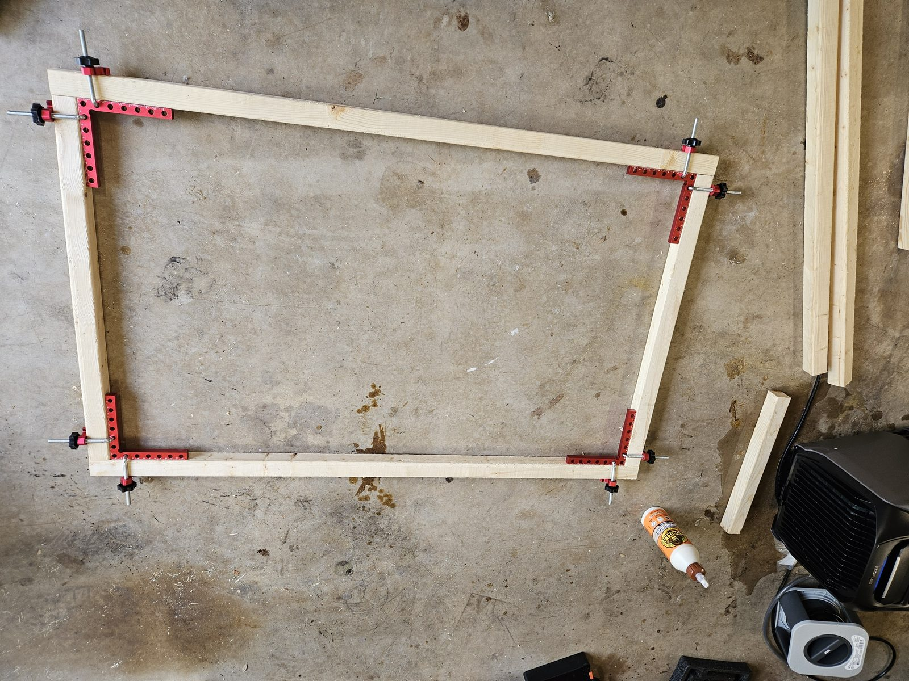
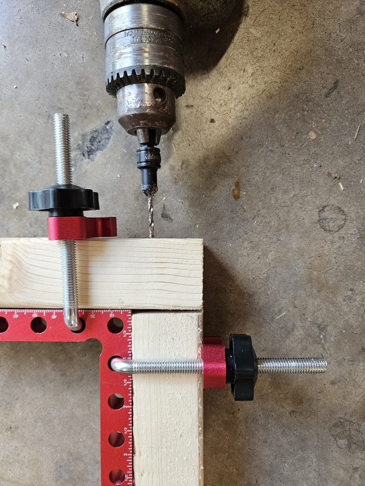
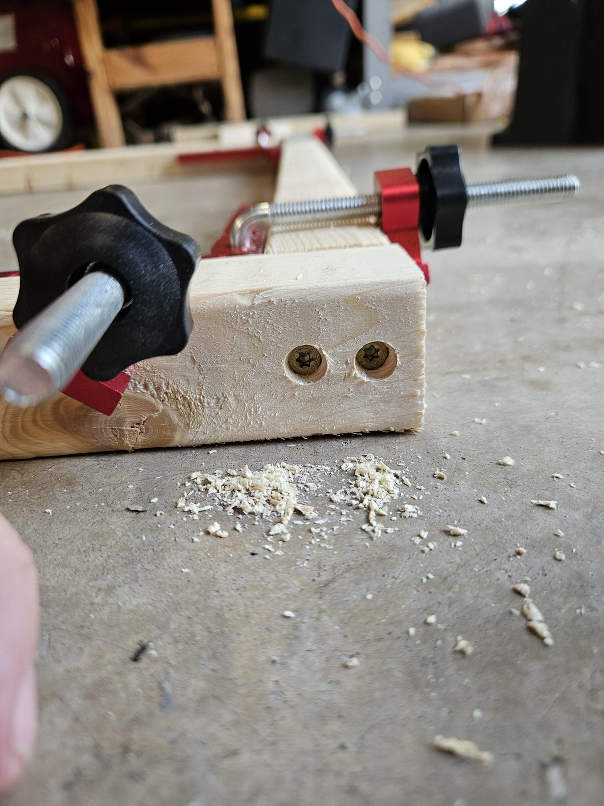
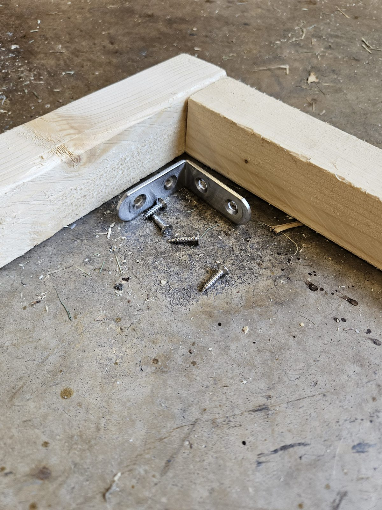
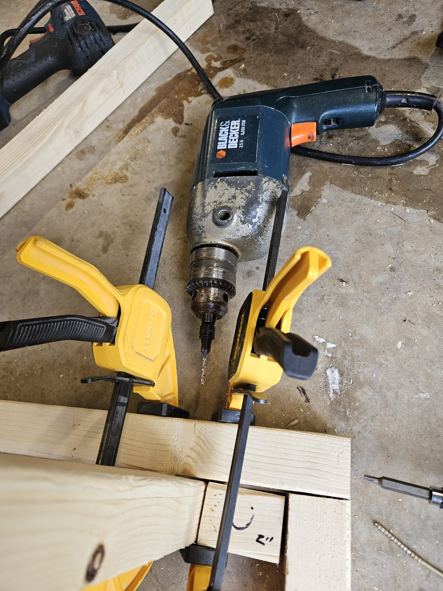
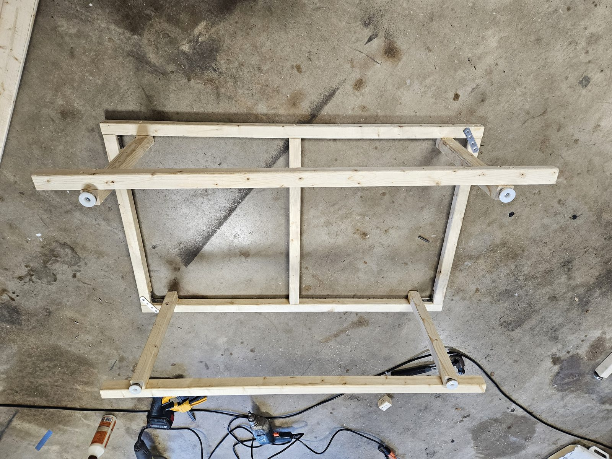

# Project S'mores — Full Build Plan

*Free to view, share, and build from for personal, non-commercial use only. Commercial use, resale, or redistribution for profit is prohibited without prior written permission. © 2026 JJJJJ Enterprises, LLC — all rights reserved.*

Two-person setup, 2nd row seats **removed entirely** (3rd row folded flat; seat removal/reinstall procedure incl. the SRS airbag emulators: Section 9). Layout, tailgate to front seats: **Kitchen (Panel C's fridge/kitchen void) → Rear pantry (prefab drawers on Panel C's deck) → Bed (Panel B + Panel A) → front seats.** The rear pantry is a **prefab drawer cluster** (owner, July 2026): a 2×2 array of IRIS USA 12"W stackable drawers sitting on the tailgate end of Panel C's deck, held by a cleat pocket + a cam strap, with a pot/pan crate in the ~21.8" of open deck beside it — nothing built, ~27 lb lighter, and each drawer unit lifts straight out (Component 1). Panel A and B have no top of their own (capped by the three-piece bed frame — Panel A's section is screwed down, and Panel B's top is two centreline halves that lift out individually), while Panel C keeps its fixed top — **recessed flush into its rail plane** (the deck ply drops between the rails onto cleats; Panels A/B's rails sit at 16.25" vs Panel C's 17", so the platform on their rails lands in the same flush 18.5" plane — ¾" more headroom; the legs themselves are 1.5" taller than those figures because they are lapped past the rails, see Section 3) — forming one continuous deck with 79¼" of sleeping length for the HEST Dually Long mattress (78" x 50" x 4") (Panel A now sits flush with the front seatbacks, using up the floor space that used to sit empty in front of it). Panel B is a bare-frame deep-storage bay — the side doors don't reach it, so it has no drawers and loads from above by lifting out either half of its **two-piece bed top** (owner, Aug 2026); Panel A holds a right drawer (EcoFlow DELTA 3) plus a left open-storage bay (EcoFlow WAVE 3, no drawer box); Panel C's under-deck void instead houses a real BougeRV compressor fridge and a real JAGAHAHA slide-out camp kitchen, both on heavy-duty slides pulling straight out the open tailgate — bought products, not built from plywood — plus a shallow slide-out **kitchen drawer** hung under the deck in the dead air above the kitchen unit. The fridge and its cooling fans run off the EcoFlow DELTA 3 stack (Panel A) via their own DC line, so they keep running when people are away from the van regardless of ignition state; the DELTA 3 itself gets AC-charged from the front console outlet while driving, while the induction cooktop and Power strip 1 plug into the van's REAR AC outlet (back passenger area — verified to exist), right beside them: two short cords, no seam crossings.

**Vehicle measurements** — the van was surveyed on Aug 1 2026 and every dimension in this plan comes from that survey. The full record (V1–V10 interior/opening measurements, F1–F8 rear-floor survey, what each finding changed, and the few items still open) is **Appendix A**.

## Renders

Parametric 3D model: [`platform.scad`](platform.scad) (dimensions in [`params.scad`](params.scad) — edit one file to regenerate every view via `./render.sh`).

### No-Drill Anchor Platform — Overhead Detail

The overhead companion to the floorplan: Section 8's securing system in plan view — the mat + ply anchor board under Panel C, its 2 steel tongues running forward to bolt to the rear ends of the 2nd-row long-slide floor rails, and its 3 ratchet straps dropping into the crash-rated 3rd-row striker loops. Rail-end and striker positions are drawn at the plan's ASSUMPTIONS until the Appendix A F1–F8 survey pins them:

*Notes that used to be printed on this sheet — they set its width, which held every label on it to 3–6pt on paper:*

- tongues + straps pass UNDER its rear bottom rail (shallow notches)
- NO-DRILL ANCHOR PLATFORM — overhead: Panel C + the factory hardpoints forward of it (Section 8)

### Anchor Board — Assembly & Connection Details

The IKEA-style header for the platform — the finished piece, its bought hardware (lettered), and its cut parts (numbered), in the same format as the Section 6 component banners:

The banner above only *names* accessories A–G. **Where each one goes is the install map below** — the board in plan with every accessory ballooned to its actual position. The what/where/how for each letter, and the build order, follow it as tables.

*The map is the drawing; the descriptions are the table below. They used to be two more columns on the same sheet, which doubled its width and drove every label down to about 4pt on paper — a figure is only ever as legible as page-width ÷ sheet-width allows.*

#### Accessory list A–G

| | Accessory | Where it goes, and how it fastens |
|---|---|---|
| **A** | **L-track, cut down** (×2) | Bolted flat onto the two KITCHEN-SIDE strips: the centre strip's kitchen face (X=23) and the 1.5" panel-edge strip (X=44.75), ~23" each. 7 bolts per length, ~3" apart, down into T-nuts. Cut the 48" stock down first; deburr the slots |
| **B** | **Stud fitting w/ D-ring** (×7) | No fasteners — each one **drops into** an L-track slot and twist-locks. 4 go in the kitchen L-track (2 per side, at Y=6 and Y=24) as the kitchen strap corners; 3 go on the BRIDGE (X=8, 23, 38) as the striker-strap points |
| **C** | **Ratchet strap, 400 lb WLL** (×5) | Never fastened to the board — they hook to B's D-rings. **2 run straight across the kitchen unit, each seated in that face's pair of notches** (the unit has 4 notches and 4 D-rings of its own — MEASURED Aug 2026), ends into the L-track D-rings; 3 run forward from the bridge D-rings into the van's 3rd-row striker loops, **measured 44.5" from the hatch** (F4a). Tension last; re-tension after one drive |
| **D** | **¼"-20 bolt + T-nut** (~30 pairs, incl. spares) | The T-nut goes in the board's **underside**, counterbored flush so the board still lies flat on its mat; the bolt comes down from **above** through whatever it holds: riser flanges (4 each = 8), L-track (7 each = 14), steel tongues (2 each = 4). **Seat every T-nut before any hardware goes on** — you cannot reach them afterward |
| **E** | **Non-slip rubber mat** (×1) | Cut to the board's outline and laid **under** it — friction, trim protection and rattle control. Not fastened to anything. It goes in only when the finished board is set into the van (step 7), not on the bench |
| **F** | **Threadlocker, blue 242** (×1) | One drop on every machine screw as you fit it — that is the A, D and G fasteners (B needs none, it twist-locks). They all end up hidden under the appliances, so they must never need re-checking. Cure ~24 h before loading |
| **G** | **Rail-end engagement** (×2) | **In-van only.** The forward end of each steel tongue engages the 2nd-row floor rail's own track — **measured 42" from the hatch** (F8a), rails **17.5" apart** (F8b), so cut both tongues **16" long**. **No new holes in the vehicle.** The forward load is carried by a **vertical ¼" pin** dropping into the ¼" hole in each rail's steel end cap, in shear. Full detail in **"How the tongues connect to the rails"** later in this section, with a top-down plan and a side section |

#### Build order — steps 1–6 on the bench, step 7 in the van

1. **Cut** the comb as ONE piece from the ¾" sheet (grain along the strips, ~½" fillet at every inside corner — assembly sheet V5). Have the store break the sheet down first (Section 3).
2. **D** — Mark and drill every bolt hole, then counterbore the **underside** and seat all ~30 **T-nuts** flush. Do this before anything is in the way.
3. **D** — Bolt the 2 **steel riser angles** onto the rail-line strips (4 bolts each) — the fridge's fixed slide rails land on these.
4. **A + D** — Bolt the two cut-down **L-track** lengths onto the kitchen-side strips (8 bolts each).
5. **D** — Bolt the 2 **steel tongues** into the dado in the bridge's underside (2 bolts each). Leave their forward ends unfixed until step 7.
6. **B + F** — Drop the 7 **stud D-rings** into their slots. Threadlocker on every machine screw as it goes in; let it cure ~24 h before loading.
7. **E + G + C** — **In the van:** lay the **mat**, set the board on it, engage the tongue ends to the floor rails (**G** — see the connection detail), notch Panel B's rear bottom rail 3/16" where the tongues and straps pass under it, then hook and **tension** the straps (**C**) — 3 to the striker loops, 4 over the kitchen unit.

Nothing in this sequence joins plywood to plywood — the board arrives at step 2 already whole.

How the platform actually goes together, in five views: **V1** the bare plywood board from above — ONE 46"x33" comb (full-width bridge + 3 strips, continuous ply, no wood joints), dimensioned, with the steel tongue runs, L-track, D-rings, and riser bolt patterns; **V2** a 4x-scale side section through a rail-line strip (mat → ply → T-nut → riser angle → rail, with the tray hanging over bare floor beside it); **V3** the kitchen's 2 hold-down straps, each seated in a pair of the unit's own top-edge notches, into the stud D-rings, rear elevation; **V4** the board-to-van side view — the steel tongue let into the bridge's underside dado, bolted, running forward to the floor rail's rear end, plus the striker strap and the step fallback; **V5** the cut plan — how the comb nests in the 3/4" sheet's spare, which way the face grain runs, the two offcut rectangles that fall out of it, the cut order and the fillet at each inside corner (there is no joinery view, because the board has no joints) — with a SYMBOLS legend decoding every mark:

**Why the board is ONE piece** (moved off the sheet — this block was the widest thing on it, holding every dimension label on all five views to ~3.6pt):

- **ONE PIECE, NO WOOD JOINTS** — The bridge and all three strips are a single continuous 46"x33" comb. Nothing on this board is glued or screwed to another piece of ply — the 12 lap screws and the wood glue are GONE from the BOM.
- **IT FITS THE STOCK YOU ALREADY BUY** — The 3/4" sheet carries only Panel C's deck plus some ripped cleats, leaving a contiguous spare of at least 48"x60": the comb drops in with ~26" of sheet length still left over for the control-panel backer, the rear-pantry hold-down cleats and the spare-tire skid battens.
- FACE GRAIN RUNS ALONG THE STRIPS (the 33" direction = the sheet's 96" length). That is the axis a rearward pull loads in tension, and the strips are the narrow members — the panel-edge one is only 1.5" wide, so it wants its face plies running lengthwise. The bridge takes its load in-plane over a 6" depth, where cross-grain costs nothing that matters.
- **THE FALLOFF IS NOT WASTE** — The two gaps come out as clean rectangles (16.85"x27" and 20.5"x27") — keep both as 3/4" offcut stock.
- **CUT ORDER** — rip the two gaps out with a track saw or a circular saw on a straightedge (both cuts run the full 27" and STOP at the bridge line), then crosscut the teeth free. FILLET every inside corner ~1/2" radius — drill a 1/2" hole centered ON the corner first, then saw into it. A square re-entrant corner is exactly where a comb starts a tear, and it is the only place this one-piece board is weaker than three separate strips would be.

*Notes that used to be printed on this sheet — they set its width, which held every label on it to 3–6pt on paper:*

- riser-angle footprint (2"x24") — 4x 1/4-20 bolts into T-nuts
- (riser shown dashed; same on the center strip)
- steel tongue (2"x3/16"), let into a 3/16" dado in the
- bridge's UNDERSIDE, 2x 1/4-20 T-nut bolts each — runs fwd,
- cut to the F8-measured length (~10-14" past the bridge)
- ONE PIECE — cut the whole comb from the 3/4" sheet's spare (V5):
- NO ply-to-ply joints, no glue, no lap screws. Rubber mat under it.
- Every fastener on this board holds HARDWARE, never wood to wood.
- (gaps = bare van floor: the tray hangs there, the kitchen sits there)
- V1 — TOP: the one-piece plywood board, 46"x33" (bench-built, then laid in as ONE piece)
- ← fridge sits on the tray (dashed, continues up)
- ← 1/2" ply TRAY — hangs 0.375" over BARE van floor (no board here)
- ← 1x3 apron (the slide's moving member screws to it)
- ← 1/4-20 bolt → T-nut (flange counterbored into the ply bottom)
- (the whole stack repeats at the other rail line, on the center strip)
- ← stud D-ring (WLL 1,333lb) dropped into the L-track
- ^ floor STEP at the striker row = the tongue's bearing FALLBACK (F7)
- Panel B rear bottom rail sits over the run — its shallow notch lets the tongue + strap pass
- ← 3/4" PLY BRIDGE on its mat — strips continue right
- RATCHET STRAP (x3): bridge D-ring → striker loop, tensioned (rearward + lift restraint)
- STEEL TONGUE (x2) at floor level: bolt/clamp to the rail's rear end (F8) ... 2x T-nut bolts up into the bridge's underside dado
- V5 — ONE-PIECE CUT: how the comb nests in the 3/4" sheet's spare
- Why one piece matters: the striker straps hold the BRIDGE — the strips (and everything bolted to
- them) hang off it in a rearward pull. As one piece that load path is continuous ply, instead of three
- glue lines working in tension. (The steel tongues are NOT wood joints — they bolt through the
- dashed = hidden or overlaid part (riser footprint,
- tongue under the bridge, fridge above the tray)
- stud-fitting D-ring (drops into an L-track slot)
- ANCHOR BOARD — assembly & connections (Section 8; companion to the overhead platform diagram)

| Top-down | Side profile |
|---|---|
|  |  |

The interior envelope used for fit checks (Section 1: 93.75" x 49" x 42" — all three MEASURED, owner Aug 1 2026) is a simplified rectangular box — the real hatch curvature, vent shapes, and wall taper aren't modeled beyond the reserves called out in `params.scad`.

Rear view, looking forward from the open tailgate at Panel C with the fridge and kitchen unit both stowed for driving: 

**Marker key.** This 11-row legend used to print beside the view. Its longest
row was 77 characters, which set the sheet at 128 units wide against a 49"-wide
van — and a figure's printed text height is `size × (page_width ÷ sheet_width)`,
so it was holding every label on the drawing to about 4pt on paper.

| # | Part |
|---|---|
| 1 | Frame / deck / fridge tray |
| 2 | Kitchen unit (standalone) |
| 3 | Fridge (standalone) |
| 4 | Intake fan (120mm) |
| 5 | Exhaust fan (120mm) |
| 6 | NTC temp sensor |
| 7 | Control panel — switches + surge protector, at the back of the open bay; reach in |
| 8 | Power strip 2 (cooktop) |
| 9 | Floor vent intrusion (both sides) |
| 10 | Open utility bay — no door |
| 11 | Anchor-board strips, end-on (mat + 3/4" ply — the no-drill rail platform, Section 8) |

Standing at the tailgate looking in, the DRIVER side is on **your left** —
exactly as drawn. Both appliances are shown stowed for driving.

And the same view with both units **deployed** — pulled out the tailgate and set
up for use, leaving their bays in Panel C empty:

The deck plane the two units slide out of is 46" wide, recessed flush behind the
tailgate end rail — dimensioned on the Panel C sheets. Markers 1–5 are keyed in
the legend on the sheet itself.

Side elevations, driver and passenger, showing where each panel sits against the
van's own openings — the side doors reach Panel A but not Panel B, which is why
Panel B is top-loaded:

*Notes that used to be printed on this sheet — they set its width, which held every label on it to 3–6pt on paper:*

- Exhaust fan: fridge's right wall, blows INTO the open utility bay | NTC probe: just inside the bay at that wall (in the hot exhaust, NOT the bay)
- Intake fan + a passive LOW cool-air louver: both on Panel C's FRONT wall (see its render) | exhaust exits the OPEN bay toward the tailgate
- Control panel: switches + surge protector — at the back of the open bay, reach in
- Looking forward from the open tailgate at Panel C — both units shown stowed for driving
- (standing at the tailgate looking in, the DRIVER side is on YOUR LEFT — exactly as drawn)

### Fridge Installation Detail

The rear view above is too small-scale to label the fridge's 2 cooling fans and temperature sensor clearly. This top-down detail of Panel C zooms in on just that area, with numbered markers and a coordinate list (see Section 2 for the coordinate system and the full component coordinate table):

**Marker key.** Markers 1–10 on the sheet index this table. It used to be
printed on the drawing itself as a 10-row, 3-line side list; its longest line
was 180 characters, which stretched the sheet to ~160 units wide against a
46"-wide plan — and a figure's printed text height is `size × (page_width ÷
sheet_width)`, so every label on it, the coordinates included, came out near
3pt on paper.

| # | Component | Position | Fastening |
|---|---|---|---|
| 1 | Intake fan (120mm) — blows IN | X=11.11, Y=35.75 (Panel C's FRONT wall), Z=8.8 | 4× M4×20 machine screws over the wall's fan hole (see the Panel C Front Wall render) |
| 2 | Exhaust fan (120mm) — blows INTO the open utility bay | X=19.72, Y=14.4, Z=8.8 | 4× M4×20 machine screws, 105mm bolt circle, into a plywood fan ring |
| 3 | NTC temp sensor | X=18.22, Y=12.2, Z=8.8 | Adhesive thermal pad, or 1× #4 screw through its bracket tab |
| 4 | Control cluster — switches + surge protector + W1209, **no enclosure** | X=40.4–45.4, Y=35.75 (Panel C's FRONT wall), Z=3.5–14.5 — on the wall's **Panel-B face**, standing ~2" off it | Screwed DIRECTLY to a backer board (3/4" offcut) on the wall; 4× #8×1" screws. Reached by lifting one of Panel B's lift-out bed-top halves |
| 5 | Anchor-board rail strips (2 of the board's 3, under the slide rails) | A mat + 3/4" ply band on each rail line BESIDE the tray (side-mount) — part of the ONE-piece board, not separate strips; the fixed rails' risers bolt to them | 1/4-20 machine screws into T-nuts from below — NO holes in the van (Section 8) |
| 6 | Kitchen tie-down: L-track + 4 stud D-rings | On the board's kitchen-side strips (the utility-bay gap + the 1.5" band at the panel edge) | **2** ratchet straps (400 lb WLL), one across each face, each dropped into that face's pair of the unit's own top-edge notches, ends into the D-rings |
| 7 | WAVE 3 hose/cord hook | In the open bay, kitchen side — bundle the hoses so nothing swings out | 1× heavy-duty hook, #8×1.5" screw up into the deck underside |
| 8 | Fridge hold-down strap D-rings (×2) | Tray side apron, near the tailgate end — hooks to the fridge's 2 end handles | Cam strap, snug not tight. This secures the fridge TO its tray; the anchor board secures the tray to the van. Side profile in the Fridge Slide detail |
| 9 | Board bridge (same piece) + 2 steel rail tongues | The board's full-width front edge at Y=29–35 — one continuous 46"×33" comb with the strips, NO joints | 2"×3/16" flat bars run forward and BOLT to the rear ends of the 2nd-row FLOOR rails (seat anchorage, F8). Forward restraint is steel-to-steel to the van's own rails — no new holes. Fallback: butt the striker-row step (F7) |
| 10 | Striker straps (×3) | Bridge D-rings → the 3rd-row seat striker loops, forward of Panel C (crash-rated; position UNVERIFIED, F4) | 400 lb WLL ratchet straps — rearward + lift restraint. Re-tension after the first drive |

All coordinates are measured from Panel C's tailgate-facing left corner at
floor level. **NO-DRILL (Section 8): no new holes in the van** — the board
straps to the 3rd-row striker loops and its tongues bolt to the 2nd-row floor
rails' rear ends. Cut the board's outline only AFTER the Appendix A F1–F8
survey. The airflow arrows on the sheet show cool air in at the front wall
(fan + the low passive louver), across the fridge, and OUT through the open
utility bay toward the tailgate — there is no door in the way. The CO monitor
and fire extinguisher are owner-placed and deliberately not located here.

And the electrical side — a schematic (not to physical scale) of how the fridge, both fans, and the NTC sensor are powered and wired — now down to **every physical wire landing**: connection points P1–P12 are numbered on the diagram, each naming the exact terminal, connector type, and crimp, with the full list repeated in Section 5's connection-point table:

*The schematic carries the box titles and the P-numbers; every description was moved here so those titles could be legible (they were at ~4pt).*

**Connection points P1–P12**

| | Connection |
|---|---|
| **P1** | DELTA 3 12V car-power outlet → fused (15A) car-plug/SAE adapter — hand-plug, no tools |
| **P2** | SAE #1 at the A/B seam — mate the OYMSAE cord ends; zip-tie a strain loop each side |
| **P3** | SAE #2 at the B/C seam — same; both disconnects hang slack, never taut |
| **P4** | 1" grommet, Panel C front wall (low, driver side) — push cord through, no termination |
| **P5** | Fuse block main studs: red → +IN, black → -IN — #10 ring terminals, M5 nuts, 20 in-lb |
| **P6** | SW1 FRIDGE: F1(10A) red → PWR spade; LOAD spade → pigtail red; GND spade → NEG bus |
| **P7** | Pigtail: SAE mates to SW1 side; female 12V socket zip-tied by the fridge's kitchen wall |
| **P8** | Fridge DC jack: fridge's own cord plug → socket; slack loop to the FIXED rail, 3 clips |
| **P9** | SW2 FANS: F2(3A) red → PWR spade; LOAD spade → W1209 +12V; GND spade → NEG bus |
| **P10** | W1209 screws: +12V, GND, K0 (jumper from +12V), K1 (fan feed) — strip 1/4", snug screws |
| **P11** | NTC probe: plug on the W1209 header; TIP zip-tied at the kitchen-facing wall by the exhaust fan |
| **P12** | WAGO 221 x2: K1 → both fan reds; fan blacks → one black → NEG bus — levers fully closed |

**What each box on the schematic holds**

- VERIFIED — charges DELTA 3; one 1500W inverter feeds BOTH van outlets
- 2048Wh combined — Panel A right drawer
- AC in 1500W (0-100% in ~56 min) · 12V car-power DC out 12.6V/30A
- hand-plug into the DELTA 3's 12V car-power outlet
- OYMSAE cord ends mate; pull apart to lift Panel A out
- same cord family; pull apart to lift Panel B out
- cord passes into the fridge bay → open utility bay
- +IN / -IN main studs: strip 3/8", crimp #10 RING terminals, M5 nuts
- F1 = 10A ATO → fridge branch · F2 = 3A ATO → fan branch · F3-F6 spare
- EVERY black (-) return in the bay lands on this NEG bus (ring, screw)
- PWR tab ← F1 · LOAD tab → pigtail · GND tab → NEG bus
- (0.25" female spade crimps on all 3)
- zip-tied in the open bay, near the fridge's kitchen wall
- use the fridge's OWN 12V cord; leave a slack loop for
- the 24" slide, clipped to the FIXED rail (3 clips)
- cooktop is 120V AC — switch it at Power strip 2 instead)
- PWR tab ← F2 · LOAD tab → W1209 "+12V" · GND tab → NEG bus
- "+12V" ← SW2 LOAD · "GND" ← NEG bus (18AWG black)
- "K0" ← short jumper from "+12V" · "K1" → fan feed wire
- set: fans ON ~95F, OFF ~85F (P0=H mode, P1/P2 setpoints)
- plug → W1209's
- 2-pin probe header;
- TIP by the exhaust fan
- nut A: K1 feed → both fan REDS · nut B: both fan
- BLACKS → one 18AWG black → NEG bus
- cabin air IN
- warm air OUT

*Notes that used to be printed on this sheet — they set its width, which held every label on it to 3–6pt on paper:*

- Charge + discharge simultaneously supported — running the fridge/fans
- while AC-charging is normal, just slows the charge rate a bit
- Circuit 1 (right): fridge — F1 10A, switched at SW1. Circuit 2 (left): fans — F2 3A, switched at SW2, W1209-driven off the NTC probe.
- CONNECTION POINTS — every wire landing, in install order
- Wire spec: main run 16AWG (the OYMSAE SAE cord itself); in-bay branches 18AWG red/black;
- crimps: heat-shrink ring #10 (block studs) + 0.25" female spades (switch tabs). Crimp, tug-test, then shrink.

The fridge's slide mechanism itself, closed vs. fully extended. The VADANIA rails stand vertically BESIDE the tray (side-mount): each fixed rail on a steel riser angle bolted to the no-drill anchor board's mat + ply rail-line strip (Section 8 — the board raises only the rails; the tray keeps its hang), each moving rail on the tray's 1x3 side apron — nothing under the hanging tray, so the slide hardware adds zero height and the mounted fridge keeps 0.33" of running clearance under Panel C's end rail:

*What the sheet shows, in words. (These sentences used to be printed on the
drawing, where their length set the sheet's width and held every label on it to
3–6pt on paper — and where the batch pass that lifted them out left them broken
mid-sentence.)*

- **The slides** are a VADANIA VD2576 industrial pair: 24", 379 lb, locking both closed (transit) and extended (loading). A loaded fridge can hit 60–90 lb, so the rating has plenty of margin.
- **The tray** is 1/2" ply with two 1x3 side aprons, and hangs BETWEEN the rails on the slides' moving members — the moving member screws to the apron, not under the tray, so nothing sits beneath it. Each apron's top edge stands proud of the tray as the fridge's anti-shift lip, and the tray itself hangs 0.375" clear of the van floor. **(Aug 2026: the tray went 3/8" → 1/2" when the 3/8" purchase was deleted, and its floor hang gave up the matching 1/8" so the mounted fridge top does not move — see Section 3.)**
- **The fixed rail stands VERTICALLY beside the tray**, screwed to a steel riser angle that bolts to the anchor-board strip. Mounted this way it adds width beside the tray and *zero* height under it. Never mount it undermount: laid flat under the tray it adds ~1.2" and the fridge then hits the tailgate end rail it has to slide under.
- **The DC line's slack clips to the FIXED rail** (3 screw-mount clips, Sections 5–6) — never to the moving tray, where it could get pinched between apron and rail as the slide comes home.
- **Under this rail line runs the anchor-board strip** (Section 8, no-drill): non-slip mat + 3/4" ply, riser bolted through with 1/4-20 T-nuts, no holes in the van. The board continues forward (+Y) to the bridge, where 2 steel tongues bolt to the 2nd-row floor rails' rear ends (F8) and 3 straps drop into the 3rd-row striker loops.
- **The hold-down strap** (×1, cam-buckle) runs from the fridge's end handle to 2 D-rings on the tray's side apron. It stops the fridge lifting off the TRAY — the riser and board bolting only pin the tray to the van. Snug, not tight, and it must clear the lid at full extension.

The kitchen drawer — a shallow slide-out drawer hung under Panel C's deck in the dead air above the kitchen unit (11.8" unit, 17" clear void), riding a 24" full-extension slide pair and pulling out the open tailgate; ~3.5" clear inside for utensils, cutting board, flat dry goods, and the cooktop's griddle plate:

*Notes that used to be printed on this sheet — they set its width, which held every label on it to 3–6pt on paper:*

- anchor-board strips (mat + 3/4" ply) flank the kitchen — its tie-down straps land here (no-drill, Sec. 8)
- 2x 1/2" ply cheeks, screwed UP into the deck (2" screws every 6")
- outer cheek also screws into the side rail's inner face
- 24" side-mount slides, 100lb pair — one per cheek
- The drawer box is 26" deep, riding that 24" full-extension slide pair, and pulls straight out the open tailgate.
- The box is 18" wide across its outside, leaving ~17" clear inside it, in the 19" between the two cheek faces.
- The kitchen unit below it is the bought JAGAHAHA slide-out camp kitchen, 11.8" tall, which slides out on its own rails — nothing in this drawing supports it.
- Box: 1/2" ply, glue + 1-1/4" screws, ~3.5" clear inside — utensils / cutting board / flat dry goods / griddle plate.
- Face gets a magnetic catch so nothing rattles in transit (the old cabinet door it matched was cut — open bay now).

### Rear Pantry — Prefab Drawer Cluster + Pot Bay

The custom plywood pantry was **swapped for bought prefab drawers** (owner, July 2026 — Component 1): a 2×2 array of IRIS USA 12"W stackable drawers (Home Depot #500163) on the tailgate end of Panel C's deck, plus a pot/pan bay in the ~21.8" of open deck beside it. Nothing is built — a cleat pocket + one cam strap hold it, and each drawer unit lifts straight out (removable). This deletes the plywood carcass, the cam-lever clamp set, the 2 steel sway braces, and the fiddle-lip retention kit, and drops the pantry from ~42 lb to ~15 lb:

*Notes that used to be printed on this sheet — they set its width, which held every label on it to 3–6pt on paper:*

- Replaces the plywood pantry — ~27 lb lighter, nothing built. Each drawer unit lifts straight out once the cam strap is loosened.
- Canned goods LOW, boxed dry goods UP. Cab-side cleat stops the forward slide under braking; the strap doubles as drawer-shut + hold-down.

### Floor Panel Detail

Each floor panel, exploded (Panel A: frame + legs + center divider + one right drawer, left bay is WAVE 3 open storage; Panel B: a bare cube frame — no divider or drawers; Panel C: no divider or drawers — the fridge/kitchen units live in its void, shown here as reserved footprint):

**The two hole details in the left margin of each sheet, in full.**

- **LEG BOTTOM** — the same hole on all 12 legs: 1/2" dia × **1-3/4"** deep, dead centre of the 1.5" × 1.5" end grain, taking a 3/8-16 threaded insert driven with a **10mm hex wrench**. The depth is set by the foot's *stud*, not the insert: bored the old 7/8" the stud bottoms out on wood and the leg loses half its adjustment (owner, boring the real thing, Sept 3 2026). **Drill it before assembly** — see the Leveling Foot render, and the shop photos in Section 3.
- **END-RAIL SEAM FACE**, both ends — 2× 3/8" dia × 3/8" deep pin holes, 3" in from each side edge, centred on the rail. Drill the mating panel's face **as a matched pair**: clamp both panels together and drill through a guide block (Component 5).

**Per-panel differences:**

- **Panel A** — left (driver-side) bay is WAVE 3 open storage: no drawer box, no slide. The unit is too wide for a boxed drawer.
- **Panel B** — no divider, no drawers, no skirts. The side doors don't reach it, so its whole bay is deep storage loaded from above. It is **the full cube**: bottom rails on all 4 faces, since nothing exits Panel B sideways.
- **Panel C** — no divider, no drawers; the void stays open for the bought fridge and kitchen unit (Component 7). It carries the ONE wall in the build, on its front (B-facing) face.

### Bed Platform Detail

Component 2's slatted bed platform (58" x 49" overall, 15 slats pocket-screwed between 1x4 side rails — one flush 3/4" plane, cantilevered 1.5" past the boxes on each side; **width cut back from 52" by measurement V7, Aug 2026**), exploded. **It is three pieces, but only two of them are loose (owner, Aug 2026): Panel A's 29" × 49" section is SCREWED DOWN, and Panel B's top is two 29" × 24.5" centreline halves that each lift out on their own.** Per-site leveling is done at the WHEELS with blocks (Block Calculator, Appendix E); the interior leg feet are a one-time set. Both sections rest DIRECTLY on Panel A/B's top rails and the platform ENDS at the B/C seam — Panel C's own fixed deck sits at exactly the same surface height, so the two meet flush and the mattress's last ~20" rides that deck. Leveling happens at the leg feet, down at the floor, and an RV bar bubble level screwed to the driver-side rail's outer edge reads fore-aft pitch while you turn the feet (its twin on the rear-pantry deck edge reads roll):

*The numbers on the drawing key to this table. They used to be a six-row list printed on the sheet itself, which took it to 160 units wide and drove every label to 3–4pt on paper; as text they render at the document's own size.*

| | Part | Size | Notes |
|---|---|---|---|
| **1** | Side rails (×2 per piece, ×6) | 6 × 29" × 3.5" × ¾" — 1x4 pine | Each piece's spine; its slats pocket-screw into the inner edges |
| **2** | Panel A slats (×5) | 42" × 3.5" × ¾" — 1x4 pine, two per 8ft board | ~2.9" gaps. This section is **screwed down** — it is also acting as a diaphragm across Panel A's rails |
| **3** | Panel B half (×2) | 29" × 24.5" | **Lifts out on its own**, ~6 lb. 24.5" wide clears the 35" side door — a 49" piece never would. No hinge, no lid stay, no opening-angle limit |
| **4** | Panel B slats (×10) | 17.5" × 3.5" × ¾" — 1x4 pine, five per 8ft board | 5 per half, ~2.9" gaps |
| **5** | Centre bearer (Panel B's frame) | 26" × 3" — two 2x2s side by side, top flush with Panel B's long rails | 1½" of bearing per half, and it **halves the deck's unsupported span** over Panel B, 46" → ~22". Panel B never had a centre divider where Panel A always did (**new, Aug 2026**) |
| **6** | Bubble level (PITCH) | Larbeti stick-on bar level | Self-adhesive — degrease the rail edge first. Its twin (ROLL) mounts on the rear-pantry deck edge; read both while turning the leg feet |

**Panel B is top-load-only**, which is why its top splits: the measured side-door aperture is 35" × 45" with only 29" ever clear, and it sits over Panel A's footprint, not Panel B's. Lift the mattress clear and take out only the half on the side you're standing at.

### Leg Leveling Foot Detail

Leveling lives at the floor: each leg is cut 1" short and gets a 3/8-16 insert in its bottom end grain, taking a leveling glide bolt with a floor pad, turned by the stud's own fixed hex collar (12 total: 4 per panel x 3). **The ~2" star knob is gone** (owner, Sept 2026 — it took up too much room under the legs), and its jam nut with it: put a wrench on the collar instead. Effective leg heights are 18.5" on Panel C's lapped front pair / 17.75" on A/B / 17" on Panel C's butt-under rear corner pair (cuts: 17.5", 16.75", 16" — the deck recess sets the rail height, the lap adds 1.5" of leg above it); dropping the old between-layers adjusters bought 1.25" of headroom, and recessing the deck ply into the rail plane buys another 3/4". To adjust: tip that corner of the box slightly and turn the collar — every leg is exposed at floor level:

*Notes that used to be printed on this sheet — they set its width, which held every label on it to 3–6pt on paper:*

- To level: kneel at the side door, tip that corner of the box slightly, wrench the foot's hex collar. Every leg is exposed at
- floor level — nothing boxes it in. The platform above rests DIRECTLY on the box rails (no adjusters up top anymore).

**Load**: worst case is ~700 lb total (2 people + mattress + platform + boxes + cargo) spread over 12 feet — ~60 lb per foot against the feet's 330 lb rating each, a 5x margin before dynamic factors. The feet are not the weak point. If you want more margin anyway, 1/2"-13 leveling mounts (1,100 lb each) are a drop-in upgrade — same install, just a 5/8" insert hole instead of 1/2".

**Access**: the practical answer is to stop crawling under the bed at camp entirely — **level the VAN at the wheels** (Andersen/Camco-style curved ramps, standard van-life practice) each site, and set the interior feet ONCE against the van's own floor irregularities. After that first setup you shouldn't need to touch a foot; the two bubble levels tell you at a glance whether the wheels need a ramp.

**Blocks + calculator (the no-feet workflow)**: the two bubble levels read DEGREES (-7 to 7). Degrees plus the wheelbase are all the math needs, so there's a phone calculator for it — **[Sienna Block Calculator](https://claude.ai/code/artifact/149333c6-8f02-47a2-915f-52d26d9059d9)** (also saved in the repo as `leveling_calculator.html`): enter the two readings and which end/side is low, and it returns how many Lynx-style leveling blocks to stack under each tire, the total, and the residual tilt after driving up. One 10-pack of blocks covers ~2.9° of correction at 1.5"/block over the 120.5" wheelbase — beyond ~4 blocks per tire, find a flatter spot. This makes the interior feet a ONE-TIME set (against the van's own floor irregularities), not a per-site chore — and if you'd rather delete the feet entirely, replace them with fixed shims set once and let the blocks do all site leveling (saves ~$72, loses the fine-trim option).

**Installing the calculator on a phone** (two ways):

1. *Online*: open the [calculator link](https://claude.ai/code/artifact/149333c6-8f02-47a2-915f-52d26d9059d9) in Chrome on the phone (it needs the claude.ai login), then Chrome menu → **Add to Home screen** — it gets an icon and opens full-screen. Needs signal at launch.
2. *Offline — the one to rely on at camp*: `leveling_calculator.html` is a single self-contained file with zero network dependencies. Send the copy from this repo (or `~/Downloads/sienna_block_calculator.html`) to the phone by email/Drive/Nearby Share, open it once via **Files → Open with → Chrome**, and bookmark it. It runs with no signal forever and remembers the settings below.

**Using it at a site:**

1. Park in the spot you actually want, engine off, **parking brake on**.
2. Read the two bed-mounted levels: the fore-aft level on the platform's driver-side rail (pitch) and the side-to-side level on the rear-pantry deck edge (roll). Each reads in degrees; the bubble floats toward the HIGH side, so the opposite end/side is the LOW one.
3. Enter both degree readings and tap which end (nose/tail) and side (driver/passenger) are low. One-time settings under "Van & block settings": wheelbase 120.5", track ~68", and the height each block adds — Lynx-style ≈ 1.5", but **measure your own stack once** and enter that.
4. The van diagram shows blocks per tire. Lay each stack just ahead of its low tire, **drive up slowly**, and chock a wheel.
5. Re-read the levels and refine once if needed — suspension squish and block nesting make a second small pass normal. If any tire calls for more than 4 blocks, the calculator says so: re-park (turning the van around often halves the stack) rather than building a tower.

### DELTA 3 / WAVE 3 Stowage Detail

Stowage for the EcoFlow gear: the DELTA 3 Plus + Smart Extra Battery, stowed unstacked side by side in Panel A's right drawer, and the WAVE 3, stored as open bay storage (no drawer box, no slide) in Panel A's left bay (its hoses/cord stow separately — item 12 in the fridge installation detail above):

### Panel C Front Wall

The one wall any panel gets, as a flat pattern with **every hole dimensioned**: the 120mm intake-fan hole (with its 105mm screw square) centered on the fridge bay, ONE 1" grommet (fridge DC line low — Power strip 1 now plugs into the REAR outlet and never crosses this wall), and the 8 perimeter mounting screws (2 now landing in the cube-frame bottom rail). Panels A and B have no walls or skirts at all, Panel C's sides stay open, and its tailgate face needs no wall — the fridge, the open utility bay between the units, the kitchen unit, and the kitchen drawer face fill it completely:

*The sheet carries the geometry; here is what each opening on it is for. (These
sentences used to be printed on the drawing, where their length set the sheet's
width and held every label on it to 3–6pt on paper.)*

- **Where it goes.** Panel C's front (B-facing) face, floor to rail underside. This is the ONLY wall on any panel — Panel A has none (both bays face the side doors), Panel B has none (bare-frame deep storage), and Panel C's sides stay open (van wall ~1" away) and its tailgate face is filled by the fridge, open utility bay, kitchen unit and kitchen drawer.
- **FAN 4.75" dia** — the 120mm intake fan, blowing IN. Cut with a hole saw or jigsaw. Fastened with 4× #8 screws on a 4.13" (105mm) square, the standard 120mm pattern.
- **DC CORD GROMMET 1" dia** — carries the fridge DC line, in the driver-side cord chase outboard of the front leg. Just the one: the verified-outlet round put Power strip 1 on the van's rear outlet, so its line never crosses this wall.
- **LOUVER 9" × 2"** — a passive scoop admitting cool floor-level air, directly under the fan and on the fan's centerline. 18 sq in, which covers the 120mm fan's own 17.7 sq in aperture.
- **Openings re-laid out Aug 2026.** The earlier numbers put three openings on top of each other in one corner of the front wall: the second grommet was drilled *inside* the louver cut-out, the DC grommet's edge landed on the bottom rail, and 0.18" of ply separated the louver from the fan hole. `params.scad` now asserts a 3/4" minimum web between every pair of openings, so this cannot come back.
- **Perimeter fastening** — 8× #8 × 1-1/4" screws: 2 into each front leg, 2 up into the top rail, 2 into the bottom rail.

---

## 1. Overview

### Vehicle constraints (hard limits — everything below is designed inside them)

The 2nd row seats are being **removed entirely** (not just pushed forward), with the 3rd row folded flat as before. **Every figure in this table was measured on the actual vehicle on Aug 1 2026** (owner), with the 2nd row out and the 3rd row folded as it sits in camper mode — see Appendix A for the survey sheet those numbers came off, including what each one changed.

| Constraint | Value | Notes |
|---|---|---|
| Max interior length | **93.75"** | Closed rear hatch to the front seatbacks, 2nd row removed — MEASURED V1 (Aug 2026), 2¼" under the old estimate |
| Max floor width | **49"** | Between the wheel wells (54" forward of them) — MEASURED V2 |
| Max height | **42"** | Load floor to headliner, mid-van; 37" back at the gate — MEASURED V3 |
| Vent intrusion | **3.5" per side** | Rear lower heat vents, at floor level only — legs must stay clear; the raised deck may overhang — MEASURED V4, 1" per side deeper than assumed |
| Hatch curvature reserve | **0"** | Nothing needs reserving: the build never rises high enough to meet the hatch glass/trim curvature — MEASURED V5 |
| **Usable width at the sleeping plane** | **50"** | Wall-to-wall at ~18.5" up (49.5" at ~22.5") — MEASURED V7. **The walls do NOT flare to the ≥53" this design assumed**, which is what cut the bed platform to 49" |

**What the measurement changed (Aug 1 2026):** the old 96" was an estimate extrapolated from a 72" figure taken with the 2nd row still installed. The real empty interior is **93¾"** — 2¼" shorter. That would have forced every panel to shrink, except that V5 measured the hatch-curvature reserve at **zero** and handed back the 2" that was being held at the tailgate end, so the panel train only lost **¼" net**. **Panel C absorbed all of it (36" → 35¾")** — forced by two of the model's own guards: Panels A and B must stay equal (shared step diagrams / cut list), and A + B *is* `bed_frame_length`, so trimming either would change the 58" bed rails for no reason. Panel C's ~7" of fore-aft slack around the fridge is where the quarter inch comes from. The one casualty of the zeroed reserve: the pantry drawers were allowed to sit 0.3" proud of the deck edge into it, so `pantry_len` grew 14" → 14.5" and the deck now carries them fully. All `assert()` guards in `params.scad` pass with the measured numbers in place.

That leaves a **93.75" usable length** (V5 reserves nothing at the hatch) and a **42" floor-level width** (full 49" available at deck height, 50" up at the sleeping plane). The math: Panel A 29" + Panel B 29" + Panel C 35.75" = **93.75" of panels — Panel A sits flush with the front seatbacks (no open floor left over)**, filling usable_length exactly. Unlike the earlier "three panels + a separate rear row" layout, there's no length lost to a dedicated fridge/kitchen zone — the fridge and kitchen unit both live in the void *underneath* Panel C's deck, sharing space with the same legs that hold up the mattress. The rear pantry claims the last 14.5" of Panel C's own 35.75" (the tailgate-most strip, right next to the fridge/kitchen void), leaving **79.25" of continuous sleeping run** (Panel A + Panel B + the first 21.25" of Panel C) for the mattress — the HEST Dually Long (78" long) rides here with ~1.25" of spare at the head end. The measured interior *did* come in shorter than the 96" estimate, and the `assert()` guards in `params.scad` are what forced the ¼" out of Panel C and the ½" into `pantry_len` rather than letting the train silently overflow. These limits live at the top of [`params.scad`](params.scad): bump any dimension past the envelope and every render fails loudly instead of silently overflowing the van.

### Rear liftgate opening (MEASURED — owner, Aug 1 2026)

Every module has to physically pass through the liftgate opening to be lifted in and out — that's the entire point of the modular design, so this matters as much as fitting once installed. These were web-sourced estimates (48" × 36"); both are now tape measurements, and **both came back better than the estimate.**

| Constraint | Value | Notes |
|---|---|---|
| Gate opening width | **50"** | Narrowest point — MEASURED V6a (was estimated 48") |
| Gate opening height | **37"** | Clear height at the centre of the opening — MEASURED V6b (was estimated 36") |
| Height out at the corner radius | **20.5"** | The corners round off hard — MEASURED V6b. Carry modules through the **middle** of the gate, not flat against one side |

**Fit check** (each module carried upright, legs down, the way it sits once installed):

| Module | Passes through as | Width margin | Height margin |
|---|---|---|---|
| Panel C | 46"W x 18.5"H | **2" per side** | 18.5" to spare |
| Panel A, Panel B | 46"W x 17.75"H | **2" per side** | 19.25" to spare |
| Bed platform (Component 2) | 49"W x 58"L x 3/4"H | enters tilted diagonally (gate diagonal ~62") | — |
| Rear pantry drawer units (prefab, Component 1) | ~12.1"W each | easily | a few lb each — lifts out one at a time |

The fridge and kitchen unit never need to pass through the gate opening at all — they live inside Panel C's own void as bought products, installed once and left in place, not lifted in and out. The tight spot is no longer width — the measured 50" opening gives the 46" boxes **2" per side**. It is the **corner radius**: only 20.5" of height survives out at the rounded corner, so an 18.5"-tall box walked in flat against one side will foul long before it runs out of the 37" available in the centre. `params.scad` asserts against the measured numbers the same as every other hard limit. The rear pantry's prefab drawer units are separate pieces from Panel C by nature — loosen the cam strap and each ~12.1"-wide unit lifts out and through the gate trivially (Component 1).

### Side door openings (FULLY MEASURED Aug 2026 — aperture 35" × 45", 29" ever clear, opening starts at the front seatback)

The side doors only matter for **Panel A**: its right drawer (DELTA 3) pulls out the passenger door and its left bay (WAVE 3) is reached through the driver door — the door openings sit over the old 2nd-row footprint, which is exactly where Panel A lives. **Panel B is beyond the door openings entirely** (owner-confirmed), which is why it has no drawers: nothing pulled sideways from it could clear a door, so its bay is top-loaded deep storage instead. Panel C's void houses the fridge and kitchen unit, both pulling out through the open tailgate. Measured Aug 2026 (V8) — and the news is worse than the estimate.

| Constraint | Value | Notes |
|---|---|---|
| **Usable clear width at the door's real stop** | **29"** | MEASURED V8c — **11" tighter than the 40" assumed.** This is the number that governs; `side_door_opening_width` = 29 |
| Side door aperture | **35" × 45"** | MEASURED (Aug 2026) — the opening itself. The door parks 6" short of its forward edge, which is why only 29" is ever clear |
| Door panel (not the opening) | 50" × 58" | Measured, but these are the door's own outside dimensions — recorded so they aren't mistaken for aperture figures |
| Door opening's fore-aft position | **Y = 0** | MEASURED (Aug 2026) — the front seatback is essentially **even with the opening** at build height; if anything the seatback intrudes ~¼" into it. `side_door_y0` = 0 is now a measurement, not the old guess |

**Reach caveat, now sharper:** a **29"** clear opening won't expose the full 58" drawer run (Panel A + Panel B) from one position — the reachability check in `params.scad` reports Panel A reachable and **Panel B effectively unreachable from the side.** That is survivable only because Panel B was already designed as a top-loaded bay with no drawers; nothing has to change. Put your most-used gear in Panel A's drawers, and re-run the check once `side_door_y0` is actually measured.

### Layout

- **Rear pantry — prefab drawer cluster + pot bay** (owner, July 2026): the custom plywood pantry is **replaced by bought prefab drawers** — nothing built, and ~27 lb lighter. A **2×2 array of IRIS USA 12"W stackable drawers** (Home Depot #500163, two 3-packs) sits on the **tailgate end of Panel C's deck**, in the same tailgate-end footprint the plywood pantry used, now 14.5" deep (the units' 14.3" depth is carried entirely by the deck — V5 measured the hatch reserve at zero, so there is nothing left to hang 0.3" proud into; the sleeping run is 79.25"). The cluster is **24.2" W × 14.3" D × 16.8" H**, leaving **~21.8" of open deck** on the passenger side for a **pot/pan crate** (~13" milk crate — the pots' own 11×11 box drops inside) and the relocated power/wiring. It's held by a **cleat pocket + one cam strap across the drawer fronts** (which also keeps the drawers shut) — no fasteners into the units, so each drawer unit **lifts straight out** and clears the gate. **Gone with the plywood pantry:** the cam-lever clamp set, the 2 steel L-angle sway braces, the fiddle-lip/lash-strap retention kit, and the **enclosed bed cubby** — so **Power strip 1 and the ROLL bubble level move to the deck edge** in the 19" bay (still reached from the bed). See the Rear Pantry render and Section 6, Component 1.
- **One continuous sleeping deck**, 46" wide x 93.75" long (Panels A + B + C, flush with the front seatbacks — no gap), deck surface sitting **18.5"** above the van floor: **the horizontal ply is recessed INTO the rail plane** (deck recess, owner July 2026 — Panel C's deck drops between its rails onto 3/4"×3/4" bearer cleats, flush with the rail tops; Panels A/B instead sit their rails at **16.25"**, so the 3/4" bed platform resting ON their rails tops out at the same 18.5" plane). That buys 3/4" of headroom: **19.5" sitting headroom** over the 4" mattress (V3 measured the cabin at 42", not 44" — so the deck recess is now carrying more of the load than it was designed to). Panel C's `leg_height` stays 17", driven by the fridge's mounted stack (see below), not by the folded 3rd-row well depth — confirm 17" clears your actual well before cutting.
- **Panel A and Panel B share the same frame, and neither has a top of its own.** Panel A has a center divider splitting its bay in two, reached through the side doors: the right (passenger) side is the one real drawer (DELTA 3), the left (driver) side is WAVE 3 open storage (the unit is too wide for a boxed drawer — Section 1). **Panel B has NO drawers and no divider** — the sliding-door openings sit over the old 2nd-row footprint (Panel A), not over Panel B, so nothing pulled sideways from Panel B could clear a door. Its whole bay is deep storage instead, loaded from above by lifting out **either half of its two-piece bed top** (long-term/bulky items you don't touch at camp). The slatted bed platform (Component 2, 15 slats between 1x4 side rails, 58" x 49" overall — cantilevered 1.5" past the boxes each side, 3/4" thick; **cut back from 52" by V7**) spans Panel A + B ONLY and ENDS at the B/C seam: Panel C's own fixed deck is at exactly the same surface height, so the two meet flush and the mattress's last ~20" rides that deck (an 80" platform would have to sit ON that deck — 3/4" too high). It rests DIRECTLY on Panel A/B's top rails as one flush 3/4" plane (slats pocket-screwed between the side rails). Leveling happens at the leg feet down at the floor — each leg is cut 1" short and carries a hand-adjustable leveling foot.

  **SPLIT INTO THREE LIFT-OUT PIECES (owner, Aug 2026).** It used to be one 58" piece that lifted off whole — which meant that reaching Panel B, the only bay with no side access at all, involved wrestling a 49"×58" frame out and finding somewhere in a packed van to put it. It is now three pieces:

  - **Panel A's section** — 29" × 49", one piece, **screwed down and permanent** (owner, Aug 2026). It never needed to come out: Panel A's two bays are both reached through the side doors — the DELTA 3 drawer pulls out the passenger side, the WAVE 3 bay is reached by hand from the driver side. Fixing it is a real simplification, not just one less loose part. It becomes a **screwed-down diaphragm** across Panel A's rails, putting back some of the torsional stiffness the design gave up when Panels A and B lost their plywood tops (the diagonal corner braces now have help rather than carrying that alone); it is the **fore-aft datum** the two loose halves locate against; and it **cannot rattle**, so it needs no anti-rattle pads. The trade: Panel A's bay loses its from-above deep-cleaning route and is side-door-only. Acceptable — the 29" clear side gap exactly spans Panel A's 29" length, and the DELTA drawer (22" fore-aft) comes out through it.
  - **Panel B's TWO HALVES** — 29" × 24.5" each, **split on the centreline**, each lifting out on its own at ~6 lb. Lift the mattress clear and take out only the half on the side you're standing at.
  - **A centre bearer in Panel B's frame** — 26⅛" of 3"-wide 2×2 (two 2×2s side by side, or one 2×4 laid flat) running fore-aft at the centreline, its top flush with Panel B's long rails. The halves' inner rails land on it, 1½" of bearing each — the same as their outer rails get from the long rails.

  **Why halves rather than one hinged leaf** (which is what this replaces): **24.5" fits back out through the 35" side door, and 49" never could** — a full-width piece could only ever leave via the tailgate, which defeats the point of working from a side door. Halves also mean the mattress only has to be lifted clear of half the width, there's no hinge, lid stay or opening-angle limit (a hinged 29" leaf could only reach ~67° before hitting the headliner — there's just 23.5" above the deck), and **the centre bearer halves the deck's unsupported span over Panel B, 46" → ~22"**. Panel B never had a centre divider where Panel A always did, so the sleeping surface is stiffer than it has ever been. The costs: two loose parts to set down instead of one captive lid, and ~1.7 lb over the hinged version.

  ⚠️ **Neither scheme gets you around the mattress.** It's one 78" piece and Panel B is the *middle* third of the bed — fold the head end back and it lands on Panel B; fold the tail end forward and it lands there too. The mattress comes off, or gets folded clear, first. Halving the width is what makes that manageable rather than a two-person job.

  Sourcing: five 42" slats (Panel A) and ten 17.5" slats (the halves, five per 8ft board) plus six 29" side rails — **seven 1×4 × 8ft boards, crosscuts only** (a 1x4 is already ¾"×3½", the slat spec, so nothing gets ripped), plus 52" of 2×2 for the centre bearer. No bought slat kit: they come stapled to webbing or riveted to metal side frames, neither of which survives being cut down (Section 4 + Component 2).
- **Trade-off: no top means no enclosure — answered with CUBE FRAMES.** Removing the plywood tops loses torsional rigidity and a dust barrier. Two fixes are now specified: diagonal corner braces up top, and **bottom rails closing each frame into a box** (underside 1" up — dropped to the leg bottoms, just clear of the leveling feet, for the tallest box section and the lowest floor-edge curb) on every face that can take one — Panel A's two END faces (its sides must stay open for the drawer/WAVE 3), ALL 4 faces of Panel B (the full cube), and Panel C's FRONT face (its tailgate face stays open for the appliances; its fixed top + new front wall already stiffen it). A closed frame racks far less than rails + brackets alone. The bed frame's slats still have gaps — small items can fall through into the bays below.
- **Panel C has no drawers.** Its under-deck void instead holds two bought products side by side across the 46" width: a **BougeRV Rocky 40 (41-quart, dual-zone)** — 17.72" side left-right, reversible lid (manual §4.4), optional detachable B240 battery at the tailgate-facing end — on a heavy-duty slide, against the driver-side REAR CORNER leg (1.5" in from the edge); and a **JAGAHAHA slide-out camp kitchen** (26"L x 20"W x 11.8"H closed, with its own 2-burner stove space and built-in slide), against the passenger-side rear corner leg — its shelves swing out on that side. (Panel C's rear leg pair sits at the TRUE corners — inset legs would stand exactly in the appliances' slide paths, a collision the Rocky 40's extra width exposed. The rear-corner floor vents were checked Aug 2026 and do NOT reach the leg area, so those legs land on solid floor.) **Both pull straight out the open tailgate** (not a side door). Neither is something this plan builds from plywood — both are bought, standalone units. Unlike everything else in this build, both are **strapped to the van's crash-rated 3rd-row striker loops** via a shared no-drill anchor board (Section 8 — the owner ruled out drilling the vehicle) — too heavy to rely on the same "rests unbolted" approach as the sleeping panels. The gap between them is an **open utility bay — no door** (an earlier revision hung a hinged door with a louver there; the owner cut it as pointless: the louver only existed because the door trapped the exhaust air, and the door itself just slowed down reaching the switches). The exhaust fan blows the fridge bay's warm air INTO the bay and straight out toward the tailgate, and the control panel (switches + surge protector) mounts at the back of the bay on a backer board hung from the deck underside — everything electrical is reachable by just reaching in. The 2 utility bins that live in the bay's spare volume get hook-and-loop tape under them, since there's no longer a door holding loose items in.
- A **HEST Dually Long mattress (78" x 50" x 4", solid foam — no air chambers)** rides on the **49"** cantilevered platform: **25" of width per person** (vs 23" at the old 46") and ~1.25" of spare length parked at the head end beside the rear-pantry cluster. The platform overhangs the 46" boxes by 1.5" per side — the boxes stay at 46" (floor vents + liftgate pass-through), and the mattress lives ~18.5–22.5" up. ⚠️ **V7 (Aug 2026) measured wall-to-wall up there at 50" / 49.5", not the ≥53" this assumed — the platform came down from 52" to 49", and the 50"-wide mattress is now a ZERO-CLEARANCE fit between the walls that also overhangs its own frame by ~½" per side.** Solid foam tolerates both, but **dry-fit the foam in the van before cutting the platform to final width** — Appendix A, V7. Budget fallback: the DIY 2-layer foam build (Section 4/Component 9), same 50x78 footprint.
- Panel legs sit inset **3.5"** from the deck's side edges so they land clear of the floor-level vent intrusion (**MEASURED V4, Aug 2026 — was 2.5"**; the vents eat 1" per side more than assumed). The deck itself still overhangs the vents harmlessly at height.
- **Power:** the fridge is 12V-native, but now runs off the EcoFlow DELTA 3 stack (Panel A) via its own dedicated DC cord rather than the van's rear accessory outlet — see Section 1 for why. **The cooktop, Power strip 1, and the DELTA 3's own AC charging cord each get their own dedicated run to the front console now** (previously the cooktop and Power strip 1 shared one line) — see Section 5 for all three routes.
- **Fire safety + CO safety (owner-placed):** the fire extinguisher and the low-level CO monitor are **deliberately not located in this plan** — both are owner-supplied and will be positioned manually once the build is in the van. Two reminders that survive from the earlier analysis: the design has no propane at all (electric induction cooktop), so the only combustion-gas risk is the Sienna's own engine exhaust while idling parked; and a generic 70ppm home-style CO detector is too slow for that job — use a low-level unit (alarms at 9/25ppm within ~60s).
- **Camp power/cooling (EcoFlow):** an EcoFlow DELTA 3 Plus + Smart Extra Battery (~48 lb combined) stows unstacked, side by side, in Panel A's **right (passenger-side)** drawer — a normal drawer, not strapped down like Panel C's appliances, since 48 lb is well within what the drawer slides already handle and this gear is never used while driving. Within the drawer, the **DELTA 3 Plus sits outboard** (nearest the pull wall — it's what the WAVE 3 actually plugs into, used whether or not the extra battery is along) and the **Smart Extra Battery sits inboard** (grabbed less often, for extra runtime only). The **WAVE 3 portable AC/heater stores in Panel A's LEFT (driver-side) bay as open storage, not a drawer** — it's 20.4" wide, too wide for a boxed drawer's 19" clear interior, but the raw bay (20.75", no box walls to eat into it) fits it with ~0.35" to spare. It rests directly on the bay floor on 2 UHMW glide strips, reached by hand through the driver's side door — Panel A ends up with only one actual drawer (right/DELTA 3), since the left side gave up its drawer to make room for the WAVE 3. For camp use, the unit gets carried to wherever it actually runs (Panel C's tailgate deck or the front seat — see the sleeping-configurations note below); it's storage-only in Panel A, not used in place there.
  - **Side-door access got tighter, not looser (V8, Aug 2026).** The usable clear opening at the door's real stopping point measures **29"** — not the ~40" estimated — against Panel A + Panel B's combined 58" drawer run, so barely half that run can land within reach from any one door position. The door's fore-aft position is **now measured too**: the opening starts level with the front seatback, i.e. at **Y = 0** (owner, Aug 2026). So the 29" clear gap runs from 0" to 29" — **exactly spanning Panel A's 29" length**. Panel A is therefore reachable end to end, and Panel B (29–58") gets **zero overlap — blocked outright** behind the van's own body structure. **Both design decisions now rest on measurements rather than a placeholder:** the DELTA 3 stack belongs in **Panel A**, and Panel B correctly has no drawers, which is why its bed top is two lift-out halves instead (Component 2). The coincidence is worth noticing — the door runs out precisely at the A/B seam, so there is no margin either way, and the DELTA drawer (22" fore-aft, centred in the 29") clears it with ~3.5" a side. Both units are charged at camp via shore power or solar — this design does not route van power to either (see Section 5).
  - **Why the fridge (and its fan system) now run off the DELTA 3 stack, not the van's rear outlet.** The earlier design kept the fridge on the Sienna's rear 12V accessory outlet specifically to avoid two costs: a long cord run across all 3 module seams, and competing with the WAVE 3 for the DELTA 3's battery budget. This design accepts both costs deliberately, for a concrete reliability win: **the fridge keeps running when people are away from the vehicle, regardless of the van's ignition state** — the original design's whole fridge-on-the-van's-outlet approach had exactly one open risk (many factory 12V outlets cut off with the key out, which would mean the fridge stops cooling every time the van is parked and locked), and putting the fridge on the DELTA 3 instead makes that risk moot rather than just hoping the outlet turns out to be always-hot. **The real numbers make this hold up:** the DELTA 3 Plus + Smart Extra Battery combined is 2048Wh; the Rocky 40 is rated 60W max / 45W ECO (dual-zone, compressor duty-cycled) — realistically ~450–1050Wh/day depending on mode, partition use, and ambient temp, so a full charge runs the fridge alone for roughly **2 to 4.5 days** unattended, worst case to best case. And recharging is fast: the DELTA 3 Plus's AC input maxes out at 1500W, an almost exact match for the Sienna's front console outlet (**confirmed 1500W**) — a full 0-100% charge takes about 56 minutes, so even a short errand run tops it back off. EcoFlow's DELTA 3 line supports charging and discharging at the same time (running the fridge while AC-charging is normal, it just slows the charge rate somewhat), so there's no need to choose one or the other. **The fan system moves to the DELTA 3 too, not just the fridge** — the fans exist to vent the compressor's heat, so they need to stay available under the exact same conditions the fridge does (parked, people away, ignition off); leaving them on the van's outlet while moving only the fridge would defeat the point. The old rear 12V accessory outlet is simply unused by this design now — free for anything else you'd like to plug in there later. **One real trade-off to plan around:** the front console circuit now has 3 things wanting it (the cooktop, Power strip 1, and the DELTA 3's AC charging, which alone can draw up to the circuit's full 1500W) — see the shared-circuit note in Section 5.
- **Modular lift-out design**: Panel A, Panel B, and Panel C are each built as an independent, self-supporting module — own frame, own 4 legs (the fridge and kitchen unit are bought products with no frame of their own, and aren't lifted out as part of this; the rear pantry isn't its own module either — see below). All three now lift straight out and drop straight back in without touching the others (for deep cleaning or reconfiguring — day-to-day storage access is through the drawers/shelves, not by removing a module). With no tops or skirts, each panel is gripped by its exposed 2x2 top rails (no routed hand-holds needed — those were dropped along with the router jig), and anti-rattle bumpers + alignment pins + hand-released seam draw-latches at the A/B and B/C seams keep things fast to install/remove, quiet in transit, and clamped into one rigid beam (Component 5) — see Section 8. The rear pantry's prefab drawer units just sit on Panel C's deck behind a cleat pocket and one cam-buckle strap (Component 1) — loosen the strap and any unit lifts straight out, contents and all.

### WAVE 3 sleeping configurations: tent vs. no tent

The WAVE 3 is **stored** in Panel A's left bay either way (see the DELTA 3/WAVE 3 stowage detail, Renders) — these two configurations are about where it gets carried to and set up for actual camp use, and where its hoses vent. Both use the same unit and DELTA 3 stack.

**With a tent (tailgate open):** carry the WAVE 3 from its Panel A storage bay back toward the tailgate, setting it down on the mattress-covered part of Panel C's deck just forward of the rear-pantry cluster (the pantry's 14" occupies the tailgate-most strip of Panel C, so the WAVE 3's spot sits a few inches forward of that) — still blowing toward the open tailgate so the shared van+tent air volume gets conditioned together. A cheap non-slip mat under it keeps it from creeping while it runs. Its intake/exhaust hoses route the extra short distance past the pantry cluster and through the open tailgate gap to true outside air — the open tailgate itself is the path outside, no window seal needed. Power cord runs from the DELTA 3 stack in Panel A's right drawer, the length of Panels A/B/C.

**No tent (sleeping in the Sienna alone, tailgate closed):** with the tailgate shut for security/weather, there's no gap to vent hoses through and nothing to usefully blow into at the tailgate — so the WAVE 3 instead moves to the front of the van:

- Move the WAVE 3 forward to the front passenger seat (seatback reclined or folded flat, whichever the unit sits more level on) — the only open seat/floor space once Panels A/B/C fill the rear cargo area. A non-slip mat or a simple bungee strap around the seat frame keeps it from sliding off during setup; it isn't a permanent mount, just an occasional-use position.
- Vent the hoses out a front window using the **[EcoFlow WAVE Series Car Vent Kit](https://us.ecoflow.com/products/wave-car-vent-kit)** — a real EcoFlow accessory, **$39, officially compatible with both WAVE 2 and WAVE 3**: a 47.2" x 27.6" waterproof, UV-resistant nylon cover that velcros over the window opening (window cracked, not removed) with sealed duct pass-throughs for both hoses. 15-second install, no permanent modification, fully reversible.
- With the front window sealed around the hoses and every other window/door shut, the WAVE 3 conditions the **entire sealed cabin**, not just the back — likely more effective in this configuration than the tent setup, since the whole volume it's blowing into is the one you're sleeping in.
- Power cord routes back to the DELTA 3 stack in Panel A's drawer — roughly the same length run as the induction cooktop's own forward cord (Section 5), just the opposite direction (front seat instead of tailgate). Budget for an extension or a quick-disconnect if the stock WAVE 3 cord doesn't reach.
- **This configuration seals the cabin more tightly than the tent setup, with no open tailgate providing passive fresh-air exchange — the owner-placed low-level CO monitor (see the safety note above; Section 4) matters even more here.** Confirm it's active and audible from the sleeping position before using this configuration, same engine-exhaust-while-idling risk as always, just less passive ventilation to dilute it.

---

## 2. Dimensions & Layout

| Section | Length | Width | Notes |
|---|---|---|---|
| Rear pantry — prefab drawer cluster + pot bay (on Panel C's deck, tailgate end) | 14.3" (carried entirely by Panel C's last 14.5" of deck) | 24.2" cluster + ~21.8" bay = 46" | **Bought, not built** — a 2×2 IRIS drawer cluster (24.2" × 14.3" × 16.8") on the driver side + a rigid ~13" pot crate in the ~21.8" open deck; held by a cleat pocket + a cam strap (each unit lifts out). Power strip 1 + the ROLL bubble level relocate to the deck edge here. |
| Panel A | 29" | 46" | **No top of its own** — capped by the bed frame's screwed-down section (Component 2); right (DELTA 3) drawer through the passenger door, left bay is WAVE 3 open storage through the driver door (no drawer box) |
| Panel B | 29" | 46" | **No top of its own** — capped by the same bed frame; **no drawers, no divider, no skirts** (the side doors don't reach it): a bare 2x2 frame whose bay is deep storage, loaded from above by lifting the platform + mattress |
| Panel C | 35.75" (21.25" mattress-covered + 14.5" rear pantry) | 46" | **Keeps its fixed top** (recessed flush between its rails on bearer cleats — deck plane 18.5") — the mattress-covered part only reaches ~21.25" into it (the rear pantry claims the last 14.5", Section 1), and the fridge/kitchen void underneath needs the enclosure regardless; no drawers |
| Fridge (BougeRV Rocky 40, in Panel C's void) | 28.74" deep (incl. handles) | 17.72" wide | 15.79" tall — drives `leg_height` via the mounted stack: 0.375" tray hang + 1/2" tray + fridge = 16.665", leaving 0.335" running clearance under the tailgate end rail; on 24" VADANIA slides mounted on the SIDES (nothing under the tray), against Panel C's driver-side rear corner leg (1.5" in from the edge) |
| Kitchen unit (JAGAHAHA, in Panel C's void) | 26" deep (closed) | 20" wide | 11.8" tall; against Panel C's passenger-side rear corner leg (1.5" in from the edge) — shelves swing out that side; own built-in tailgate slide |

**Drawer dimensions** (Panel A's single right-side DELTA 3 drawer — its left bay is WAVE 3 open storage, and Panel B and Panel C have no drawers):

| Drawer dimension | Value | Notes |
|---|---|---|
| Travel (pull-out direction) | 20" | Matches a standard 20" full-extension slide |
| Depth (fore-aft) | 22" | Fits between the panel's front and back legs — the **lapped** legs sit 1.4375" inboard at each end, so the bay's clear fore-aft span is 23¼", not 26" (this row read 25" before the lap). Clear interior 20.5" against the DELTA 3's 15.7" |
| Height | 13.75" | Inside the 16.25" leg-height storage bay (A/B legs, deck recess), under the removable bed platform (Panel A has no fixed deck of its own) |

`leg_height` (17") is driven by the fridge's mounted stack — 0.375" tray hang + 1/2" tray + 15.79" fridge = 16.665", leaving 0.335" of running clearance under the tailgate end rail (the slides mount on the tray's SIDES; nothing sits under it) — not by the folded 3rd-row well depth. **That 17" is Panel C only, and it is the height of the VOID — the rail underside — not the leg: Panels A/B's rails sit at 16.25" since the deck recess, so the platform on their rails lands flush with Panel C's recessed deck at the one 18.5" plane. Every leg but Panel C's rear corner pair is lapped past its rail and so is cut 1.5" longer than the void it stands in (Section 3).** Measure your actual well and confirm 17" clears it before cutting — if your well is shallower, the fridge (and therefore every leg on the platform) still needs the full 17" of standing height regardless, so the platform would simply sit a bit higher off the true floor than the well alone would require.

### Walls & skirts, by panel

The panels are open 2x2 frames — plywood skins exist only where something needs one:

| Panel | Walls/skirts | Why |
|---|---|---|
| Panel A | **None** | Both bays face the side doors — a skirt would block the only access. Passenger side: DELTA 3 drawer. Driver side: WAVE 3 open bay. |
| Panel B | **None** | Nothing to see or reach — it sits under the platform between A and C. Bare frame, deep storage from above. |
| Panel C — front (B-facing) | **The ONE wall**: 1/2" ply, 46" x 17" | Mounts the 120mm intake fan, holds the low intake louver, and passes the fridge DC line (one 1" grommet — Power strip 1 feeds off the rear outlet, not through this wall) — every opening dimensioned in the Panel C Front Wall render. |
| Panel C — sides | None | The van wall is ~1" away; the exhaust fan still pulls a net flow across the fridge, so side leakage doesn't matter. |
| Panel C — rear (tailgate) | None needed | Fully occupied already: fridge face + the open utility bay + kitchen unit face + kitchen drawer face. |

With no tops and no skirts, every panel's top rails are exposed — **grip those to lift a panel out**. The old routed hand-hold holes (and the router jig for them) are gone from the plan.

### Component coordinates

Two coordinate conventions, each picked to match how you'd actually stand at the access point in question — full reasoning and diagrams in `fridge_install_detail.scad` / `rear_view.scad`:

- **Panel C** (fridge + kitchen system, AND the rear pantry — it sits on Panel C's deck, sharing this same coordinate frame): origin (0,0) at Panel C's **tailgate-facing DRIVER-side corner**, floor level. X increases toward the passenger side (0-46"), Y increases forward toward the Panel B seam (0-35.75"). Z increases up from the van floor. The rear pantry occupies Y 0-14.5 (the tailgate-most 14.5", above deck level) — the SAME Y range the fridge/kitchen's own tailgate-facing ends sit in, just at a different Z height (Z 18.5+ for the pantry vs. Z 0-16ish for the fridge/kitchen below deck).
- **Panel A, Panel B**: origin (0,0) at that panel's **own front-left corner** (front = toward the front seats). X increases right (0-46"), Y increases toward the tailgate (0 = that panel's own length). Z from the van floor.

| Component | Panel | X (in.) | Y (in.) | Z (in.) |
|---|---|---|---|---|
| Kitchen unit (JAGAHAHA) | C | 24.5–44.5 | 0–26 | 0–11.8 |
| Fridge (BougeRV Rocky 40) | C | 2–19.7 (slide rails flank at ~0.6–1.5 and ~20.2–21.2) | 0–28.74 | 0.5–16.67 (hanging tray + fridge) |
| Intake fan (120mm) | C | 11.11 (on the front wall) | ~35 (Panel C's front wall) | 8.8 |
| Exhaust fan (120mm) | C | 19.7 (fridge's kitchen-facing wall) | ~14.4 | 8.8 |
| NTC temp sensor | C | ~18.2 (just inside the fridge's exhaust wall) | ~12.2 | 8.8 |
| Control cluster (switches, surge protector, W1209) | C | 40.4–45.4 | 35.75 (Panel C's FRONT wall) | 3.5–14.5 — on the wall's Panel-B face, standing ~2" off it into Panel B's bay |
| Power strip 2 (cooktop) | C | ~34.5–37.5 | ~26 (kitchen unit's front face) | ~1.5 |
| Right drawer (the only one) | A | 23.75–43.75 | 2–27 | 0–13.75 |
| Center divider | A | 22.25–23.75 | 1.5–27.5 | 0–16.25 |
| Rear pantry: 2×2 IRIS drawer cluster (bought) | C | driver 0–24.2 | 0–14.3 | 18.5–35.3 |
| Rear pantry: pot/pan crate + hold-down cleats/strap | C | passenger 24.2–46 | 0–14 | 18.5 (on the deck) |
| Power strip 1 + ROLL bubble level (relocated to the deck edge) | C | ~33 (passenger bay) | on the deck, back edge | ~19.25–20.25 (just above the deck) |

Coordinates for the fixed/structural items (drawers, panels, fridge, kitchen) come directly from `params.scad`/`platform.scad`'s real geometry. Power strip 1/2 positions are schematic markers in the 2D diagrams (approximate, not separately modeled in the 3D assembly) — confirm exact placement against the real frame once built.

**Fridge clearance vs. the manual (CR04001, saved user manual):** BougeRV asks for **200 mm of free air at the compressor end and 100 mm at the sides** — free-convection numbers the enclosed bay can't offer (the van wall is ~1" away). The forced cross-flow above is the substitute, and the manual makes the geometry work in its favor: the compressor, louvers, control panel, and power port are **all at ONE end** (manual-confirmed — this answers measurement row #4), and Component 7 faces that end toward the tailgate. So intake air enters at the front wall, washes down the bay past the fridge, and the exhaust fan on the kitchen-facing wall pulls it out across the louvered end into the open utility bay, where it exits straight toward the tailgate (no door in the way — the old cabinet door and its louver were cut). Two things keep that substitution honest: the louvered end must stay unblocked (the plenum strip in front of the appliances stays empty — see the access notes below), and the NTC probe + controller exist precisely to prove the airflow is doing its job — if the fans can't hold the bay near ambient, the fix is more airflow, not less clearance. Confirm the louver faces on the physical unit when it arrives (measurement row #4).

### How under-deck storage is accessed, by panel

- **Panel A**: a **center divider** splits its under-deck void in two. The right (passenger) side is the one real drawer on a 20" full-extension slide (the DELTA 3 stack); the left (driver) side is **WAVE 3 open storage** — no box, no slide, the unit rests on 2 glide strips, reached by hand through the driver's side door. Both van side doors are used, both for Panel A only.
- **Panel B**: **no drawers, no divider** — the side-door openings don't reach it. Its whole bay is deep storage: lift the platform + mattress off and load from above. **The SPARE TIRE stows here** (RJ-MODINI kit, flat on 3" cleats at the axle — the best weight placement in the van, Component 3) with **2× Sterilite 28-Qt lidded totes restacked on top** and the jack kit beside it — you lift out whole labeled totes instead of rummaging a loose pile (plain lidded totes on purpose: with no side access, a slide-drawer front would be a wasted feature). Use it for the long-term/bulky stuff you don't touch at camp.
- **Panel C**: no drawers at all. Its entire under-deck void is split between the fridge (left/driver side, on its own slide) and the kitchen unit (right/passenger side, on its own slide) — both bought products, both accessed by pulling them out through the **open tailgate**, not a side door. There's no "storage bay" here in the drawer sense; the fridge and kitchen units *are* the storage, permanently installed rather than removable containers. (There's a ~7–10" strip of under-deck space in *front* of the stowed appliances, but it's deliberately **left empty** — it's the intake fan's cool-air plenum, and it's boxed in with poor access, so filling it would choke the fridge cooling. The found-storage additions instead reclaim the dead headroom above the DELTA 3 and WAVE 3, and the open utility bay's spare volume — see Component 8.)
- None of the 3 panels needs to be lifted out for routine storage access — lifting a panel (gripping its exposed top rails) is only for deep cleaning or reconfiguring, per Section 8. (Panel B's bay is the exception in spirit: loading it means lifting the platform, though never the panel itself.) The rear pantry's drawer units are the one exception with routine lift-off access: loosen the cam strap and any unit lifts out in seconds — day-to-day restocking just opens the drawers, nothing needs removing.

---

## 3. Full Lumber Sizing & Cut List

The fridge and kitchen unit are bought products (Section 4) — **neither needs any plywood or lumber**, which is why this cut list is smaller than it would be if they were built.

### Have the store break the sheets down (owner, Aug 2026)

*Notes that used to be printed on this sheet — they set its width, which held every label on it to 3–6pt on paper:*

- left to right after S3: 2 cheeks 5.45 x 26, 2 sides 4 x 26,
- PLYWOOD CUTTING LAYOUT — STORE CUTS vs SHOP CUTS

*Every red cut is a straight, full-length or full-width cut a store panel saw can follow, numbered in the order it has to happen. The dashed inner line is the sheet after its factory edges come off. Bring this page to the saw.*

**Two policies, both owner decisions:**

1. **Trim ~½" off all four factory edges first** (cuts T1–T4 on every sheet). Factory edges are chipped, out of square, and frequently not straight — and every part referenced off one inherits that. Trimming first means every later cut runs off a known-straight edge. **The usable sheet is therefore 47" × 95", not 48" × 96", and every part in the tables below is checked against that.**
2. **Let the store make the rectangles.** Ask for the crosscuts *before* the rips — a crosscut on a full sheet is far easier to hold straight than a rip, and it makes each following piece small enough to handle alone. What comes home is rectangles; what's left for your saw is only the shaped cut (the anchor board's comb), the narrow ¾"×¾" cleats, and the holes.

**Two things to know before you go:**

- **Store saws hold about ±⅛".** For the parts that must end up exact — Panel C's deck, its front wall, the fridge tray — **ask for them ~⅛" oversize** and trim at home. For everything else, store tolerance is fine.
- **Many stores won't rip narrower than ~4".** If yours won't, bring the kitchen drawer's 5.45" cheeks and 4" sides home as one wide strip and rip them yourself — easy fence cuts once the sheet is already broken down.

⚠️ **THE 3/8" PURCHASE IS DELETED (owner, Aug 2026) — those four parts now come out of the two sheets you're already buying.** The history is worth keeping because it's what led here: the plan first called for "a 3/8" half-sheet, ~18 sq ft, so a half 4×8 covers it" — but half a 4×8 is **16.0** sq ft against **18.0** sq ft of parts, so it never fitted; that was corrected to two 4×4 handy panels (~$50); and then the leftovers turned out to cover the whole thing, so nothing 3/8" gets bought at all. **Where each part goes instead:**

| Ex-3/8" part | Now | Cut from |
|---|---|---|
| Panel C front wall, 46 × 17 | **1/2"** | the 1/2" sheet's big 47 × 44 leftover |
| Fridge tray, 17.72 × 28.74 | **1/2"** | the same leftover, **cross-grain** (see below) |
| Battery drawer, 2 sides + 2 front/back | **3/4"** | the 3/4" sheet: 1 side + 1 front out of its 47 × 19 strip, the other 2 out of **the anchor board's two comb gaps** |

**Three consequences, all of them real:**

1. **It costs ~16 lb** (Appendix F re-run: build ≈470 → ≈486 lb), which gives back most of July's 21 lb weight swap. **12 lb of that is the battery drawer** going to 3/4" walls — a drawer that also carries the 48 lb DELTA 3 stack, so its 20" slide pair now sees ~78 lb of a 100 lb rating (margin ~34% → ~22%). It still passes, and payload has room (Appendix F), but this is the one place the change is felt rather than just accounted for. *If you'd rather not carry it, one 4×4 3/8" panel covers just those four walls — that's the only part of the deleted buy worth reconsidering.*
2. **The drawer box's corner biscuits go from 2× R1 to 2× R3** — R1 is thin-stock sizing and would be lost in 3/4" ply.
3. **Build order changes:** two of the four walls come out of the anchor board's comb gaps, which don't exist until you've jigsawed the comb. **Cut the anchor board (Section 8) before the battery drawer box (Component 2).**

**Why 3/4" for the walls and not 1/2".** Not preference — capacity. The 1/2" sheet's leftover holds the front wall and the tray and then one 22 × 14.5 wall, and stops; nothing left on it has a 14.5" dimension. The only leftovers that do are 3/4". Mixing (two 1/2" walls, two 3/4") would break the box's 20"/22" arithmetic and its biscuit sizing, so the box is one thickness throughout.

**And why the tray is cut cross-grain.** The only leftover big enough puts the tray's 28.74" across the sheet's width, so its face grain runs along the 17.72" instead. The extra thickness more than pays for it — bending stiffness goes as t³, and (0.5/0.375)³ = 2.4× against roughly a 2× cross-grain penalty — and the two glued 1×3 aprons carry the long span anyway.

`render.sh` also generates the top-down/side/rear assembly views; the per-piece tables below stay as tables — they're easier to keep correct as dimensions change, and just as usable at the saw.

### Material options & upgrades (owner review, July 2026)

The base build is **Baltic birch plywood + pine framing**, chosen for cost and availability. Two optional upgrades trade a little weight and money for durability — worth it in targeted spots, overkill everywhere:

- **Plywood is already Baltic birch** for every panel that matters (Panel C's deck, the drawer/kitchen boxes, the fridge tray). No change needed — birch is the dent- and screw-holding win people usually ask for, and it's already specified.
- **Poplar (or ash/maple) for the top rails.** Pine dents, and the *one* place that matters is the exposed **2×2 top rails you grip to lift each module** — those get handled constantly. Swapping just those rails to poplar (a hardwood) resists denting and holds biscuits/screws noticeably better than pine, which suits the biscuit joinery. Cost: poplar is ~20% denser (a few lb of added lift weight across the rails) and pricier per board — so upgrade the **grip rails only**, and leave the hidden framing and the under-mattress 1×4 slats as pine (weight and cost win there, and they never show or get bumped). Budget ~$25–40 extra.
- **Aluminum angle for the diagonal corner braces.** The Panel A/B corner braces can be aluminum L-angle instead of steel/wood — lighter (these modules are carried) and rust-proof. Budget ~$10–15 for the aluminum swap.

Neither upgrade changes any dimension in the cut list below — same sizes, different stock. The weight deltas are folded into the note in **Appendix F (Weight Budget)**.

**Weight-reduction swaps (APPLIED, July 2026).** Separately, and pulling the *other* way, the owner asked to lighten the build wherever safe — so the plywood was thinned wherever it isn't carrying real load, and the bed dropped from 10 to 8 slats. This is already reflected in the cut list above and in Appendix F (~21 lb off the structure, build ~449 → ~424 lb):

- **Battery-drawer walls, fridge tray, Panel C front wall → 3/8"** (was 1/2") — non-structural; the drawer corners get glued + biscuited, the tray gets a glued edge frame. ⚠️ **REVERSED Aug 2026** when the 3/8" purchase was deleted: the wall and tray went back to 1/2" and the drawer walls to 3/4", all cut from leftovers (+16 lb, ~−$50). This bullet is kept as the record of why those parts were thinned in the first place.
- **Kitchen-drawer cheeks → 1/2"** (was 3/4"); **bed platform → 8 slats** (fine under the solid-foam mattress). *Partly given back in Aug 2026: splitting the platform into three lift-out pieces put it at 15 (shorter) slats over 6 rails, plus Panel B's new centre bearer — ~+5.5 lb all in. See Component 2.*
- **The rear pantry went further than thinning — it's not plywood at all anymore:** the prefab IRIS drawer cluster (~15 lb) replaced ~42 lb of built shelving outright (Component 1).
- **Kept 3/4":** Panel C's deck — it carries sitting load. **Note the tension with the poplar upgrade above:** poplar *adds* ~20% weight, so if you're chasing weight, keep poplar to the grip rails only or skip it.

Honest trade, and how it ended: the swap reshuffled the plywood so it needed 3/8" material (~+$50 for two 4x4 handy panels) even though it was lighter — a poor cost-per-pound, chosen for easier module lifts, not payload (which already has margin, Appendix F). **In Aug 2026 the owner took the money and the simpler shopping trip instead: no 3/8" purchase, those four parts cut from leftovers, ~16 lb back on.** The 21 lb figure above is therefore historical — the current number is Appendix F's.

### Plywood — 1 sheet 3/4" + 1 sheet 1/2", Baltic birch (or shop-grade) — **two sheets, nothing else**

**Thickness note (owner, Aug 2026 — supersedes the July weight swap for these parts).** Two sheets are bought and that's all: **one 3/4"** and **one 1/2"**. Panel C's deck stays 3/4" (it carries sitting load) and now so do the battery drawer's four walls (from offcuts); the kitchen boxes, the battery-drawer bottom, Panel C's front wall and the fridge tray are 1/2". Nothing in the build is 3/8" ply anymore, and neither sheet is "lightly used spare" now — between them they carry every plywood part, which is what deleted the third purchase. **Panel A/B have no tops** (Component 2), and **Panel B has no drawers.**

**3/4" sheet** — Panel C's deck plus the Section 8 anchor board (the plywood pantry is gone — Component 1 is prefab drawers). Even with the anchor board on it this sheet is still under half used: rip the cleats from the offcut, and keep the rest for the control-panel backer board (Section 6) and repairs:

| Piece | Qty | Dimensions |
|---|---|---|
| Panel C top (deck) | 1 | 33" x 43" — drops BETWEEN the rails onto bearer cleats, flush with the rail tops (deck recess: 3/4" more headroom) |
| Anchor board (Section 8) | 1 | **ONE comb-shaped piece, 46" x 33" overall** — full-width bridge 46" x 6" with three strips 27" long running back from it (2.5" / 4.65" / 1.5" wide, at X = 0, 19.35 and 44.5). Face grain along the 33" direction; ~1/2" fillet at each inside corner. Its two gaps fall out as usable 16.85" x 27" and 20.5" x 27" offcuts. Final dimensions only after the F1–F8 floor survey |
| Deck bearer cleats | 4 | 3/4" x 3/4" strips: 2 x 33" + 2 x 40" (ripped from the offcut; screwed to Panel C's rails' inner faces, tops 3/4" below the rail tops). **Interrupt the FRONT cleat at the 2 lapped front legs** — their tops come up into the deck plane on that face; cut it as 3 short runs rather than one 40" strip |
| Rear-pantry hold-down cleats | ~4 | ~1" x 1" x 12–14" strips (ripped from the offcut; cab-side + both sides of the drawer cluster) |
| **Battery drawer side wall** | 2 | **22" x 14.5"** — one out of the 47" x 19" strip, one out of the anchor board's **gap A** (16.85" x 27", so it comes out rotated). 3/4" (was 3/8"): glue + **2× R3** per corner |
| **Battery drawer front/back wall** | 2 | **20" x 14.5"** — one out of the same 47" x 19" strip beside the side wall (25 + 20 = 45 of the 47), one out of the anchor board's **gap B** (20.5" x 27", also rotated). 3/4", 2× R3 per corner |

**1/2" sheet** — the kitchen drawer box + its 2 hanging cheeks and the battery drawer's bottom (the plywood-pantry carcass is deleted — that frees most of this sheet):

| Piece | Qty | Dimensions |
|---|---|---|
| Kitchen drawer box | 5 pieces | bottom **18" x 26"**; 2 sides 26" x 4"; front/back **17" x 4"** (4.5" exterior height). **Widened Aug 2026 — was a 16" box; the assembly was sitting 2" shy of the kitchen's inboard edge for no reason** |
| Kitchen drawer hanging cheeks | 2 | 26" x 5.45" (1/2" — screwed up into Panel C's recessed deck, flanking the drawer) |
| Battery drawer bottom (Panel A right) | 1 | 20" x 25" (1/2" — the base under the 48 lb stack) |
| **Panel C front wall** | 1 | **46" x 17"** (1/2", was 3/8") — 120mm fan hole + two 1" grommet holes, positions in the Panel C Front Wall render. Cut ~1/8" oversize and trim to the frame |
| **Fridge tray** | 1 | **17.72" x 28.74"** (1/2", was 3/8") + two 1x3 side aprons, 28¾" each, glued+screwed to its edges — the slides' moving members screw to them and their top edges are the fridge's anti-shift lip. Cut from a 29 x 18 blank, **cross-grain** (see the buy note above) |

**No third sheet.** The four parts that used to sit on 3/8" material are in the two tables above — front wall and fridge tray on the 1/2" sheet, all four battery-drawer walls on the 3/4". The only plywood-ish parts still coming from elsewhere:

| Piece | Qty | Dimensions |
|---|---|---|
| WAVE 3 overhead shelf | 1 | ~20.75" x 14" — 1/2" offcut (the 27" x 25" piece left beside the battery-drawer bottom) |
| WAVE 3 glide strips (scrap, not from these sheets) | 2 | 20" x 1", UHMW or laminate offcut |

### Frame lumber — 2x2 pine (or 1"x1" aluminum L-channel), sold in 8ft (96") lengths

Panel A, Panel B, and Panel C each get their own independent perimeter frame — 2 side rails + 2 end rails sized to that module's own footprint — plus its own 4 legs. **Which rail is outboard matters, and this table used to get it wrong** (both were listed at full size, which double-books 1.5" × 1.5" at all four corners): the **end rails run the full 46" width** and the **side rails fit between them**, 3" shorter than the panel's length. End rails are outboard for three reasons — they are the face the lapped legs bear against, Panel C's 46" front wall matches them, and it is the end rail that covers Panel C's true-corner rear legs. No rail is shared between modules, which is what makes each one lift straight out on its own. **The rear pantry needs no frame lumber at all** — it's bought drawer units sitting on Panel C's already-built deck. The fridge and kitchen unit need no frame lumber either.

| Piece | Qty | Cut length | Notes |
|---|---|---|---|
| End rails (all 3 modules) | 6 | 46" | 2 per module. **The OUTBOARD pair** — full panel width, so they set the 46" and the side rails fit between them |
| Panel A side rails | 2 | **26⅛"** | = 29" panel length − 2 × **1.4375"** of end rail (MEASURED stock, Sept 2026) |
| Panel B side rails | 2 | **26⅛"** | = 29" panel length − 2 × **1.4375"** |
| Panel C side rails | 2 | **32⅞"** | = 35.75" panel length − 2 × **1.4375"** |
| Center divider | 1 | **26⅛"** | Panel A only — splits its bay into drawer (right) + WAVE 3 (left) runs, see Step 2 diagram. Panel B and C have none. |
| Legs — Panel C, FRONT pair | 2 | 17.5" | **lapped**; cut 1" short, the leveling foot makes each an effective 18.5" — floor to rail TOP (Leg Leveling Foot Detail) |
| Legs — Panel C, REAR pair | 2 | 16" | **butt-under**, at the true corners — the only 2 legs in the build that are. Effective 17". Each gets its own steel angle bracket into the rail's inner face |
| Legs — Panels A/B | 8 | 16.75" | **lapped**; cut 1" short, foot brings each to an effective 17.75" — 3/4" shorter than Panel C's front pair (deck recess: the platform on A/B's rails lands flush with C's recessed deck) |
| Bottom rails (cube frames) | 5x 46" + 2x **23¼"** | see notes | underside at 1" (dropped to the leg bottoms): Panel A both END faces (2x46), Panel B all 4 faces (2x46 + 2x23), Panel C FRONT face only (1x46) — 2x 2½" screws + glue into each leg. They screw into the legs, so they sit on the legs' line: 1.5" inboard wherever the legs are lapped, which is what took Panel B's side pair from 26⅛" to 23¼" |

**The stock measured 1‑7/16", not 1½" (MEASURED, Sept 2026).** The 2×2 bought for this build reads **1.4375"** across the face (cross-checked at ~36 mm) — neither the 1½" of kiln-dried board nor the 1⅜" of furring, most likely 1½" stock that dried and shrank. Measured governs, so **every side rail grew ⅛" and Panel B's bottom side pair grew ¼"**, to hold each panel at its designed 29" / 35.75" length. Cut the plan's old numbers instead and each panel lands ⅛" short — ⅜" across the three, against the seatbacks and the tailgate. **The 46" end rails, the 46" bottom rails and all twelve legs are unaffected:** end rails set the full width regardless, and leg length runs floor-to-rail-*top*, so stock thickness never entered it.

**Cut the end rails first, then measure each panel's actual gap.** The numbers above are the design intent and your sanity check, not gospel — SPF 2×2 varies board to board and along a single board, which is the same reason H.4 tells you to sort the bundle. So: cut the six 46" end rails, stand each panel's pair up, measure the real opening, and cut that panel's side rails to it. Do the same for Panel B's bottom side pair once its legs are on. Costs nothing but sequence, and it is immune to a board running 1.40" beside one running 1.46". Panel C's deck is already handled this way (H.8 — cut oversize, trimmed to the measured opening).

**The leg-to-rail joint (owner, Sept 2026).** A leg is **lapped** to the inner face of its end rail and runs up **flush with the rail top** — it is not butted under the rail. The two screws then pass through the rail's *face* into the leg's *side*: long grain, loaded in shear, on a real face-to-face glue joint. Butting the leg under the rail instead puts those screws into end grain, where they have almost no withdrawal strength and the glue does nothing. Two consequences run through this whole section: each lapped leg is **1.5" longer** than the void it stands in, and it sits **1.5" further inboard** along the panel's length. **The two exceptions** are Panel C's rear pair — at a true corner the 46" end rail covers the leg's entire footprint, so there is no face to lap to and no room to move inboard (Panel C's width chain has 1.28" of slack). Those two are butt-under, and the steel angle bracket on each is not optional.

<figure>

<figcaption>The lap, in side elevation with the end rail seen in section. The leg's top is <strong>flush with the rail top</strong> — the 18.5" deck plane — not stopped at the rail's underside. The 1.5" of leg above the void is what makes an A/B leg 16.75" and not 15.25".</figcaption>
</figure>

<figure>

<figcaption>The leg as a part, all three batches: Panel C front (17.5" cut, lapped), Panel A/B (16.75" cut, lapped), Panel C rear corner (16" cut, butt-under), and the bottom end grain with its 1/2" × 1-3/4" insert bore dead centre.</figcaption>
</figure>

#### Boring the legs and fitting the feet — from the bench

Photographed doing it (Sept 3 2026). Four things here that no drawing was telling you:

<figure class="photo-figure">

<figcaption><b>Two drills, so no bit ever gets swapped.</b> Pilot bit on the right, 1/2" brad point on the left with a <b>blue-tape depth flag</b> wrapped at 1-3/4". Bore the pilot, put that drill down, pick the other one up, bore to the tape. Twelve legs is twelve pilots and twelve bores — one drill means 24 chuck changes. Measure the flag from the bit's <b>full diameter</b>, not the brad point's tip.</figcaption>
</figure>

<figure class="photo-figure">

<figcaption><b>The insert takes a 10mm (1 cm) hex wrench</b> — "CRV 10mm" on the shaft here. Not 3/8", not 7/16": metric, and the one tool on this job you are least likely to already own. Clamp the leg so both hands are free to keep the key square; the first two turns set the angle for all of them.</figcaption>
</figure>

<figure class="photo-figure">

<figcaption><b>Why the bore is 1-3/4" and not 7/8".</b> The foot threaded home — stud, fixed hex collar, 1-3/8" pad. Almost none of the stud is showing, because all of that length is inside the leg. Bored to the old 7/8" it bottoms out on solid wood and the leg loses the bottom half of its travel. Note also what is <i>not</i> on the face: no stick-on pad, and no star knob on the stud.</figcaption>
</figure>

<figure class="photo-figure">

<figcaption><b>The feet, for re-ordering: X002FCXYQT</b> — "Furniture Leg Leveler … Made in China", 198 g per pack. That is an Amazon-style seller barcode (the <code>X00…</code> prefix), <b>not</b> a manufacturer UPC: it will find the listing again on Amazon, but it will not scan in a store. Photograph the bag before it goes in the bin.</figcaption>
</figure>

**Total linear footage: 1,002⅛" as designed — 801⅛" still to cut** (the twelve legs, 201", are already cut, bored and footed). Remaining: 6@46 + 4@26⅛ + 2@32⅞ + 1@26⅛, plus the cube-frame bottom rails 5@46 + 2@23¼, and Panel B's 2-piece centre bearer 2@26⅛. Already cut: 2@17.5 + 8@16.75 + 2@16. Nine 8ft (96") boards hold 864", so the eleven bought leave two spare — see the board-by-board packing plan in **Appendix H**.

### Hardware sizing

| Item | Size needed |
|---|---|
| Drawer slides | 1 pair, 20" full-extension — Panel A's right (DELTA 3) drawer, mounted between the drawer box and the frame's long rail / center divider. Panel B has no drawers (side doors don't reach it) |
| Drawer catches | 1, simple friction catch or small turn latch — Panel A's drawer |
| WAVE 3 glide strips | 2, UHMW or laminate scrap, ~20" x 1", glued/screwed to Panel A's left bay floor — cuts friction sliding the unit in/out by hand (no slide hardware there) |
| Wood screws | 1.25" for plywood-to-frame, 2" for frame-to-frame joints |
| Corner brackets | 2" or 3" steel L-brackets, 12 total (4 per module x 3 modules — the rear pantry has no frame of its own, no brackets needed) |
| Cable grommets | 1" diameter, 7 needed (1 cooktop line, 1 Power strip 1 line — both short rear-outlet hops, 3 fridge DC line, 2 DELTA 3 AC charging line — see Section 5) |
| Hand-hold holes | **REMOVED** — with no tops or skirts, every panel's 2x2 top rails are exposed; grip those to lift. (The router jig went with them.) |
| Anti-rattle bumper strips | 2 strips (one at each lift-out seam: A/B, B/C — the pantry and fridge/kitchen aren't lift-out modules, so no seams of their own). Adhesive-backed felt or closed-cell foam weatherstrip |
| Alignment dowel pins | 4 pins (2 per seam x 2 seams), 3/8" dowel rod, ~3/4" long, friction-fit into a matching hole on each module face |
| Seam draw-latches | 4 over-center draw latches (2 per seam x 2 seams), stainless/zinc, ~3" body. Mounted LOW on the bottom-rail band (~1.75" up), over the inset leg line, one on each side of each seam. Base plate on one module, hooked bail + lever on its neighbour — flip to clamp the two tight against the bumper, flip to release. Alignment pins LOCATE the modules; these CLAMP them into one rigid beam (with the bed platform tying the A/B tops). Hand-released, so the modular lift-out is preserved — see Component 5 |
| Rear pantry — prefab drawer cluster | 4x IRIS USA 12"W stackable drawers (Home Depot #500163, two 3-packs), 12.1" x 14.3" x 8.4" each, stacked 2 wide x 2 high (24.2" x 14.3" x 16.8", ~13 lb). Contains its own contents; each unit lifts out for the gate |
| Rear pantry — hold-down | ~1" birch cleats (cab side + both sides, ripped from the 3/4" offcut) + 1 cam-buckle strap across the drawer fronts + 2 flush deck D-rings (strap anchors) + anti-rattle felt tape + 2 Velcro ties linking top units to bottom |
| Pot/pan bay | 1 rigid ~13" milk crate (the pots' 11x11 box drops inside) in the ~21.8" of open deck beside the cluster + a corner cleat + a bungee |
| Panel B deep-storage totes | 2x Sterilite 28-Qt under-bed lidded totes (23.5" x 16.9" x 5.9"), restacked ON the spare in Panel B's bay — containerized top-load storage (lift the platform, lift out whole totes) |
| Spare tire stowage | RJ-MODINI kit (T155/85R18 on an 18x4 steel wheel, 28.5" dia x ~6.4" stored, ~40 lb w/ 2-ton jack) FLAT in Panel B's bay at the axle: a cradle skid (3x ~3" cleats screwed to 2 battens, from the offcut) over a non-slip liner offcut + 1" cam strap to 2 footman loops on the bottom rails + tool case nested in the wheel — install/access diagrams on the Spare Tire Stowage render |
| Panel A/B diagonal corner braces | 4 used (2 per panel, Panels A + B) from the purchased Sumnacon 4" 8-pack (4 spares), steel flat-strap — recovers some of the racking rigidity lost by removing each panel's own top |
| Leg leveling feet | 12 total (4 per panel x 3 panels), 3/8-16 screw-in threaded insert (7/16" OD coarse outer thread — the Anwenk kit's "T-nut") + leveling stud with a 1-3/8" pad and a fixed hex collar (the collar is the adjustment — the ~2" star knob and its jam nut were deleted Sept 2026 for taking up too much room under the legs). Legs are CUT to 17.5" (Panel C front pair) / 16.75" (Panels A/B) / 16" (Panel C rear corner pair) and drilled in the bottom end grain (1/2" dia x **1-3/4"** deep — deep enough for the whole stud, not just the insert; test-fit in offcut first) — the foot brings each back to an effective 18.5" / 17.75" / 17" (Leg Leveling Foot Detail render). Drive the insert with a **10mm hex wrench**, pilot-drill before the 1/2" (two drills saves 24 bit changes over 12 legs), and flag the depth with tape on the bit. Skip the kit's stick-on pads — the bare nylon grips better and doesn't shed. Pack barcode **X002FCXYQT** ("Furniture Leg Leveler", 198 g) — an Amazon seller code, not a retail UPC. Tip a corner slightly and wrench the collar to level |
| Bed platform side rails | 6, all **29" x 3.5" x 3/4"** (1x4 pine) — one pair per piece: Panel A's screwed-down section (set 49" apart outside-to-outside, 42" slats between them) and Panel B's two halves (each set 24.5" apart, 17.5" slats between them). One flush 3/4" plane cantilevered 1.5" past the boxes per side (Bed Platform Detail render). **Width set by measurement V7 (Aug 2026) — was 52"/45"; split into three lift-out pieces Aug 2026 — was one pair of 58" rails** |
| Bed platform slats | 15: **5 × 42"** (Panel A section, ~2.9" gaps) + **10 × 17.5"** (five per Panel B half, ~2.9" gaps), all 3.5" x 3/4" 1x4 pine — two 42" or five 17.5" per 8ft board |
| Panel B centre bearer | 1, **26" x 3" x 1.5"** — two 2x2s side by side (or one 2x4 laid flat), fore-aft at Panel B's centreline between its end rails, top flush with its long rails. Carries the inner edge of both bed halves (1.5" bearing each) and halves the deck's unsupported span, 46" → ~22" (**NEW, Aug 2026**) |
| Ryobi R-series biscuits | R1 (thin stock / 1/2" ply), R2, R3 (3/4" ply) — buy an R1/R2/R3 assortment for the DBJ50. Wood glue (already in the BOM) goes in every biscuit slot + mating face |

### Joinery & Fasteners (Ryobi DBJ50 biscuit guide)

Every wooden joint's method — biscuit vs. screw — with the exact biscuit spacing is on the **Joinery & Fastener Guide** render below. The short version, using the Ryobi DBJ50 detail biscuit joiner (R1/R2/R3 biscuits, 0–9/32" depth, 1-1/2" 6-tooth blade, 90°/45° fence):

- **Biscuits where clean plywood faces meet** (hidden strength + self-alignment, no screw heads on show faces): every drawer/tray box corner — the kitchen drawer (**2× R1 per corner, centred on the ½"**) and the battery drawer (**2× R3 per corner** — its walls went to ¾" in Aug 2026, and R1 would be lost in that thickness). (The plywood-pantry carcass that used to be biscuited here is gone — Component 1 is now prefab drawers.) **Rule for any biscuited joint: first biscuit 2" from each end, then ~6" on center, always centered on the stock thickness; glue the slot and the mating face, then clamp.**
- **Screws (+ glue) for everything into the 2×2 frame or hardware:** all frame corners get **2× 2½" screws + a steel corner bracket** (a biscuit would blow out the 1.5" stock — the one place to skip biscuits); Panel C's fixed top and front wall, the base cleats, and the kitchen-drawer cheeks are screwed to the frame; slides and threaded inserts use their own hardware.
- **PAINT AFTER ASSEMBLY, never before (owner chose matte black, Sept 2026).** The frames get BEHR flat black (Section 4), but **glue does not bond to painted wood** — and every frame corner, all 12 leg laps and all 14 bottom-rail joints are glue *plus* screws, with the lap joints relying on a real long-grain glue face. So build all three frames complete, then paint. Pre-painting and masking ~38 joint faces is the alternative, and one missed patch is a dead joint you will not discover for a year. Painting last also blacks out the steel corner brackets, the diagonal braces and every screw head in the same pass, which reads as intentional. **Trade to accept:** flat black burnishes, and the exposed top rails are the grip surfaces you lift each module by — they will show hand wear. Touch-up on flat is trivial; keep the leftover quart.
- **No fasteners:** the adjustable shelf rests on pins, and the DELTA 3 tray + utility-bay bins just drop in (the bay bins get hook-and-loop tape — the bay is open to the tailgate).

*The five numbered vignettes on the sheet give the geometry and spacing; what each one means is below. The sentences and the method table used to be printed on the sheet itself, which set its width and drove every label to ~4.6pt on paper.*

| | Vignette | What it specifies |
|---|---|---|
| **1** | **Spacing rule** — any biscuited joint, edge-on | First biscuit **2" from each end**, then **~6" on centre**, always **centred on the stock thickness**. Glue the slot *and* the face; clamp until set |
| **2** | **Shelf into a side panel** (¾" ply → R3) | **3 × R3 per end**, at **2" / 7" / 12"** from the front, centred on the ¾". Glue + clamp |
| **3** | **Box corners** (½" ply → R1; ¾" → R3) | **2 × R1 per corner** + glue, all four corners — the kitchen drawer and the fridge-tray apron. **Panel A's battery drawer is ¾" now → 2 × R3** |
| **4** | **2×2 frames** (rails / legs / bottom rails / dividers) | **Screws only.** 2 × 2½" screws + glue per corner + a steel corner bracket. **Length is 2½", not 2" (Sept 2026)** — the screw crosses a full 1.5" rail before it bites, so a 2" screw leaves only ½" of engagement; 2½" gives a full 1" with ½" of wood still beyond the tip. A biscuit would blow out the 1.5" stock — the one place not to use one. **Rail-to-leg is a LAP**: the screws go through the rail's face into the leg's side, with the leg's top clamped flush to the rail's top before drilling |
| **5** | **Ply to frame** (Panel C's top, front wall, cleats, cheeks) | **Screws + glue.** 1¼" screws ~8" o.c. into the rail. Front wall: 8 screws, positions on the Panel C Front Wall render. Cheeks and cleats: 2" screws ~6" o.c. |

#### Method by component

| Component | Joint | Method (biscuit sizes are Ryobi R1/R2/R3) |
|---|---|---|
| Kitchen drawer box (½") | box corners | 2 × R1 per corner + glue; bottom in a glued rabbet |
| Panel A battery drawer box (¾" walls, ½" bottom) | box corners | **2 × R3** per corner + glue; bottom in a glued rabbet |
| Fridge tray + slide apron (½" + pine) | edge / face | R1 biscuits **or** 1¼" screws + glue |
| Kitchen-drawer hanging cheeks ↔ deck (¾") | face-to-face | 2" screws every ~6" up into the deck |
| WAVE 3 overhead shelf ↔ 1x1 cleats | shelf-on-cleat | Cleats screwed to the frame; shelf screws down to the cleats |
| Panel C fixed top ↔ 2×2 rails | ply-to-frame | 1¼" screws every ~8" + glue (R2 optional at the corners, to align) |
| Panel C front wall ↔ frame | ply-to-frame | 8 × #8 × 1¼" screws (exact positions on the Front Wall render) |
| **All 2×2 frames** (rails / legs / bottom rails / dividers) | 2×2 corners | 2 × 2½" screws + glue + a steel corner bracket — **no biscuit** |
| **Leg ↔ end rail** (10 of 12 legs) | **lap**, leg top flush with the rail top | 2 × 2½" screws through the rail's FACE into the leg's side + glue. Clamp flush first — the leg top is the deck-plane reference |
| **Leg ↔ end rail** (Panel C's 2 rear corner legs) | butt-under | 2 × 2½" screws down into the leg's end grain + **a steel angle bracket into the rail's inner face** — the bracket is the joint here, the screws are alignment |
| Bed platform slats ↔ 1x4 side rails | end-to-edge | 2 × 1¼" pocket screws per end (**or** 1 × R2 biscuit + glue, cleaner) |
| DELTA 3 tray / utility-bay bins / adjustable shelf | none | Drop in or rest on pins — no fasteners |

---

## 4. Bill of Materials (BOM)

| Item | Qty | Est. Unit Cost | Est. Total |
|---|---|---|---|
| 3/4" Baltic birch plywood, 4x8 sheet (Panel C deck + the anchor board blank + **all 4 battery-drawer walls** + the bearer and pantry cleats ripped from the offcuts — no longer "spare stock", see Section 3) — **PURCHASED 2026-09-06** | 1 | $65 | $65 |
| Rear pantry — IRIS USA 12"W stackable drawers, Home Depot #500163 3-pack (buy 2 packs; use 4, 2 spare) | 2 packs | $30.29 | $61 |
| Rear pantry hold-down — 1 cam-buckle strap + 2 flush deck D-rings + anti-rattle felt tape + Velcro ties (cleats ripped from the 3/4" offcut) | 1 set | $26 | $26 |
| Pot/pan bay — rigid ~13" milk crate + bungee (e.g. 1 of an ORGANIZE-IT 4-pack; in the ~21.8" bay) | 1 | $15 | $15 |
| Panel B totes — Sterilite 28-Qt under-bed lidded (23.5" x 16.9" x 5.9"), restacked on the spare | 2 | $12 | $24 |
| RJ-MODINI spare kit — 2011-2026 Sienna incl. Hybrid (T155/85R18 steel, 28.5" dia + 2-ton jack + wrenches/sockets + cases) — **$349.95 on Amazon** | 1 | $350 | $350 |
| Spare hold-down hardware: 2x 1" footman loops (from a 4-pack, screws included) + 1" x 6 ft cam-buckle strap (Masterwise multi-pack, purchased — a ~5.5 ft over-stack run, so 6 ft reaches; spares cover the pantry + DELTA 3 drawer straps); skid + liner from offcuts | 1 set | $24 | $24 |
| 1/2" Baltic birch or shop-grade plywood, 4x8 sheet (kitchen drawer box & cheeks + battery-drawer bottom + **Panel C front wall + the fridge tray**, which used to be a separate 3/8" buy — Aug 2026) — **PURCHASED 2026-09-06** | 1 | $50 | $50 |
| 2x2 pine (8ft lengths) or aluminum L-channel — **PURCHASED 2026-09-06**. ✅ **MEASURED 2026-09-06: 1‑7/16" (1.4375") actual**, not the 1½" the plan originally assumed. Every side rail and Panel B's bottom side pair were re-cut to suit — see the measured-stock note in Section 3. Eleven boards bought, **nine used, two spare** (H.9) | 12 | $8–15 | $96–180 |
| Panel drawer slides, 20" full-extension (1 pair — Panel A's right/DELTA 3 drawer; Panel B has no drawers, Panel A's left bay has none either) | 1 pair | $16 | $16 |
| Drawer catches (friction catch or small turn latch) — **PURCHASED 2026-07-20: WOOCH 30 lb magnetic door catch, $6.48. VERIFY THE COUNT** — the build needs 2 (Panel A drawer + kitchen drawer) and the order was one line item | 1 | $3 | $6.48 |
| WAVE 3 glide strips (Panel A's left bay floor, UHMW or laminate scrap) | 2 | $3 | $6 |
| Corner brackets (frame joints, 4 per module x 3 modules — the rear pantry has no frame, no brackets needed) — **PURCHASED 2026-07-20: 2× "8 Pack L Bracket Corner Braces 2 inch stainless" = 16, $20.54** (12 used, 4 spare) | 12 | $1 | $20.54 |
| **SPAX #8 × 2½" Interior Flat Head, Torx T-Star Plus, 133 ct / 1 lb, bit included** — every 2×2 frame joint: corners, leg laps, bottom-rail-to-leg, divider and centre bearer (~88 used of 133) — **PURCHASED 2026-09-06** | 1 box | $12.63 | $12.63 |
| **Everbilt #8 × 1¼" Phillips Flat Head, 100 ct** — the 12 corner brackets (48), the 8 diagonal braces (32), and ply-to-frame — **PURCHASED 2026-09-06**. ⚠️ A 2nd box is likely: Panel C's deck and front wall are not covered by the first 100 | 1 box | $8.98 | $8.98 |
| Anti-rattle bumper strip (adhesive felt/foam weatherstrip roll) | 1 | $10 | $10 |
| Alignment dowel pins (3/8" dowel rod, cut to 4 pins) | 1 | $3 | $3 |
| Seam draw-latches (over-center, 4 total — both sides of the A/B and B/C seams) | 4 | $4 | $16 |
| Utensil bins + non-slip liner (loose, inside the drawers/bins as desired) | 1 set | $12 | $12 |
| Wood glue | 1 | $8 | $8 |
| Ryobi R-series biscuit assortment (R1/R2/R3) for the DBJ50 — carcass, shelf, drawer & box joints (see the Joinery & Fastener Guide) | 1 | $12 | $12 |
| Panel A/B diagonal corner braces (2 per panel, A + B = 4 used — Sumnacon 4" 8-pack, 4 spares, **PURCHASED**) | 1 pack | $9 | $9 |
| Leg leveling feet — [Heavy Duty 3/8-16 furniture levelers w/ T-nut kit, 4-pack](https://www.amazon.com/Furniture-Levelers-Adjustable-Leveling-Cabinets-Sofa/dp/B081ZT4Q4G) (330 lb per foot; buy 3 packs = 12) | 3 packs | $12 | $36 |
| Bed platform lumber — 1x4 x 8ft pine boards (five 42" slats + ten 17.5" slats + six 29" side rails; crosscuts only) — **PURCHASED 2026-09-06** | 7 | $5 | $35 |
| Kitchen drawer slide pair — 24" side-mount — **PURCHASED 2026-07-20: Liberty 942405 soft-close ball-bearing 24", 2-pack, $37.63** (soft-close rather than the plain full-extension originally specced — no dimension changes) | 1 pair | $37.63 | $37.63 |
| Kitchen drawer magnetic catch — see the drawer-catch line above: **one WOOCH catch is purchased, and two are needed** (box + cheeks come from the plywood sheets' spare area) | 1 | $3 | $3 |
| RV bubble levels — Larbeti stick-on 2+2 pack, bar + T-shape (PITCH on the platform's driver-side rail edge, ROLL on the rear-pantry deck edge) — **PURCHASED July 2026** | 1 | $10 | $10 |
| RV leveling blocks, Lynx-style 10-pack + 1 wheel chock (per-site leveling at the WHEELS — see the Block Calculator note, Appendix E) | 1 | $40 | $40 |
| **HEST Dually Long mattress** ([hest.com/products/dually](https://hest.com/products/dually) — 78" x 50" x 4" solid foam, memory-foam top, washable waterproof cover INCLUDED; no air chambers) | 1 | $530–590 | $530–590 |
| — Budget fallback: DIY 2-layer foam (queen 4" HD base + 1.5" memory topper, both cut to 50" x 78" with a serrated/electric knife + spray adhesive + a separate waterproof cover) — swaps in for the HEST at ~$185–255 total | (alt) | ($185–255) | ($0 in total below) |
| Cable grommets (1 cooktop line, 1 Power strip 1's line — both short hops to the rear outlet now, 3 fridge DC line, 2 DELTA 3 AC charging line) — EASYEAH 20-pack covers all 7, **PURCHASED** | 1 pack | $10 | $10 |
| 16 AWG extension cord (household AC-rated — cooktop to the REAR outlet, short + slack loop for the slide) | 1 | $8 | $8 |
| 16 AWG extension cord (household AC-rated — Power strip 1 to the REAR outlet beside it, short) | 1 | $8 | $8 |
| **HDX 30 ft. 16/3 Extension Cord Reel — 4 grounded outlets + surge protector, gray** — **PURCHASED 2026-09-06, $29.98.** **This adds SHORE POWER, which the design did not previously have:** every AC path in this plan runs off the van's 1500W inverter (engine on) or the DELTA 3's battery, with no way to take an external outlet. With the reel the DELTA 3 charges from a campground pedestal or a house outlet **without idling the van**, and its surge protection guards the DELTA 3 and the fridge electronics against notoriously rough pedestal power. ⚠️ **Two hard limits — see the shore-power note in Section 5** | 1 | $29.98 | $29.98 |
| Fridge DC line — OYMSAE 12-ft 16AWG SAE-to-SAE 2-pack: the cord AND its 2 seam quick-disconnects in one part, **PURCHASED July 2026** (don't buy cord and connectors separately) | 1 pack | $22 | $22 |
| 16 AWG cord (household AC-rated — DELTA 3 AC charging line, front console to Panel A, ~3-4ft) | 1 | $8 | $8 |
| Per-module surface wire raceway — a CordMate II kit for the 3 AC lines (~$28) + a 123" open-slot raceway kit for the DC line (~$18, screws included), AC and DC in separate channels + screw-mount cord clips | 1 set | $46 | $46 |
| SAE quick-disconnect connectors (2 for the fridge DC line's 2 seams — DC-rated, matches the fridge's actual 12V circuit) | 2 | $8 | $16 |
| Fused (15A) male car-plug → SAE adapter — DELTA 3 end of the fridge line (**P1**; its fuse is the line's upstream protection). Any 16AWG fused SAE adapter kit works | 1 | $9 | $9 |
| SAE → female 12V socket pigtail — fridge end (**P7**; the fridge's own cord plugs into it). Often sold in the same kit as the P1 adapter | 1 | $9 | $9 |
| 18AWG red/black hookup wire, ~10 ft (in-bay branch runs, P6–P12) | 1 | $8 | $8 |
| Crimp terminal assortment — #10 heat-shrink rings (fuse-block studs) + 0.25" female spades (switch tabs) | 1 kit | $12 | $12 |
| WAGO 221-413 lever nuts (fan feed + fan return splits — **P12**) | 1 pack | $10 | $10 |
| 2-way AC outlet tap (REAR outlet — Power strip 1 + the cooktop share it) | 1 | $5 | $5 |
| **BougeRV Rocky 40 (CR04001), 41QT dual-zone** ([bougerv.com Rocky V3.0](https://www.bougerv.com/products/rocky-12v-camp-fridge) — specs verified against the saved user manual: 28.74" x 17.72" x 15.79", 40.6 lb (18.4 kg), 60W max / 45W ECO, reversible lid, optional B240 battery) — **PURCHASED July 2026 direct from bougerv.com (New Rocky V3.0 41QT, JULY7 coupon; the 30-Qt Amazon unit ordered by mistake is cancelled)** | 1 | $400–500 (verify invoice) | $400–500 |
| Heavy-duty 24" full-extension drawer slide pair — VADANIA #D76 locking, 379 lb, **PURCHASED July 2026** (locks closed AND extended; supersedes the original 200 lb non-locking spec; loaded fridge can realistically hit 60–90 lb). Rails mount VERTICALLY on the tray's sides — never under it (see the fridge slide detail) | 1 pair | $79 | $79 |
| Steel riser angles for the fridge slides, ~2"x2"x3/16" x 24" (1 per fixed rail, drilled to match — bolted atop the anchor board's rail-line strips with 1/4-20 screws into T-nuts; the board raises the rails ~0.85", and the moving member screws lower on the tray apron to compensate, Section 8) | 2 | $12 | $24 |
| 1x3 pine, 6 ft (rip the fridge tray's two 28¾" side aprons from it) — **PURCHASED 2026-09-06** | 1 | $6 | $6 |
| **[JAGAHAHA wooden slide-out camp kitchen](https://www.amazon.com/dp/B0FLDCNYZX)**, right-side variant (kitchen faces out the passenger side), built for a 2-burner stove (confirmed product link — **no listed price found in research; treat as an UNVERIFIED estimate** until you check the live listing) | 1 | $300–350 | $300–350 |
| [COOKTRON Portable Induction Cooktop 2 Burner w/ Removable Iron Cast Griddle Pan](https://www.amazon.com/dp/B09MCR1SDT) — confirmed exact product, 18.1"x9.1"x4.3" (fits the JAGAHAHA's 23"x15.7"x5.7" stove tray with margin on every axis); see Section 7 for why the Duxtop 9620LS was dropped | 1 | $189.99 | $189.99 |
| BLACK+DECKER EM720CPN-P microwave, 0.7 cu ft / **700W output** — Target TCIN 50568401, pickup San Antonio North — **PURCHASED 2026-09-06**. ⚠️ **Two things still open, one settled — see the power note in Section 7.** (a) 700W is the *output* rating; input draw for this class is **~1200W, UNVERIFIED** — read the nameplate. (b) ✅ **SETTLED (owner, Sept 2026): never run at the same time as the cooktop.** The van has ONE 1500W inverter feeding BOTH outlets, so the remaining watch item is pausing DELTA 3 AC charging before use. (c) **No home is allocated** — measure its footprint against the ~21.8" open bay on Panel C's deck, which currently holds the pot/pan crate | 1 | $54.99 | $54.99 |
| 120mm 12V fan + PWM temperature controller w/ NTC probe (W1209-style, fridge-bay cooling) | 1 | $15–20 | $15–20 |
| Snap-in louvered RV vent — 1 low intake (front wall, cool-air scoop; the old cabinet-door exhaust louver went away with the door — the utility bay is open now) | 1 | $6 | $6 |
| 12V fused distribution block (control panel) — **PURCHASED July 2026: Nilight 6-way blade fuse block w/ negative bus, waterproof cover, label stickers, fuse assortment included** (no separate ATO fuse pack needed) | 1 | $17.98 | $17.98 |
| Illuminated toggle switches (SW1 fridge, SW2 fans, SW3 spare — the old "cooktop" label predates the verified-outlet round; the cooktop is AC, switched at Power strip 2) | 3 | $5 | $15 |
| Small electrical project enclosure (control panel housing) | 1 | $10–15 | $10–15 |
| **Windmill Smart Fan 2-in-1 air circulator** (personal comfort, Power Strip 1) — **PURCHASED July 2026**, swapped in for the planned Claymore V600+ | 1 | $69 | $69 |
| [US Cargo Control aluminum L-track, 48" 4-pack](https://www.amazon.com/US-Cargo-Control-Strength-Aluminum/dp/B07W923TC6), ≥2,000 lb/ft — cut down and screwed to the anchor board's kitchen-side strips + bridge (Section 8, no-drill; the Sienna's factory cargo hooks are rated for cargo nets only, not this). 2 of the 4 lengths are spares | 1 pack | $95 | $95 |
| [L-track single-stud fittings with D-ring, WLL 1,333 lb, 10-pack](https://www.amazon.com/US-Cargo-Control-Black-Fitting/dp/B07W5T13JS) — 4 kitchen strap corners + 3 bridge striker-strap points, 3 spares | 1 pack | $45 | $45 |
| Anchor board — 3/4" ply comb, **ONE piece** 46" x 33" (bridge + 3 strips continuous, no wood joints — cut from the 3/4" sheet's spare, so no plywood to buy; Section 8, assembly sheet V1/V5) + 1/4-20 machine screws & T-nuts ~30 ea | 1 | $20 | $20 |
| Steel flat bar 2" x 3/16" — the 2 forward rail tongues, **cut 16" each** (F8a: rail ends at 42" from the hatch) | 1x 36" bar | $15–25 | $15–25 |
| DEWALT 4-1/2" cut-off wheels, 5-pack — aluminum oxide, 7/8" arbor, angle grinder. Cuts the 2 tongues from the flat bar and the 2 riser angles from the angle stock (H.8). Cut **dry** — never put fluid on an abrasive wheel — **PURCHASED 2026-09-05** | 1 pack | $6.46 | $6.46 |
| Tap Magic 30004P ProTap cutting fluid, 4 oz — for the **drilling** that follows the cuts: the 2 tongues' pin and bolt holes, the 2 riser angles' 1/4-20 holes, and the anchor board's steel work generally. Nothing to do with the cut-off wheels — **PURCHASED 2026-09-06** | 1 | $4.98 | $4.98 |
| **¼" pin per tongue** — a ¼" bolt through the tongue, nutted on its own accessible face, plain end pointing **DOWN** into the steel cap's ¼" hole. No lug, no bend | 2 | $1 ea | $2 |
| **Hold-down per tongue** — a clip hooked over the cap's side skirts, or a saddle clamp on the rail just forward of it. **Essential:** a vertical pin lifts straight out | 2 | ~$5 ea | $10 |
| Washers/shim stack — the 0.15" step under each tongue's lap on the bridge | 2 sets | $1 | $2 |
| ¼"-20 bolts + washers + nylocks — 2 per tongue through the bridge | 4 | $1 ea | $4 |
| Non-slip rubber utility mat, under the anchor board's strips | 1 | $25 | $25 |
| Blue medium-strength threadlocker (Loctite 242 or equivalent — on the anchor board's machine screws) | 1 bottle | $8 | $8 |
| Erickson ratchet straps (01415), 400 lb WLL / 1,200 lb break, 1" x 10' (2: kitchen unit, one across each face in its notches, to the board's L-track; 3: bridge D-rings to the 3rd-row striker loops; 1 spare) | 2 packs of 4 | $32 | $64 |
| Fridge hold-down — 1 low-profile cam strap + 2 screw-eye D-rings (hooks to the fridge's 2 end handles, down to the tray's side apron — keeps the fridge from lifting off the tray in a hard stop) | 1 set | $10 | $10 |
| Cable clips for the fridge DC line's slide-travel slack (3, screwed to the slide's fixed outer rail — same VIPMOON-type clip as the cooktop run, buy links below) | 3 | $1 | $3 |
| Tension rod + blackout curtain fabric | 1 | $40 | $40 |
| **BEHR Premium Plus 1 qt. Black Flat Low Odor Interior Paint & Primer** (130004) — **matte black on all three frames** (owner, Sept 2026). ~52 sq ft of frame surface vs ~100 sq ft/coat, so one quart covers two coats with margin; paint-and-primer in one because raw pine drinks the first coat. Low-odor / GREENGUARD Gold, which matters in a vehicle you sleep in. **Apply AFTER assembly — see the paint note in Section 3** — **PURCHASED 2026-09-06** | 1 qt | $17.48 | $17.48 |
| Interior satin polyurethane for Panel C's deck and the drawer/tray surfaces things slide across (NOT spar urethane — H.5 note 5) | 1 qt | $20 | $20 |
| Sandpaper, misc finishing supplies | — | $15 | $15 |
| 6-outlet power strip, individual switches (Power strip 1 + Power strip 2) — CRST metal, **PURCHASED July 2026** | 2 | $25 | $50 |
| UMETRE 9-Piece Detachable-Handle Induction Cookware Set — nests flat, its 11x11 box drops into the pot crate (Component 1); induction-compatible, dishwasher-safe — **PURCHASED July 2026** (bought in place of the Cook N Home stainless set) | 1 set | $45 | $45 |
| [PeaceOut Toyota Sienna Sliding Doors Bug Nets](https://peaceout.ca/en/products/toyota-sienna-front-sliding-doors-bug-nets) — Sienna-specific, sold as a pair (driver + passenger sliding doors), no-see-um mesh, magnetic + hook-and-loop attachment (temporary, no screws), carry bag included — lets both side doors stay open for ventilation while sleeping without bugs getting in. Real listed price is in CAD; $ figure here is an approximate USD conversion — confirm current exchange rate before ordering. | 1 pair | ~$197 (CAD $269.99) | ~$197 |
| DELTA 3 drawer hardware: 1x1 pine locating cleats, 2 screw-eye D-rings + cam strap, 1" cable grommet (Panel A right drawer — see Renders) | 1 set | $15 | $15 |
| WAVE 3 hose/cord storage hook, in the open utility bay (screwed up into the deck underside at the bay's kitchen side; bundle the hoses with their strap so nothing swings — see Renders) | 1 | $4 | $4 |
| Non-slip mat, WAVE 3's point-of-use surface (Panel C's deck or the front seat — not the Panel A storage bay, see Renders) | 1 | $12 | $12 |
| FOUND STORAGE — DELTA 3 drawer top tray (reclaims ~2.2" of dead headroom above the DELTA 3 stack — was ~3.3" before the deck recess: cables, the DELTA 3's own cords, dongles) — shallow lift-out bin | 1 | $8 | $8 |
| FOUND STORAGE — WAVE 3 bay overhead shelf (reclaims ~2.2" above the WAVE 3 — was ~2.9" before the deck recess: hoses, remote, flat soft goods; the unit still slides out beneath it) — 1/2" ply on 1x1 cleats, from offcut/scrap | 1 | $5 | $5 |
| FOUND STORAGE — utility-bay bins (the open bay's spare volume beside the control panel: dish soap, sponges, utility odds) + hook-and-loop tape under each (no door holds them in anymore) | 2 | $4 | $8 |
| [EcoFlow WAVE Series Car Vent Kit](https://us.ecoflow.com/products/wave-car-vent-kit) — official accessory, WAVE 2/3 compatible, velcro window seal + duct pass-throughs, no permanent modification (no-tent sleeping configuration, Section 1) — **PURCHASED July 2026** (order EFUS-426448, $40) | 1 | $40 | $40 |
| SRS airbag emulators, Sienna 2nd row — **PURCHASED July 2026**: 0651 Round x2 + 5522 "Square" x2 (shipped). Click into the van-side yellow floor plugs when the seats are out so the airbag system reads normally (Section 9). **VERIFY before seat-removal day that the 5522 mates with the Sienna's rectangular floor plug — the original spec called for a 6134 Rectangle** | 1 set | ~$60 | ~$60 |

**EcoFlow DELTA 3 Plus + Smart Extra Battery and WAVE 3 (already owned, not priced here)** — see the DELTA 3/WAVE 3 stowage detail in Renders and Section 1.

### Recommended purchase links — slides + electrical (checked July 2026)

- **Rear pantry (prefab)**: [IRIS USA 12"W stackable drawer 3-pack, Home Depot #500163](https://www.homedepot.com/p/IRIS-1-Drawer-Stackable-Storage-Unit-in-Gray-12-in-W-x-8-39-in-H-3-Pack-500163/318989007) (buy 2 packs; 2×2 cluster + 2 spares) + a [1"×6' cam-buckle strap 4-pack](https://www.amazon.com/Masterwise-Lashing-Buckles-Adjustable-Securing/dp/B0B4WP4MFL) + [flush deck D-rings](https://www.amazon.com/US-Cargo-Control-Stainless-Environments/dp/B00SLTKIQ8) + [felt tape](https://www.amazon.com/Adhesive-Polyester-Protecting-Furniture-Surfaces/dp/B09H72KZ2G) + VELCRO ONE-WRAP 8"×1/2" ties.
- **Panel B deep-storage totes**: [Sterilite 28-Qt under-bed lidded tote](https://www.amazon.com/Sterilite-16558010-28QT-Storage-Box/dp/B0042KXV28) ×2 — plain lidded totes on purpose (Panel B has no side access, so slide-drawer versions would waste money).
- **Spare tire**: [RJ-MODINI kit, 2011-2026 Sienna incl. Hybrid](https://www.amazon.com/RJ-MODINI-2011-2026-Including-Changing-Storage/dp/B0F7QJXHWJ) ($349.95) — T155/85R18 on an 18x4 steel wheel with the factory 60.1mm hub-centric bore; at **28.5" rolling diameter it's the closest match to the ~29.1" OE tires** (−2%, vs −4.8% for the T145 kits — gentlest on the AWD systems). Includes a model-specific 2-ton jack, lug + ratchet wrench, 4 sockets, gloves, and cases (the tool case nests inside the wheel barrel). Skid + liner come from offcuts already in the build. (Alternatives compared: ValueSpare ~$270-385 steel/27.7", Modern Spare ~$350-460 alloy/27.7".)
- **Spare hold-down hardware**: [NVAAV 1" stainless footman loops, 4-pack w/ screws](https://www.amazon.com/NVAAV-Stainless-Footman-Installation-Corvette/dp/B0D8BR83D4) (~$10, need 2) + [Cartman 1" x 12 ft cam-buckle lashing straps, 6-pack](https://www.amazon.com/CARTMAN-Lashing-Straps-600lbs-Carry/dp/B017902W8G) — **PURCHASED July 2026**: footman loops (2 packs) + a Masterwise 6-ft x 1" cam-strap multi-pack bought in place of the Cartman 12-footers (the spare's over-stack run is ~5.5 ft, so 6 ft reaches; spares cover the pantry + DELTA 3 drawer straps).
- **Leveling blocks**: [Lynx Levelers 10-pack](https://www.amazon.com/Lynx-Levelers-00015-Leveling-Blocks/dp/B000BUV1RK) — the "legos"; pair with the [Sienna Block Calculator](https://claude.ai/code/artifact/149333c6-8f02-47a2-915f-52d26d9059d9).
- **Bubble levels**: **PURCHASED July 2026** — Larbeti stick-on 2+2 pack (bar + T-shape, self-adhesive): PITCH bar on the platform rail edge, ROLL on the rear-pantry deck edge, 2 spares. (Replaces the planned RV Designer E409 screw-ons — the adhesive mount skips two screw holes in the poplar rail; degrease the surfaces first.)

Specific products verified against this plan's specs, full URLs shown for copy-paste. Quantities refer to what THIS build needs; several listings are multi-packs. The AITRIP W1209 3-pack originally recommended went **Currently unavailable** — the HiLetgo 2-pack below is the same W1209 board with case, in stock. The low-level CO monitor is owner-supplied (battery-powered, see the BOM note above) and deliberately absent here.

<table class="buy-links">
<tr><th>Item (plan spec)</th><th>Product</th><th>Link</th></tr>
<tr><td>Panel drawer slides — only 1 pair needed now (Panel A's right/DELTA 3 drawer; Panel B has no drawers — the side doors don't reach it — and Panel A's left bay is WAVE 3 open storage, Section 1), 20" full-extension, 100 lb class — <strong>PURCHASED</strong> (July 2026)</td><td>GlideRite 20" 100 lb ball-bearing slides, 5-pair pack ($46.99; 4 spares now — one could serve as the kitchen drawer's pair if you go 20" instead of 24" there)</td><td><a href="https://www.amazon.com/20-inch-Extension-Ball-Bearing-Drawer-Over-Travel/dp/B07KFLS2C9">https://www.amazon.com/20-inch-Extension-Ball-Bearing-Drawer-Over-Travel/dp/B07KFLS2C9</a></td></tr>
<tr><td>Fridge slide — 1 pair, 24" — <strong>PURCHASED</strong> (July 2026)</td><td>VADANIA #D76 (VD2576) 24" industrial heavy-duty WITH LOCK — 379 lb, 3" (76mm) rail, 3-fold full extension, locks both closed (transit) and extended (loading), 1 pair ($79.20). The lock is an upgrade over the original non-locking 200 lb spec. INSTALL NOTE: the 76mm rail wants ~3" of flat vertical face — the rails stand VERTICALLY, one flanking each side of the tray: the moving member screws to a 1x3 apron glued+screwed along each tray edge, and the fixed member screws to a steel riser angle bolted to the no-drill anchor board (Section 8; the board raises the rails ~0.85" — the moving member screws lower on the apron so the tray keeps its height). NEVER mount them flat under the tray — undermount adds ~1.2" of height the 17" void doesn't have, and the fridge would hit Panel C's end rail (the mounted stack clears it by 0.33").</td><td><a href="https://www.amazon.com/VADANIA-Industrial-Extension-Bearing-Widening/dp/B08C56Z6GF">https://www.amazon.com/VADANIA-Industrial-Extension-Bearing-Widening/dp/B08C56Z6GF</a></td></tr>
<tr><td>Fridge slide, premium alternate</td><td>Hettich 24" full-extension, 500 lb (~$70+)</td><td><a href="https://www.amazon.com/Drawer-Slide-Extension-Capacity-Hettich/dp/B0016LEBBG">https://www.amazon.com/Drawer-Slide-Extension-Capacity-Hettich/dp/B0016LEBBG</a></td></tr>
<tr><td>120mm 12V fans — need 2 (intake + exhaust)</td><td>GDSTIME 120mm x 25mm 12V dual-ball-bearing fan, ~$9 — sold singly, ORDER QTY 2. (The UMLIFE 2-pack link originally here started redirecting to a 60mm 5V USB variant — verify 12V / 120x120x25mm on the spec table before buying any fan listing.)</td><td><a href="https://www.amazon.com/GDSTIME-Bearings-Brushless-Cooling-Exhaust/dp/B00N1Y4BMA">https://www.amazon.com/GDSTIME-Bearings-Brushless-Cooling-Exhaust/dp/B00N1Y4BMA</a></td></tr>
<tr><td>W1209 temp controller + NTC probe (need 1; 2nd is a spare)</td><td>HiLetgo 2pcs W1209 12V with case + waterproof probe (~$10)</td><td><a href="https://www.amazon.com/HiLetgo-Temperature-Controller-Thermostat-One-Channel/dp/B07VDWRZKB">https://www.amazon.com/HiLetgo-Temperature-Controller-Thermostat-One-Channel/dp/B07VDWRZKB</a></td></tr>
<tr><td>Fused 12V distribution block — <strong>PURCHASED</strong> (July 2026)</td><td>Nilight 6-way blade fuse block w/ negative bus, waterproof cover, label stickers + fuse assortment included ($17.98 — replaces the Blue Sea 5025 pick and the separate ATO fuse pack)</td><td><a href="https://www.amazon.com/Nilight-Negative-Standard-Waterproof-Automotive/dp/B09NPQBXCG">https://www.amazon.com/Nilight-Negative-Standard-Waterproof-Automotive/dp/B09NPQBXCG</a></td></tr>
<tr><td>Illuminated toggle switches — need 3 — <strong>PURCHASED</strong> (July 2026)</td><td>Ampper 12V 20A illuminated round rockers, 10-pack ($8.99)</td><td><a href="https://www.amazon.com/Illuminated-Rocker-Switches-Ampper-Terminals/dp/B0BZPY5D9L">https://www.amazon.com/Illuminated-Rocker-Switches-Ampper-Terminals/dp/B0BZPY5D9L</a></td></tr>
<tr><td>Control panel enclosure</td><td><strong>DELETED (Aug 2026).</strong> Was an LMioEtool IP65 hinged ABS box, 5.9" x 3.9" x 2.8" (~$12). Its slimmest dimension is 2.8" and the measured kitchen width left the utility bay 2.78" — it no longer fits. The switches, surge strip and W1209 screw straight to the backer board instead, which cannot be a worse fit: a box that holds those parts is wider than the parts.</td><td>—</td></tr>
<tr><td>16 AWG AC cords — cooktop → REAR outlet + Power strip 1 → REAR outlet (both short, no seams) + DELTA 3 charging → front console</td><td>DEWENWILS 3ft 16AWG SJTW indoor/outdoor extension cord, ETL listed, 2-pack (~$13) — 1 pack covers the two short rear-outlet hops; add a 2nd cord for the DELTA 3 charging line (or size one to your console distance)</td><td><a href="https://www.amazon.com/DEWENWILS-Extension-Weatherproof-Outdoor-Grounded/dp/B0891VDLV5">https://www.amazon.com/DEWENWILS-Extension-Weatherproof-Outdoor-Grounded/dp/B0891VDLV5</a></td></tr>
<tr><td>16 AWG DC cord run + 2 seam disconnects (fridge line — this one really is 12V DC, DELTA 3 to fridge, so the SAE connector IS the right part here)</td><td>OYMSAE 12 ft 16AWG SAE-to-SAE quick-disconnect cables, 2-pack — the SAE plugs ARE the seam disconnects (~$14)</td><td><a href="https://www.amazon.com/OYMSAE-Extension-Disconnect-Connector-Automotive/dp/B0B2JLGJCR">https://www.amazon.com/OYMSAE-Extension-Disconnect-Connector-Automotive/dp/B0B2JLGJCR</a></td></tr>
<tr><td>16 AWG cord, ~3-4ft (DELTA 3 AC charging line, front console to Panel A — household AC-rated, no seam crossing)</td><td>DEWENWILS 3ft 16AWG SJTW indoor/outdoor extension cord, ETL listed, 2-pack (~$13) — same product as the cooktop line above, 1 pack covers this with a spare</td><td><a href="https://www.amazon.com/DEWENWILS-Extension-Weatherproof-Outdoor-Grounded/dp/B0891VDLV5">https://www.amazon.com/DEWENWILS-Extension-Weatherproof-Outdoor-Grounded/dp/B0891VDLV5</a></td></tr>
<tr><td>2-way AC outlet tap (REAR outlet — Power strip 1 + the cooktop share it; the front console outlet is the DELTA 3's alone)</td><td>GE Outlet Extender Wall Tap, UL listed, 125VAC (~$5-13)</td><td><a href="https://www.amazon.com/GE-Adapter-Grounded-Outlets-52203/dp/B00006IBFC">https://www.amazon.com/GE-Adapter-Grounded-Outlets-52203/dp/B00006IBFC</a></td></tr>
<tr><td>Leg leveling feet — 12 needed (buy 3 four-packs); 3/8-16 leveling feet WITH T-nut kit, 330 lb per foot</td><td>Heavy Duty Furniture Levelers w/ T-Nut Kit, 4-pack (~$12/pack)</td><td><a href="https://www.amazon.com/Furniture-Levelers-Adjustable-Leveling-Cabinets-Sofa/dp/B081ZT4Q4G">https://www.amazon.com/Furniture-Levelers-Adjustable-Leveling-Cabinets-Sofa/dp/B081ZT4Q4G</a></td></tr>
<tr><td>1" cable grommets — need 7 (the 20-pack covers all pass-throughs) — <strong>PURCHASED</strong> (July 2026)</td><td>EASYEAH 1" rubber grommets, 20-pack ($9.99)</td><td><a href="https://www.amazon.com/Diameter-Hole%EF%BC%8CRubber-Synthetic-Protection-Double-Sided/dp/B085S6S6KH">https://www.amazon.com/Diameter-Hole%EF%BC%8CRubber-Synthetic-Protection-Double-Sided/dp/B085S6S6KH</a></td></tr>
<tr><td>6-outlet power strips, individual switches — need 2</td><td>CRST 6-outlet metal strip, individual switches, 1200J (~$25 each)</td><td><a href="https://www.amazon.com/CRST-Individual-Protectors-ECO-Friendly-Protector/dp/B097JH3W3W">https://www.amazon.com/CRST-Individual-Protectors-ECO-Friendly-Protector/dp/B097JH3W3W</a></td></tr>
<tr><td>Cord clips — ~10-12 along the cooktop cord run</td><td>VIPMOON 100x 1/4" R-type nylon screw-mount clamps w/ screws (~$9) — screw-mount, NOT adhesive: stick-on clips let go under vehicle vibration and temperature swings. Size up to 3/8" if the SAE cable measures over ~0.28"</td><td><a href="https://www.amazon.com/VIPMOON-Mounting-Fastener-Electrical-Management/dp/B07HGZ83JB">https://www.amazon.com/VIPMOON-Mounting-Fastener-Electrical-Management/dp/B07HGZ83JB</a></td></tr>
</table>

Slides + electrical together run **~$290-305**. These links satisfy the corresponding BOM rows above — don't double-count.

**Estimated total (summing the BOM table above): ~$3,485–3,855 with the fridge + kitchen included, or ~$2,785–3,005 if you already own equivalents** — the owner-supplied CO monitor and fire extinguisher aren't priced here. The itemized BOM table is the authoritative figure; the breakdown below traces where the money goes and how the design's cost evolved. It includes ~$111 for the bed platform and its leveling — six 1x4 boards (~$30, weight swap dropped it from seven), 12 leg leveling feet w/ T-nuts (3 four-packs, ~$36 — the 12 star-knob grips and their jam nuts, ~$36, were deleted Sept 2026 with the knob), and the Larbeti stick-on bubble-level 2+2 pack (~$10, purchased: pitch on the rail edge, roll on the rear-pantry deck edge); ~$19 for the kitchen drawer hung above the kitchen unit (slide pair + catch — its box and cheeks come out of the plywood sheets' spare area); ~$24 for Panel A/B's diagonal corner braces, added to recover some of the racking rigidity lost when their tops came off, ~$60 (purchased) for the SRS airbag emulators (Section 9), ~$43 that Power strip 1's old full-length cord run used to add (8ft cord + 2 grommets + 2 inline connector pairs — since deleted by the verified-outlet round below), and ~$52 that the old plywood pantry's retention system used to add (fiddle lips, lash straps, bins, liner, pins, net) — since removed with the prefab-drawer swap below. The July-18 round adds ~$191: a Lynx-style leveling-block 10-pack + chock (+$40 — per-site leveling moves to the wheels, driven by the Block Calculator), Kipp cam levers replacing the old plywood pantry's hex bolts and wing nuts (+$60 — later removed entirely by the prefab-drawer swap), three extra 2x2 boards for the cube-frame bottom rails (+$24 mid-range), cable grommets (a $10 20-pack covers all 7 pass-throughs), a passive louvered cool-air intake scoop in the front wall (+$6 — a matching exhaust louver in the old cabinet door was cut along with the door itself; the utility bay is open now), a pantry upgrade — an adjustable bottom-bay shelf plus the fiddle-lip/lash-strap/bins/liner retention system replacing the old nets-everywhere approach (a single soft-goods net stays) (+$33 net over the old $12 net), and 4 over-center seam draw-latches that clamp the three modules into one rigid beam (+$16); Panel B losing its drawers entirely (owner-confirmed: the side doors don't reach it — its bay is top-loaded deep storage now) saves ~$86: two slide pairs, two catches, and a whole 1/2" plywood sheet, less ~$8 for Panel C's new front wall hardware coming out of that freed sheet. Panel A's left bay going to WAVE 3 open storage instead of a 4th drawer nets out close to a wash: -$19 (one less drawer slide pair, one less catch, no more plywood tray) offset by the glide strips and a non-slip mat. Moving the fridge and fan system onto the DELTA 3 stack (instead of the van's rear outlet) adds ~$79: a 2nd cord (fridge DC line, Panel A to Panel C) and its own charging cord (front console to Panel A), the grommets and disconnects both need, and a 3-way splitter when 3 lines wanted the console's power (later downsized to a 2-way rear-outlet tap). Relocating the old plywood pantry onto Panel C's deck instead of its own module saved ~$20-34: one fewer module's worth of frame lumber (2 fewer 2x2 boards) and corner brackets, since it no longer needs a frame of its own. This is above the old built-from-plywood design's ~$1,245–1,452 mainly because of three swaps that trade DIY labor (or an inadequate factory feature) for bought reliability: a real BougeRV Rocky 40 + JAGAHAHA kitchen (~$700–850 combined, Rocky price UNVERIFIED) instead of building fridge/kitchen boxes from the same plywood as the panels, the fridge cooling/control electronics (2 fans, controller, sensor, surge protector — new this redesign, ~$85–120 combined), and the no-drill securing hardware — L-track + stud fittings + rated straps + the anchor board's steel and mat (~$270, up ~$150 from the drilled E-track plan it replaced when the owner ruled out holes in the vehicle, Section 8) — standing in for the factory cargo hooks once those turned out to be rated for cargo nets only, not securing a 45-90lb item. The mattress is now a bought HEST Dually Long (~$530–590, cover included) — the DIY 2-layer fallback (~$185–255) stays in the BOM as the budget swap. The plywood was ~$115 across 2 sheets (one 3/4", one 1/2") after Panel A/B lost their tops, Panel B its drawers, and the pantry moved onto Panel C's deck — down from 4 sheets earlier. The July-2026 **weight swap** then thinned the non-critical panels to 1/2"/3/8" (~21 lb off the structure, Appendix F) and the bed to 8 slats: it shaves ~$5 on the 1x4s but adds 3/8" material (~$50 — two 4x4 handy panels; corrected Aug 2026 from a half-sheet, which was 2 sq ft short), so plywood is now ~$165 across a 3/4" sheet (lightly used), a 1/2" sheet (full), and two 3/8" handy panels — a poor cost-per-pound, but the owner prioritized easier module lifts. A later review round also adds the per-module surface wire raceway — a CordMate II kit for the AC lines + an open-slot kit for the DC line, AC/DC separated (~$46, Section 5) — replacing the loose cord clips for cleaner, serviceable runs. Two optional material upgrades are documented but NOT in the total above — poplar top-rails (~$25–40) and aluminum corner braces (~$10–15), see Section 3's "Material options & upgrades." A verified-outlet round (the van has exactly **2 AC outlets: 1 front console + 1 back passenger area**) moves the cooktop and Power strip 1 onto the REAR outlet — deleting all 4 inline AC seam connectors (−$32), shortening both AC cords (−$14), downsizing the splitter to a 2-way tap (−$3), and dropping 3 grommets (−$18): **~−$65 and two fewer failure points per lift-out**. A later round then **swaps the plywood pantry for a prefab drawer cluster** (Component 1): out go ~$137 of pantry mounting + retention hardware (cam levers, 2 steel braces, fiddle-lips/straps/net, half-round edging) and ~42 lb of plywood/hardware; in come 4 IRIS 12"W stackable drawers + a cleat/strap hold-down + a pot crate (~$115, ~15 lb) — roughly cost-neutral and ~27 lb lighter, with nothing to build. A companion change containerizes Panel B with Sterilite 28-Qt lidded under-bed totes so its top-loaded bay unloads as whole labeled boxes. Finally, an **RJ-MODINI spare kit** (+$350, +~40 lb — 28.5" diameter, the closest OE match of the kits compared) stows flat in Panel B at the axle — chosen over a hitch basket (which would cost ~$180-400, add its own 30-60 lb, and lever ~130+ lb onto the rear axle) — displacing 2 of the 4 totes (−$24, −4 lb) (Appendix F).

---

## 5. Power Cord Routing

Every purchased electrical component at its real position — icon-based top-down layout, the control-cluster mounting elevation, and the fan installation detail (screw pattern + airflow direction):

**Marker key.** Markers 1–14 on the sheet index this table. It used to print
beside the plan; its longest row was 126 characters, which set the sheet at 158
units wide, so the rows themselves came out near 6pt on paper.

| # | Component |
|---|---|
| 1 | Power strip 1 — on the rear-pantry deck edge (phone / light / Windmill fan) |
| 2 | Power strip 1's cord — a SHORT hop to the rear outlet beside the pantry (no seams) |
| 3 | REAR AC outlet — passenger rear quarter trim, **22.5" up, 10" in** from the sidewall (MEASURED V9b). Shares the one 1500W inverter |
| 4 | Cooktop cord — SHORT run to the rear outlet, with a slack loop for the kitchen's slide (no seams) |
| 5 | 2-way outlet tap at the rear outlet — Power strip 1 and the cooktop share it |
| 6 | 1" grommets — deck-edge exits for the two short AC cords |
| 7 | Power strip 2 — ON the slide-out kitchen unit (cooktop); cord slack for the slide, fed from the rear outlet |
| 8 | Control cluster (no enclosure) — on Panel C's FRONT wall, Panel-B face (Section 2 below) |
| 9 | Intake fan, 120mm — on Panel C's FRONT wall, over the fridge's B-facing end |
| 10 | Exhaust fan, 120mm, into the open bay + NTC probe inside the bay at that wall, in the hot exhaust |
| 11 | Fridge DC line — DELTA 3 (Panel A) forward to the fridge (Panel C), its own dedicated run |
| 12 | SAE quick-disconnects — on the fridge DC line, one at each seam it crosses |
| 13 | DELTA 3 AC charging cord — the front console's ONE outlet (1500W, verified) to Panel A's drawer |
| 14 | DELTA 3 drawer grommet — WAVE 3 charge cable exit (see the stowage detail) |

*Notes that used to be printed on this sheet — they set its width, which held every label on it to 3–6pt on paper:*

- backer board at the back of the open bay (no door — reach in)
- A backer board (3/4" offcut) — 4x #8 x 1" screws up into the deck underside; the switches, surge strip and W1209 mount to its face (the LMioEtool enclosure they used to sit in was deleted Aug 2026, see Section 2)
- B W1209 controller (in its case) — NTC probe wire exits the bottom grommet,
- runs to the fridge's kitchen-facing wall (Section 3)
- C Nilight 6-way fuse block — feed from the DELTA 3's DC output (Panel A); fans + W1209 each
- get their own fused circuit (5A is plenty)
- D 3x Ampper switches (fridge / cooktop strip / fans) — 20mm holes in the
- enclosure face, switches snap in from the front
- FAN MOUNTING — face-on, both fans identical hardware
- NTC probe: zip-tie 1-2" from the exhaust cutout
- Cut a 4.5" round hole (or 4.5" square) in the wall; fan mounts over it with
- 4x #8 x 1-1/4" screws through the corner holes. Grill goes on the AIR-ENTRY side.
- Arrow on the fan's side frame shows its blow direction — point it per the labels above.
- Wiring: both fans in parallel off the W1209 relay (Section 5 wiring schematic).

**The fridge (and its fan system) now runs off the DELTA 3 stack, not the van's rear outlet** — see the "Why the fridge and fan system now run off the DELTA 3 stack" note in Section 1 for the full reasoning (reliability while people are away from the vehicle, backed by real runtime/recharge numbers). This does mean the fridge needs a cord after all, unlike the previous design's direct-plug simplification — a DC line from the DELTA 3 (Panel A's right drawer) forward to the fridge (Panel C), crossing the same 2 module seams the cooktop's cord does. The Sienna's rear 12V accessory outlet is simply unused now — nothing in this design plugs into it, so it's free for anything else later.

**Cord management — run each module's cords in a surface raceway, not loose clips (owner, July 2026).** Instead of loose zip-tied/clip-covered runs, route the cords through a **segmented plastic surface raceway (wire duct / Wiremold-style)** — a short length screwed to the inside of each module's frame, one channel per panel, meeting at the existing seam disconnects. Two rules keep it correct: (1) the raceway must stay **segmented per module** (a separate length in A, B, and C) — NOT one continuous conduit spanning the seams, or a panel can't be lifted out; the inline AC connectors / SAE DC disconnects still live at each seam. (2) Keep the **120V AC and 12V DC lines in separate channels** (a divided duct, or two small ducts side by side) — don't bundle them together. This protects the cords from abrasion, makes every run traceable, and lets you pull or add a wire later without fishing it through the frame — a real serviceability win over clipped cords for a small added cost (see the raceway line in Section 4's BOM). Where a run has to cross into a module's interior bay, a snap-cover raceway lifts open without unscrewing.

**The van has exactly 2 AC outlets (VERIFIED): 1 in the front center console (1500W) + 1 in the back passenger area.** That rear outlet transforms the routing: the two tailgate-end AC loads (the cooktop and Power strip 1) plug into it with **short cords and ZERO seam crossings** — the old full-length runs with their inline seam connectors are gone. The front console outlet is dedicated to the DELTA 3's charging cord. **Four cords need routing in total, each on its own independent line:**

### Cooktop line (Power strip 2 → REAR outlet) — short

**Power strip 2 rides the slide-out kitchen unit** so it travels to wherever you're actually cooking — the JAGAHAHA extends to ~70" out the tailgate in use. Its cord now just hops to the **rear AC outlet in the back passenger area**, a few feet away. This is a full 120V AC household circuit, so use a household-rated extension cord.

1. Drill one 1" grommet hole in the frame rail at the kitchen unit's corner post nearest the rear outlet.
2. Run the short cord from the strip, through the grommet, to the rear outlet's 2-way tap (shared with Power strip 1 — below).
3. Leave a **slack loop** sized to the kitchen's full ~70" slide extension, coiled near the stowed position, so the cooktop keeps power at the cook position without strain.

### Power strip 1 line (rear pantry deck edge → REAR outlet) — short

Power strip 1 (phone/device charging, reading light, the Windmill fan) mounts at the **rear pantry's deck edge** in the open bay (Component 1) — which sits directly beside the rear outlet. One short 120V AC cord:

1. Drill a 1" grommet at the deck edge where the cord drops off the pantry bay.
2. Run it to the rear outlet's 2-way tap. Leave ~1 ft of slack so lifting the pantry's drawer units never requires unplugging anything.

### Fridge DC line (DELTA 3 → Panel C fridge bay)

The fridge's DC line runs from the DELTA 3 Plus's DC output (Panel A's right drawer) back toward the tailgate, through Panel B, into Panel C's fridge bay. Unlike the cooktop and Power strip 1's lines, this one really is 12V DC, so an automotive/solar SAE quick-disconnect is the right connector type here. Like the cooktop's line, it crosses the same 2 remaining module seams (Panel A → Panel B, Panel B → Panel C), so it needs its own quick-disconnects too. This is the trade-off Section 1 already flagged: reintroducing a long cord run in exchange for the fridge no longer depending on the van's ignition state.

1. Drill a 1" grommet hole in Panel A's frame rail near the DELTA 3 drawer, and one more at each of the 2 seams it crosses (Panel A → B, Panel B → C) — 3 total, reusing the same rail-channel approach as the cooktop line (a dado groove or a zip-tied cord under a clip-cover strip both work).
2. Install a quick-disconnect connector at each of the 2 seams so Panel A and Panel B still lift out independently.
3. Terminate the cord at the fridge's DC input inside Panel C's void, near the control cluster (Component 7).
4. Leave a few inches of slack at the DELTA 3 end so opening/closing that drawer doesn't strain the connection.
5. **At the fridge end, clip the slide-travel slack loop to the slide's FIXED outer rail — not the tray, and not left loose** — 2-3 screw-mount cable clips (same VIPMOON-type clips as the cooktop line, Section 4 BOM) along the rail's inside face. The outer rail never moves, so the clipped loop stays out of the pinch point between the tray and the rail as the tray slides home; a loose coil left to dangle can get caught under the tray or crushed against the rail on the way in.

#### Every connection point, P1–P12 (matches the numbered markers on the wiring diagram, Renders)

The ONE 16AWG SAE line runs DELTA 3 → fuse block; **both** circuits branch at the Nilight block, and every black (−) return lands on its negative bus:

| # | Where | What lands there — terminal, connector, crimp |
|---|---|---|
| P1 | DELTA 3 Plus 12V car-power outlet (Panel A right drawer) | Fused (15A) male car-plug → SAE adapter — hand-plug, no tools. That fuse is the whole line's upstream protection |
| P2 | Panel A/B seam | SAE quick-disconnect #1 — the OYMSAE cord ends mate; zip-tie a strain-relief loop each side of the seam |
| P3 | Panel B/C seam | SAE quick-disconnect #2 — same part; both disconnects hang slack, never taut |
| P4 | Panel C front wall, low driver side | 1" grommet — the cord just passes through into the fridge bay, no termination |
| P5 | Nilight 6-way fuse block, main studs (in the utility bay) | Red → **+IN** stud, black → **−IN** stud: strip 3/8", crimp #10 heat-shrink ring terminals, M5 nuts snug. F1 = 10A ATO (fridge), F2 = 3A ATO (fans), F3–F6 spare |
| P6 | SW1 "FRIDGE" — Ampper rocker, 3 spade tabs | F1's 16AWG red → **PWR** tab; **LOAD** tab → pigtail red; **GND** tab → neg bus (powers the glow ring). 0.25" female spade crimps on all 3 |
| P7 | SAE → female 12V socket pigtail | SAE end mates toward SW1's LOAD side; the socket zip-ties in the utility bay near the fridge's kitchen-facing wall |
| P8 | Fridge DC input jack | The fridge's OWN 12V cord: plug → socket, plug → fridge. Slack loop for the 24" slide, clipped to the FIXED rail (step 5 above) |
| P9 | SW2 "FANS" — Ampper rocker | F2's 18AWG red → **PWR** tab; **LOAD** tab → W1209 "+12V"; **GND** tab → neg bus |
| P10 | W1209 controller — 4 screw terminals | **+12V** ← SW2 LOAD; **GND** ← neg bus (18AWG black); **K0** ← short jumper from +12V; **K1** → fan feed wire. Strip 1/4", screws snug. Settings: P0 = H mode, fans ON ~95°F / OFF ~85°F |
| P11 | W1209 2-pin probe header | NTC probe plug clicks on; the probe TIP zip-ties inside the bay at the fridge's kitchen-facing wall, next to the exhaust fan |
| P12 | WAGO 221-413 lever nuts (×2) | Nut A: K1 feed → both fan REDS. Nut B: both fan BLACKS → one 18AWG black → neg bus. Levers fully closed, tug-test every wire |

**Wire + termination spec:** main run = the OYMSAE cord's own 16AWG; in-bay branches = 18AWG red/black hookup wire. Crimps: heat-shrink #10 rings (block studs) and 0.25" female spades (switch tabs) — crimp, tug-test, then shrink. SW3 is a spare on the panel (its old "cooktop" BOM label predates the verified-outlet round — the cooktop is 120V AC, switched at Power strip 2's own outlet switch).

The fan system's own wiring (fuse/switch/PWM controller/fans, Section 1) taps off this same DELTA 3 source rather than a separate line — see the fridge wiring schematic in Renders. The rail-channel routing is illustrated in the [Step 8 diagram](renders/steps/step-08-power-channel.svg) — it now carries only this DC line, since both AC loads plug into the rear outlet instead.

### DELTA 3 AC charging line (front console → Panel A drawer)

A second, independent cord charges the DELTA 3 stack itself from the front console's AC outlet while driving — this is what makes the fridge's long runtime (Section 1) actually sustainable trip after trip, instead of draining down with no way to recharge until you're back home. Like the cooktop and Power strip 1's lines, this is a 120V AC household cord (charging the DELTA 3's AC input), not a DC connector. Panel A is now the module closest to the front seats (the pantry sits at the opposite end, on Panel C — Section 1), so this cord **crosses zero panel seams**, just a short run through the open floor gap in front of Panel A.

1. Drill a 1" grommet hole in Panel A's front end rail, near the DELTA 3 drawer.
2. Run the cord forward, through the open floor gap (nothing built there — Section 1), to a grommet hole near the front of the platform.
3. Continue along the van floor track to the front console AC outlet — same routing as the other two forward-running lines.
4. Leave enough slack at the Panel A end that pulling the DELTA 3 drawer open doesn't strain the connection.

**Outlet facts (VERIFIED): 2 AC outlets total, both fed by the van's single 1500W inverter.** The rear outlet sits on the **passenger-side rear quarter trim: 22.5" above the cargo floor, ~10" forward of the liftgate scuff plate**, socket center **10" laterally in from the right sidewall** (MEASURED V9b, owner Aug 1 2026 — this **corrects the ~9.5" / ~16" figures** carried in earlier drafts), directly above the 12V battery access panel and below the rear cup holders. **That is 4" ABOVE deck level (18.5"), not below it — which makes the cord runs easier than planned:** both cords reach the socket from deck level instead of having to drop down the gap between the kitchen unit's outer face and the van wall. Plug access no longer depends on sliding the kitchen out. **Serviceability note: the 12V battery access panel sits under/behind the kitchen's passenger rear corner — keep it clear: the anchor board's kitchen-side strip stops short of it (Section 8), and battery service = unstrap + slide the kitchen out (Component 7).**

**Shared-inverter wattage: every AC load shares one 1500W pool (confirmed — both outlets ride the same inverter).** Plugging the cooktop + Power strip 1 into the rear outlet and the DELTA 3 charger into the front one cleans up the *cords*, but not the *budget*: the DELTA 3's AC input alone (up to 1500W at full X-Stream speed) can consume the entire rated capacity. Running the induction cooktop while fast-charging the DELTA 3 could oversubscribe the inverter. In practice this rarely collides — cooktop use happens at camp with the engine off, DELTA 3 charging while driving — but if you ever want both at once (e.g., cooking at a rest stop with the engine idling), cap the DELTA 3's AC charge rate in its app (EcoFlow lets you limit input wattage) to leave headroom. **The cooktop's own half of that budget is now measured, not guessed:** both burners at P6 draw ~1460W and a single burner at max ~950W (bench-tested Sept 2026 — Section 7), so dual-burner cooking uses essentially the whole inverter on its own.

**The WAVE 3 is the one thing still fully self-contained.** It draws from the DELTA 3 Plus (in Panel A's drawer) via its own charge cable, and isn't wired to any van circuit at all.

---

## 6. Illustrated Build Manual — By Component

Everything from Sections 3-4 reorganized around **10 self-contained components**, in the order you'd actually build them. Each component lists its parts, then walks through numbered steps in instruction-manual format: **the new parts for that step on the left, an exploded assembly view showing how they go in on the right** — drawn as woodworking-plan line art (white parts, black edges, letter labels keyed to the parts list, arrows showing insertion direction). Every piece dimension traces back to the cut list (Section 3) and every hardware item to the BOM (Section 4). Panels A and B share identical frame/divider/drawer construction, so those steps intentionally reuse the same diagrams in both components.

Cut every piece for every component up front, per Section 3's cut list, before starting Component 1 — sand all edges once cut.

### Component 1: Rear Pantry — Prefab Drawer Cluster + Pot Bay

**SWAPPED (owner, July 2026): the custom plywood pantry is replaced by bought prefab drawer units** — no shelving to build, and ~27 lb lighter (out goes ~42 lb of plywood + mounting hardware; in comes ~15 lb of drawers + hold-down). A **2×2 array (2 wide × 2 high) of IRIS USA 12"W stackable storage drawers** (Home Depot #500163, two 3-packs — use 4, keep 2 spares) sits on the **tailgate end of Panel C's deck** — the same tailgate-end footprint the plywood pantry used, now **14.5" deep** so the deck carries the 14.3" units outright (V5 measured the hatch reserve at zero — there is nothing left to sit 0.3" proud into), leaving a **79.25" sleeping run**. The cluster is **24.2" W × 14.3" D × 16.8" H**, which leaves **~21.8" of open deck on the passenger side** for a **pot/pan crate** plus the relocated power/wiring. Nothing is screwed into the units — a **cleat pocket + one cam strap** hold them, so each drawer unit **lifts straight out** (removable, clears the measured 50" liftgate easily). **Deleted with the plywood pantry:** the 4 cam-lever clamps, the 2 steel L-angle sway braces + their bolts, the base cleats, the adjustable shelf, and the entire fiddle-lip/lash-strap/bin/liner retention kit — the drawers now contain their own contents. **The enclosed bed cubby is gone too**, so **Power strip 1 and the ROLL bubble level relocate to the deck edge** in the 19" bay (still reached and read from the bed). Build Panel C (Component 4) first — the cluster just sits on its finished deck.

**Parts needed:**

- **IRIS USA 12"W stackable storage drawers** (Home Depot model #500163, gray, sold as 3-packs at ~$30.29 — buy 2 packs) — **use 4 units**, 12.1" W × 14.3" D × 8.4" H each, stacked 2 wide × 2 high (2 spares for swap-in). The 14.3" depth is carried entirely by the deck: `pantry_len` went to 14.5" once V5 measured the hatch reserve at zero, so nothing hangs proud
- Hold-down cleats — ~1" × 1" birch strips (from the 3/4" sheet offcut), ~3–4 ft, screwed to the deck around the **cab side + both sides** of the cluster (tailgate side left open)
- Cam-buckle tie-down strap — 1, ~1" nylon, across the drawer fronts to the deck D-rings (holds the drawers shut + snugs the stack)
- Flush-mount deck D-rings — 2 (or a short L-track offcut — the anchor-board 4-pack leaves spares, Section 8), screwed to the deck flanking the cluster
- Anti-rattle felt/cloth tape — for the interlocking rails between the stacked units; + 2 small Velcro ties linking the top units to the bottom
- Pot/pan bay — 1 rigid ~11" × 11" bin or crate (the pots' own cardboard box works short-term, but a rigid bin takes a strap and won't crush) + a corner cleat + a bungee
- Power strip 1 + the ROLL bubble level — relocated to the deck edge in the 21.8" bay (Power strip 1's cord run is Component 6; the PITCH bubble level still goes on the bed platform, Component 2)

**Build it (mostly placement + hold-down — there's no shelving to make):**

1. **Set the cluster.** Stack the 4 drawer units 2 wide × 2 high on the tailgate end of Panel C's deck, drawers facing the tailgate. Felt-tape the interlocking rails between the stacked units, and add a Velcro tie linking each top unit to the one below so the top row can't creep off under braking.
2. **Cleat pocket.** Screw ~1" birch cleats to the deck hugging the cluster's **cab-facing side and both sides** — leave the **tailgate side open** for drawer access. The cab-side cleat is the critical one: it stops the cluster sliding forward under braking.
3. **Strap the fronts.** Screw 2 flush D-rings to the deck flanking the cluster and run one cam-buckle strap across the drawer faces. Double duty — it keeps the drawers from sliding open under acceleration AND snugs the whole stack down. Unclip one end to open the drawers.
4. **Pot/pan bay + power.** In the ~21.8" of open deck beside the cluster, set a rigid ~13" crate for pots/pans (their 11×11 box drops inside), held by a corner cleat + a bungee. Route Power strip 1's cord and the 12V/wiring along the deck's back edge behind the bin, and mount Power strip 1 + the ROLL bubble level on the deck edge where you can reach and read them from the bed.
5. **Load it.** Dense/heavy items (canned goods) in the bottom drawers, boxed dry goods up top, pots in the bin — then cinch the front strap before driving.

### Component 2: Panel A & Bed Platform

Panel A and Panel B share the same frame construction — neither has a top of its own anymore; the three-piece slatted bed frame caps both (see Steps 6-7 below, and the Bed Frame Detail render): Panel A's section is **screwed down** (it is also acting as a diaphragm — see Section 1), and Panel B's top is two centreline halves that lift out individually. **Panel B also gains a centre bearer** (Aug 2026) for those halves' inner edges — the one frame difference from Panel A's divider, which splits its bay instead. They diverge at the drawers: **Panel A's left (driver-side) bay is WAVE 3 open storage, not a drawer** — the WAVE 3 (20.4" wide) is too wide for a boxed drawer's 19" clear interior, so it rests directly on the bay floor instead, reached by hand through the driver's side door. Panel A ends up with only ONE actual drawer (right side, DELTA 3).

**Parts needed:**

- Side rails — 2, **26⅛"** cut, 2x2 pine (they fit BETWEEN the end rails: 29" panel − 2 × 1.4375" measured stock)
- End rails — 2, 46" cut, 2x2 pine (the outboard pair, full deck width)
- Legs — 4, cut to **16.75"**, 2x2 pine (1.4375" square measured — plenty for this load); the leveling foot brings each back to an effective 17.75", which is the floor-to-rail-TOP height because these legs are **lapped** to the end rails' inner faces, not butted under them (Section 3)
- Leg leveling feet — 4 (3/8-16 screw-in insert in the leg's bottom end grain + leveling stud; the stud's own fixed hex collar is the adjustment — no knob), one per leg (Leg Leveling Foot Detail render)
- Bottom rails — 2, 46" cut, 2x2 pine (END faces only — the side faces stay open for the drawer/WAVE 3)
- Center divider — 1, **26⅛"** cut, 2x2 pine
- Corner brackets — 4
- Diagonal corner braces — 2 (recovers racking rigidity lost without a top)
- Drawer box — 1 (right/DELTA 3 side only), 5 pieces: bottom 20"x22" (1/2" ply), 2 side walls 22"x14.5" + 2 front/back walls 20"x14.5" (**3/4" ply, Aug 2026** — the 3/8" purchase was deleted and these are the parts no other leftover could hold, Section 3). Glue + **2× R3** per corner since it carries the 48 lb DELTA stack. **Two of the four walls come out of the anchor board's comb gaps, so cut the anchor board (Section 8) first**
- Drawer slide — 1 pair, 20" full-extension
- Drawer catch — 1, friction catch or small turn latch
- DELTA 3 drawer hardware (right drawer) — 1x1 pine locating cleats, 2 screw-eye D-rings + cam strap, 1" cable grommet
- WAVE 3 glide strips (left bay floor) — 2, UHMW or laminate scrap, cuts friction sliding the unit in/out by hand
- Bed platform lumber — seven 1x4 x 8ft pine boards: five 42" slats + ten 17.5" slats + six 29" side rails — crosscuts only, no hardware (Bed Platform Detail render)
- Panel B centre bearer — 52¼" of 2x2 (two **26⅛"** pieces side by side), out of the 2x2 frame stock
- RV bubble levels — Larbeti stick-on 2+2 pack (PURCHASED): PITCH bar mounts here, ROLL one goes to the rear-pantry deck edge (Component 1)

1

Build the frame: 2 side rails (B, **26⅛"**) dropped BETWEEN 2 end rails (A, 46" — the outboard pair, full deck width), joined with corner brackets and 2½" screws, then the 4 legs (C) — CUT to 16.75" (Panels A/B run 3/4" shorter than Panel C's front pair: deck recess), drilled in the bottom end grain (1/2" dia x 1-3/4" deep, centered — deep enough for the foot's whole stud; test-fit in offcut) for the 3/8-16 screw-in threaded insert, so the leveling foot brings each leg back to an effective 17.75" (Leg Leveling Foot Detail render). Much easier to drill before assembly. Each leg is **LAPPED** to its end rail — 1.5" inboard, against the rail's inner face, top clamped **flush with the rail top** before you drive the 2 screws through the rail's face into the leg's side (Section 3). Legs inset **3.5"** from the deck's side edges to clear the floor-level vent intrusion (V4, Aug 2026 — was 2.5"). Then close the bottom: 2 END-face bottom rails (K, 46", underside 1" up at the leg bottoms — Panel A's SIDE faces stay open so the drawer and WAVE 3 can exit) plus 2 diagonal corner braces up top — the part-cube racks far less than rails + brackets alone. (Panel B's frame differs only at the bottom rails: it closes all 4 faces.)

2

Drop the center divider (D) into the bay, centered on the panel's width — it splits the void into a left and right bay and carries one side of the right bay's drawer slide.

3

Build the right (DELTA 3) drawer box (E, 5 pieces, open top) — biscuit the corners with 2x R1 biscuits each + glue, bottom in a glued rabbet (Joinery & Fastener Guide) — and slide it onto its pair of 20" full-extension slides (F) — one slide side on the frame's outer rail, the other on the center divider. Add a catch (G) so it doesn't slide open in transit. On the LEFT bay, skip the drawer entirely: glue/screw down the 2 glide strips (H) along the floor instead — that's the WAVE 3's storage spot (Component 8).

4

DELTA 3 drawer hardware (parts list above): pine cleats, 2 D-rings + cam strap, 1" grommet

In the right drawer, add the DELTA 3 fixtures: locating cleats glued/screwed to the drawer floor, D-rings + cam strap to hold the stack down in transit, and a cable grommet for the WAVE 3's charge cable. DELTA 3 Plus outboard (pull wall), Smart Extra Battery inboard — see Component 8.

5

seven 1x4 boards: 6 rails + 15 slats + pocket screws, plus 52" of 2x2 for Panel B's centre bearer (parts list above)

Crosscut everything from seven 1x4 x 8ft pine boards — nothing gets ripped, a 1x4 is already 3/4" x 3-1/2": six 29" side rails, five 42" slats, and ten 17.5" slats (two 42" or five 17.5" per board). <b>Build it as THREE lift-out pieces</b> (Aug 2026): Panel A's section is one pair of rails on edge-guides 49" apart outside-to-outside (was 52" — cut back by measurement V7) with its five 42" slats between them; each of Panel B's two halves is a pair of rails 24.5" apart with five 17.5" slats. Every gap lands at ~2.9". Pocket-screw each slat end into the rails' inner edges (2x 1-1/4" pocket screws per end; 2" corner braces work if you don't have a pocket-hole jig). Then add Panel B's centre bearer — two 26" 2x2s side by side, fore-aft at its centreline between the end rails, top flush with its long rails: it carries the inner rail of both halves (1-1/2" of bearing each) and halves the deck's unsupported span over Panel B. Last, <b>screw Panel A's section down</b> to its rails (2" screws every ~8", countersunk so nothing sits proud under the foam): it is permanent, it stiffens Panel A against racking, and it is the datum the two loose halves register against. Panel B's halves get no fasteners at all — they just lift, and at 24.5" wide either one will pass back out through the 35" side door. Everything sits in one flush 3/4" plane that ENDS at the B/C seam — Panel C's own deck is at the same height, so the sleeping surface stays flush and the mattress's last ~20" rides that deck. The platform adds only 3/4" to the stack. Last, stick one Larbeti bar level (self-adhesive — degrease the surface first) on the driver-side rail's outer edge at mid-span (the 3/4" face fits it exactly) — it reads fore-aft PITCH from the slider door while you turn the leg feet; its twin reads ROLL from the rear-pantry deck edge (Component 1).

6

no new parts — the assembled platform from Step 5 (leveling feet already on the legs, Step 1)

<b>Parts, keyed to A–C on the exploded view</b> (moved off the sheet so its own dimensions could be legible — the part names were crossing the exploded column):
<b>A</b> the leg — drill its end grain ½" dia × 1¾" deep, centered. The depth is for the whole stud, not just the insert; test-fit in an offcut first.
<b>B</b> screw-in insert, 7/16" OD with a 3/8-16 bore — drive it in flush with a <b>10mm hex wrench</b> in its own hex socket.
<b>C</b> the stud + its fixed hex collar — screw the stud into the insert to 1" exposure, and <b>turn it by that collar</b> to level.
<b>Three parts per foot, not five</b> (owner, Sept 2026): the ~2" PW6103 star knob and the 3/8-16 jam nut that locked it are <b>deleted</b> — a hand wheel on the bottom of all 12 legs took up too much room down there. Leveling is a wrench on the collar now. Measure your collar before you pack a wrench; it is not the 9/16" the jam nut used.
<b>12 feet total</b> (4 per panel × 3 panels): 3× Anwenk leveler 4-packs. <b>Rating 1,320 lb per foot</b> (Anwenk) — 4 under the heaviest panel is ~5,280 lb of capacity against a ~90 lb module. <b>Skip the kit's stick-on pads</b> — the bare nylon pad grips the van floor better.
Effective leg height = cut length + the 1" foot.

Set the finished platform down directly on Panel A + B's top rails and Panel C's mattress zone, centered so it overhangs the boxes 1.5" per side (was 3" before measurement V7 cut the platform to 49") — nothing fastens it, it rests there and lifts straight off for drawer-bay access (it enters/exits the van tilted diagonally through the liftgate). Then LEVEL the boxes at the floor: with a level on the platform, tip each box corner slightly and <strong>wrench that foot's hex collar</strong> until the bubble centers along both axes. Re-check after the van is parked on level ground. <strong>Bring the wrench that fits the collar — there is no hand grip on these feet.</strong> The ~2" star knob and its jam nut were deleted in Sept 2026 for taking up too much room under the legs, and with them went the old "lock the knob with the jam nut, never on the collar" rule: with no knob there is nothing to lock, and the collar that rule warned against jamming on is now simply the thing you turn. <b>From the drawing (moved here so the sheet's own labels could be legible):</b> SECTION A-A — installed, mid-travel (6x actual size) LEG LEVELING FOOT — engineering drawing. 12 feet total (4 per panel x 3 panels): 3x Anwenk leveler 4-packs. Rating: 1,320 lb per foot (Anwenk) — 4 feet under the heaviest panel = ~5,280 lb capacity vs ~450 lb actual load. NOTE: skip the kit's stick-on pads — the bare nylon pad grips the van floor better and doesn't shed.

#### Panel A, as actually built — from the bench (Sept 7 2026)

**Panel A is assembled, and it went together as drawn** — nothing below changes a dimension, a part or a fastener. What these add is the *method*, which no exploded view shows: how the corners were squared, drilled, driven and braced, and the two throwaway jigs that made it repeatable.

<figure class="photo-figure">

<figcaption><b>Three drills, so no bit ever gets swapped.</b> Two cordless and one corded: the corded one carries the <b>pilot/countersink</b> bit (it does the drilling, so it never runs flat), one cordless carries the <b>Torx</b> driver for the SPAX screws, and one carries the <b>Philips</b> for the corner-bracket screws. Same trick as the two-drill setup for boring the legs (Section 3), and it pays better here, because every corner runs pilot/countersink → Torx → Philips: one drill would mean three chuck changes per corner, four corners per panel. <b>Note the drives differ</b> — SPAX are Torx, the brackets came with Philips. That is the thing you find out at the bench if you didn't check it at the store.</figcaption>
</figure>

<figure class="photo-figure">

<figcaption><b>Glue up the whole frame flat, in four right-angle clamps, before a single screw.</b> Each clamp holds its corner at 90° with two thumbscrews, so the frame sets to <i>its</i> shape rather than to whatever the first screw pulls it into. Check the diagonals while everything is still adjustable: a 46" × 29" frame that is square on the floor is what lets the A/B seam close flat and the alignment pins register later (Component 5). Note there is no bench in this photo — the garage floor is the flattest reference surface in most shops, and it is what this panel was built on.</figcaption>
</figure>

<figure class="photo-figure">

<figcaption><b>Pilot and countersink in one pass, drilled through the clamp.</b> 2×2 pine this close to an end <i>will</i> split if you drive a 2½" screw into it dry, so the pilot is not optional. The countersink half matters for a second reason: the head has to pull flush, because a corner bracket sits flat on that same rail face afterwards and will rock on a proud screw. Drill it with the corner still clamped — that is the whole point of clamping first.</figcaption>
</figure>

<figure class="photo-figure">

<figcaption><b>Two screws per corner, and they are 2½", not 2".</b> Driven through the outboard end rail's face into the end of the side rail behind it, both pulled below flush. The length was corrected during this build: through 1‑7/16" of end rail, a 2" screw leaves only about ½" of bite in the side rail — not a joint to trust on a module that gets lifted in and out of a van by its rails. The same measured 1‑7/16" stock that moved every side rail to 26⅛" is what drove this (Section 3).</figcaption>
</figure>

<figure class="photo-figure">

<figcaption><b>The bracket goes on after the screws, not instead of them.</b> Four per panel, flat steel, on the inside of the corner. The glued and screwed joint is what carries load; the bracket's job is to hold the angle — to keep the corner from working loose over a few hundred miles of road input. Its screws are the short Philips ones, which is the third drill's only job on this panel.</figcaption>
</figure>

<figure class="photo-figure">

<figcaption><b>Clamp the leg before you drill it — and cut a block so you only measure once.</b> A <b>lapped</b> leg has to sit flush with the rail top and stay exactly there while the pilot and both SPAX screws go through the rail's face into the leg's side (Section 3). Unclamped, it walks under the bit, and it ends up proud of the rail — which is the one surface the bed platform lands on. Two bar clamps hold it; the offcut marked <b>2"</b> sets the setback. <b>It is a gauge, not a shim:</b> cut it once, register the leg against it at every corner, and the position never gets measured again. Cheapest jig in the build.</figcaption>
</figure>

<figure class="photo-figure">

<figcaption><b>Panel A complete, upside down — legs, feet, divider, bottom rails and braces all on.</b> Shown inverted, which is how you work on it: the four white <b>leveling feet</b> are already threaded into the legs' end grain (Section 3), the <b>centre divider</b> is in, splitting the bay into the DELTA 3 drawer run and the WAVE 3 bay, and the two <b>END-face bottom rails</b> are closing the frame. The <b>metal straps at two diagonally opposite corners</b> are the diagonal corner braces from the parts list — 4" steel flat-strap, and <b>two per panel is the spec, not a shortfall</b>. They recover part of the racking stiffness Panel A gave up when its plywood top was deleted; Panel A gets the rest back later from its bed section, which is screwed down and acts as a diaphragm across the rails (Step 5, and Section 1).</figcaption>
</figure>

### Component 3: Panel B

Same frame construction as Panel A — and that's the whole build. **Panel B has no drawers, no divider, and no skirts**: the sliding-door openings sit over Panel A's footprint, not Panel B's (owner-confirmed), so nothing pulled sideways from this panel could ever clear a door. Its bay is deep storage instead — lift the platform + mattress and load it from above. **The SPARE TIRE lives here** (RJ-MODINI kit, flat on 3" cleats at the axle — see the Spare Tire Stowage render), with **2× Sterilite 28-Qt lidded totes restacked on top** and the jack kit strapped beside it, so whole labeled boxes lift out instead of loose items. The Panel B detail render dimensions **every hole in the panel**: the 4 leg-bottom leveling-insert holes (1/2" dia x 1-3/4" deep, dead center of each leg's end grain) and the alignment-pin holes on both seam faces (2x 3/8" dia x 3/8" deep, 3" in from each side edge).

**Parts needed:**

- Side rails — 2, **26⅛"** cut, 2x2 pine (BETWEEN the end rails)
- End rails — 2, 46" cut, 2x2 pine (outboard, full deck width)
- Legs — 4, **16.75"** cut, 2x2 pine (leveling feet make up the inch; lapped to the end rails, tops flush with the rail tops)
- Bottom rails — 4: 2x 46" + 2x **23¼"** (all four faces — the full cube; the side pair is 23¼" and not 26⅛" because the lapped legs sit 1.4375" inboard at each end)
- Corner brackets — 4
- Diagonal corner braces — 2
- Deep-storage totes — 2x Sterilite 28-Qt under-bed lidded (23.5" x 16.9" x 5.9"), restacked ON the spare (plain lidded, NOT slide-drawer — no side access to use a drawer front)
- SPARE TIRE — RJ-MODINI kit for the 2011-2026 Sienna incl. Hybrid (T155/85R18 steel wheel, 28.5" dia x ~6.4" stored, ~40 lb incl. 2-ton jack/wrenches/cases — VERIFY weight + dims on arrival). Stows FLAT in this bay at the AXLE, on a **cradle skid**: 3x ~3" cleats screwed (glue + 1.25" screws) to 2x 1x3 battens, all from the 3/4" offcut — one piece, so the cleats can't wander, and tall enough to clear the 2.5" bottom-rail curb. NOTHING screws into the van floor: the skid just sits on a non-slip liner offcut (same roll as the drawer liner)
- SPARE INSTALL (once — see the exploded view on the Spare Tire Stowage render): (A) lay the liner offcut on the van floor mid-bay, (B) set the skid on it, (C) spare FLAT on the skid, **valve stem UP** (pressure checks without unloading), tool case nested in the wheel barrel, (D) 2 Sterilite totes restacked on top, (E) 1" cam-buckle strap OVER the whole stack, hooked to **2x 1" footman loops screwed (#10 x 3/4") to the inside faces of Panel B's bottom rails**
- SPARE ACCESS (emergency-only, no tools — 4 steps on the render): 1. lift the mattress + platform slats off; 2. lift out the 2 totes, still packed; 3. pop the cam buckle, lift out the tool case; 4. tilt the spare upright and roll it over Panel C's deck, out the gate
- NOTE: the spare does NOT fit above the kitchen (28.5" disc vs ~24" before the fridge blocks it) — Panel B is the only interior spot, and it's the best one: ~40 lb at the axle beats any hitch basket (which would lever ~130+ lb onto the rear axle)

**Does it fit?** Height stack, floor upward: 3" cleats (clearing the 2.5" floor-edge curb) + 6.4" spare + 5.9" tote = 15.3", under Panel B's 17.75" deck. Nothing screws to the van floor — the skid sits on the liner and the strap ties to footman loops on the bottom rails, which is also the best weight placement in the van (at the axle), so no hitch basket is needed. The kitchen-drawer slot does **not** fit the 28.5" disc, so that drawer stays where it is.

*Notes that used to be printed on this sheet — they set its width, which held every label on it to 3–6pt on paper:*

- Best weight placement in the van — no hitch basket needed. NOTHING screws to the van floor: the skid sits on the liner, the strap ties to footman loops on the bottom rails.

1

Build the frame — like Panel A's step 1: side rails (B, **26⅛"**) between the end rails (A, 46"), corner brackets, 4 legs (C) inset 3.5" from the deck edges and LAPPED to the end rails with their tops flush (V4, Aug 2026 — was 2.5"; drilled for their leveling inserts BEFORE assembly), the 2 diagonal corner braces, and bottom rails on ALL FOUR faces (2x 46" + 2x **23¼"**, underside 1" up at the leg bottoms) — **the full cube**: nothing exits Panel B sideways, so every face can close, and this is the stiffest frame of the three. That's the entire panel — no divider, no drawers, nothing else. Drill the alignment-pin holes when mating it to its neighbors (Component 5).

### Component 4: Panel C

Build this one before Component 1 (Rear Pantry) — the prefab drawer cluster sits on this panel's finished deck at the tailgate end (cleat pocket + cam strap — no fasteners into the units), with no frame or top of its own.

**Parts needed:**

- Panel C top — 1, 33" x 43", 3/4" ply (drops BETWEEN the rails; **notch 1.5" x 1.5" out of its front edge at 3.5" in from each side**, for the 2 lapped front legs) + 4 bearer cleats (3/4" x 3/4": 2 x 33" + 2 x 40", from the offcut — the front one cut as 3 runs around those 2 legs)
- Side rails — 2, **32⅞"** cut, 2x2 pine (BETWEEN the end rails: 35.75" panel − 2 × 1.4375" measured stock)
- End rails — 2, 46" cut, 2x2 pine (outboard, full deck width)
- Legs — 4 in **two lengths**, 2x2 pine (leveling feet make up the inch): FRONT pair **17.5"**, lapped to the front rail's inner face, tops flush with the rail top; REAR pair **16"**, butt-under at the TRUE corners — the one pair in the build that cannot be lapped (Section 3)
- Bottom rail — 1, 46" cut, 2x2 pine (FRONT face only, on the front legs' line — 1.5" inboard of the front face)
- Steel angle brackets — 2 extra, one per REAR corner leg (that bracket is the joint; the screws into end grain are alignment only)
- Corner brackets — 4
- Front wall — 1, 46" x 17", 1/2" ply (was 3/8"), with the 120mm fan hole + one 1" grommet hole + the 9" x 2" low intake louver pre-cut (Panel C Front Wall render — every opening dimensioned)
- Louvered RV vent — 1 snap-in (low intake in the front wall)
- No divider, no drawers — the void stays fully open for Component 7 (Fridge & Kitchen Install)

1

Build the frame — same construction as Panels A/B, with **32⅞"** side rails (B) between the 46" end rails (A): corner brackets, 4 legs (C) in TWO lengths — FRONT pair **17.5"**, inset 3.5" and LAPPED to the front rail's inner face with their tops flush; REAR pair **16"**, BUTT-UNDER at the TRUE corners (the fridge/kitchen slide paths pass exactly where inset rear legs would stand, and at a true corner the 46" end rail covers the whole leg so there is nothing to lap to — give each of those two a steel angle bracket; the rear-corner floor vents were checked Aug 2026 and do NOT reach the leg area, so those legs land on solid floor). Add the FRONT-face bottom rail (46", underside 1" up at the leg bottoms, on the front legs' line) — the tailgate face stays open for the appliances.

2

Screw the bearer cleats (E) to the rails' inner faces — cleat tops exactly 3/4" below the rail tops — then drop the top (D) BETWEEN the rails onto them, flush with the rail tops (the deck recess: 3/4" more headroom), and screw it down into the cleats + toe-screw into the rails. **Notch the deck for the 2 front legs** — they are lapped, so their tops come up into the deck plane 1.5" inboard of the front rail: two 1.5" x 1.5" bites out of the deck's front edge, at 3.5" in from each side. Interrupt the front bearer cleat at the same two places. (The rear corner legs are butt-under and need no notch.) NO divider, since the fridge and kitchen unit need the full width of the void underneath.

3

front wall: 46" x 17" 1/2" ply, holes pre-cut per the Panel C Front Wall render

Cut the front wall and its openings to the render's dimensions — the 4.75" (120mm) fan hole centered on the fridge bay (11.11" from the driver edge, 8.8" up), one 1" grommet hole at 3" in, 4" up (fridge DC line — Power strip 1 feeds off the rear outlet, so this wall no longer passes its line), and the 9" x 2" LOW INTAKE LOUVER directly under the fan on its centerline (11.11" over, 4.4" up) — a passive cool-air scoop that feeds the fridge the coolest floor-level cabin air, screened with a snap-in RV louver vent — then screw it to the front (B-facing) face: 2x #8 x 1-1/4" into each front leg + 2 into the top rail + 2 into the bottom rail (8 total). This is the ONLY wall on any panel; the intake fan bolts over the fan hole in Component 7. Panel C's sides stay open and its tailgate face is fully occupied by the fridge, the open utility bay, the kitchen unit, and the kitchen drawer.

### Component 5: Anti-Rattle Bumpers, Alignment Pins & Seam Draw-Latches

**Parts needed:**

- Anti-rattle bumper strips — 2 (adhesive-backed felt or closed-cell foam weatherstrip), one per seam
- Alignment dowel pins — 4 (2 per seam), 3/8" dowel rod, ~3/4" long
- Over-center draw latches — 4 (2 per seam × 2 seams), stainless/zinc, with their keepers and mounting screws

1

1 bumper strip + 2 dowel pins per seam (A/B seam and B/C seam)

At each seam, apply an adhesive bumper strip across the full seam face on one side of the joint, then drill matching 3/8" holes and friction-fit 2 alignment dowel pins — the panels register in the same spot every time they're lifted out and reinstalled, and don't rub or squeak in transit.

2

2 over-center draw latches per seam (one each side), mounted low on the bottom-rail band

The alignment pins only <em>locate</em> the modules; the draw latches <em>clamp</em> them together. Mount one over-center draw latch on each SIDE of each seam (4 total: both sides of A/B and B/C), <strong>low on the bottom-rail band (~1.75" up), over the inset leg line</strong> — hand-reachable from the side door / tailgate. The base plate screws to one module's leg/rail, the hooked bail + lever to its neighbour's; flip the handle to pull the two modules tight against the bumper strip, flip to release. This ties the three boxes into one rigid beam: the bed platform already couples the Panel A + B <em>tops</em>, and a low latch completes a top-and-bottom couple that kills sway and rattle. It stays fully modular — the latches are hand-released, so any panel still lifts out in seconds. <strong>Honest scope:</strong> this buys rigidity and quiet, not a higher weight rating — the cube-framed boxes are already strong (5× margin at the feet). Don't rely on the latches to carry more load; their job is to stop relative motion between modules. <b>From the drawing (moved here so the sheet's own labels could be legible):</b> SEAM DRAW-LATCHES — clamp the 3 lift-out modules into one rigid beam (Component 5) 4 latches total: one each side of BOTH the A/B and B/C seams, low on the bottom-rail band (~1.75" up, hand-reach). Alignment pins LOCATE the modules; the latches PULL them tight against the bumper strip. Hand-released — panels still lift out in seconds. (front seats upper-left, tailgate lower-right; the bed platform already ties the Panel A + B tops) base plate on one leg, hooked bail + lever on the other;.

### Component 6: Cord Runs — Cooktop, Power Strip 1, Fridge DC & DELTA 3 Charging

**Parts needed:**

- 16 AWG extension cord (household AC-rated), short (cooktop → REAR outlet, + slack loop for the slide)
- 16 AWG extension cord (household AC-rated), short (Power strip 1 → REAR outlet beside the pantry)
- 16 AWG DC cord (automotive/solar SAE-rated), ~8ft (fridge line — DELTA 3 in Panel A back to the fridge in Panel C)
- 16 AWG cord (household AC-rated), ~3-4ft (DELTA 3 AC charging line — front console to Panel A)
- Cable grommets — 7, 1" diameter (1 cooktop line, 1 Power strip 1 line, 3 fridge DC line, 2 DELTA 3 charging line)
- SAE quick-disconnect connectors — 2 (DC-rated, for the fridge DC line's 2 seams — the ONLY line that still crosses seams; both AC tailgate loads plug into the rear outlet)
- Fused (15A) car-plug → SAE adapter (P1, DELTA 3 end) + SAE → female 12V socket pigtail (P7, fridge end)
- 18AWG red/black hookup wire ~10 ft, crimp assortment (#10 heat-shrink rings + 0.25" female spades), 2× WAGO 221-413 lever nuts
- Per-module surface wire raceway (AC + DC separated) + screw-mount cord clips — 1 set
- 2-way AC outlet tap — 1 (REAR outlet: Power strip 1 + the cooktop share it — see Section 5)

1

cooktop's short cord + 1 grommet + slack loop (parts list above)

Drill the single grommet at the kitchen unit's corner post and run the cooktop's short cord to the REAR AC outlet in the back passenger area (a few feet — no seams, no inline connectors). Coil a slack loop sized to the kitchen's full ~70" slide extension near the stowed position so the cooktop keeps power at the cook position. Power strip 2 rides ON the slide-out unit. The outlet is at **22.5" up** (i.e. just above the deck plane), ~10" forward of the liftgate scuff on the passenger quarter trim, socket centre 10" in from the sidewall (MEASURED V9b, Aug 2026) — position the grommet to line up with it.

2

Power strip 1's short cord + 1 grommet + the rear outlet's 2-way tap (parts list above)

Power strip 1 mounts on the rear pantry's deck edge in the open bay (Component 1) — directly beside the REAR AC outlet. One grommet at the deck edge, one short cord to the outlet's 2-way tap (shared with the cooktop), ~1 ft of slack so lifting the pantry's drawer units never needs an unplug. The old full-length run to the front console — and its 2 inline seam connectors — are gone.

3

fridge DC cord + fused car-plug→SAE adapter + SAE→12V-socket pigtail + 3 grommets + 2 SAE disconnects (parts list above)

The fridge now runs off the DELTA 3, not the van's rear outlet (Section 1) — route its DC line from the DELTA 3's output (Panel A's right drawer) back through Panel B into Panel C, with an SAE quick-disconnect at each of the 2 seams it crosses, landing on the Nilight fuse block's main studs in the utility bay and branching from there to the fridge's DC input — every wire landing is numbered P1–P12 on the wiring diagram and in Section 5's connection-point table.

4

DELTA 3 charging cord + 2 grommets (no disconnect needed)

Run the DELTA 3's own AC charging cord from Panel A's drawer forward, through the open floor gap, to the front console's ONE outlet (1500W verified) — zero seams. It has that outlet to itself now; the cooktop and Power strip 1 live on the rear outlet. All AC loads still share the van's single 1500W inverter budget (Section 5).

### Component 7: Fridge & Kitchen Install

**Parts needed:**

- BougeRV Rocky 40 (41QT dual-zone) + fridge tray (1/2" ply + glued 3/4" edge frame, 17.72" x 28.74")
- Heavy-duty 24" full-extension drawer slide pair — VADANIA #D76 locking, 379 lb (purchased)
- JAGAHAHA slide-out camp kitchen + COOKTRON induction cooktop
- 120mm 12V fan + PWM temperature controller w/ NTC probe
- 12V surge protector/fused distribution block, 3 illuminated toggle switches, small electrical enclosure
- Anchor board (3/4" ply — ONE 46" x 33" comb: bridge + 3 strips continuous, no wood joints, Section 8) + 2 steel bearing tongues (2" x 3/16" flat bar) + non-slip mat + 1/4-20 machine screws & T-nuts
- Aluminum L-track offcuts + 7 stud fittings w/ D-rings (WLL 1,333 lb)
- 5 Erickson 400lb-WLL ratchet straps (2 kitchen, in the unit's notches + 3 to the striker loops)
- 1 low-profile cam strap + 2 screw-eye D-rings (fridge hold-down, hooks to its 2 end handles)
- 3 screw-mount cable clips (fridge DC line slack, clipped to the slide's fixed outer rail)
- Utility bay fit-out — 2 low-profile bins + hook-and-loop tape (no door: the bay between the fridge and kitchen stays open)
- Kitchen drawer — box (1/2" ply, 18" x 26" x 4.5") + 2 hanging cheeks (1/2" ply, 26" x 5.45" — weight swap: was 3/4") + 24" full-extension slide pair (100lb) + magnetic catch

1

no parts — inspection only

<strong>The Appendix A floor survey (F1–F8) is DONE (Aug 1 2026)</strong> and it changed this component: all 3 striker loops ARE exposed and hookable with the 3rd row folded (~11" in from each sidewall, ~13" apart, 1.5" of clear height), the 2nd-row rail rear ends sit <strong>42" from the hatch</strong> so cut the tongues to that, and the load surface is folded seatback across the whole footprint — solid enough to bear on, so <strong>no filler blocking</strong> is needed. Two fallbacks are gone: there is no hard step face at the striker row (F7 — carpet over a soft ~1" step) and the 3rd row's seat-mount bolts are occupied (F6), so the rail ends plus the 3 straps carry the load. ALSO: the hybrid's 12V battery access panel sits at the passenger rear corner (under the rear AC outlet) — the kitchen-side strip stops short of it so the panel stays serviceable. Nothing gets drilled into the van at any point in this component.

2

anchor board + 2 steel tongues + L-track + 7 stud fittings + mat + 3 ratchet straps

Bench-build the anchor board (Section 8): cut the comb as ONE piece — bridge and all three strips continuous, so there is no glue and no lap screws anywhere in it (grain along the strips, ~1/2" fillet at each inside corner) — then counterbore and seat the T-nuts flush from below, bolt on the riser angles, L-track lengths, bridge D-ring fittings, and the 2 steel tongues (blue threadlocker on every screw; cure ~24h). Set it in the van on its non-slip mat, bolt/clamp the 2 tongues to the rear ends of the 2nd-row floor rails (fallback: butt them against the striker-row step, F7/F8), notch Panel B's rear bottom rail where the tongues/straps cross under it, then hook and tension the 3 ratchet straps from the bridge D-rings into the 3rd-row striker loops. No holes in the van — the render above draws the board at the ASSUMED striker geometry; cut the final outline only after the Appendix A survey.

3

fridge + 1/2" ply tray (edge frame) + 24" 200lb slide pair

Mount the Rocky 40 on its plywood tray hanging BETWEEN the slide pair — rails vertical against the tray's 1x3 side aprons (side-mount, nothing under the tray); each fixed rail's steel riser angle is already bolted to the anchor board (step 2 — the board raises the rails ~0.85"; screw the moving members to the aprons lower in their overlap so the tray keeps its 0.5" hang), against Panel C's driver-side rear corner leg (1.5" in from the edge), pulling straight out the open tailgate between the corner legs. Face the compressor/battery end toward the tailgate (B240 swaps without a full slide-out), re-hinge the reversible lid to open toward the van wall, and let the unit stand 12 hours before first power-up (manual). Screw 2 D-rings into the tray's side apron level with the fridge's 2 end handles, and hook a low-profile cam strap over the top from handle to handle — snug enough to stop the fridge lifting off the tray, loose enough that it doesn't bind the lid at full slide extension (test this before loading the fridge). Connect its DC input to the fridge line routed in from the DELTA 3 (Component 6, step 3) — leave enough slack for the slide's full travel, and clip that slack loop to the FIXED outer rail (Component 6, step 5) so it can't get pinched when the tray slides home.

4

2 fans + controller/NTC probe + control cluster on its backer board

Bolt the intake fan over the front wall's fan hole (Component 4 step 3 — blowing IN) and snap the passive low intake louver into the wall's vent opening beside it (cool floor-level air in), install the exhaust fan + NTC probe (NTC just INSIDE the bay at the fridge's kitchen-facing wall, in the hot exhaust airflow, feeding the controller — it blows the warm air INTO the open utility bay and straight out toward the tailgate), and the control panel enclosure (switches + surge protector) at the back of the open bay, screwed to a backer board (the 3/4" sheet's offcut) hung from the deck underside — every switch reachable by just reaching into the bay. Wire everything per the schematic's numbered connection points (P1–P12 — the exact terminal, connector, and crimp for every wire is in Section 5's connection-point table). The CO monitor and fire extinguisher are owner-placed — position them yourself once the build is in the van (the CO monitor stays battery-powered and unwired either way).

5

2 low-profile bins + hook-and-loop tape

Fit out the OPEN utility bay between the fridge and the kitchen unit — no door (an earlier revision hung a hinged, louvered door here; it was cut as pointless: the louver only existed because the door trapped the exhaust air, and the door just slowed down reaching the switches). Stick hook-and-loop tape under the 2 utility bins and press them onto the bay floor beside the control panel — with the bay open to the tailgate, the tape is what keeps them (dish soap, sponges, utility odds) from sliding out in transit.

6

kitchen unit + 4 ratchet straps

Slide the JAGAHAHA kitchen unit into place against Panel C's passenger-side rear corner leg (1.5" in from the edge) — its shelves swing out on that side — and strap it down: **2** Erickson 400lb-WLL ratchet straps, one across the front face and one across the back, each dropped into that face's **pair of notches routed in the unit's top edge** so it cannot slide along the box, hooked into the stud-fitting D-rings on the anchor board's L-track (Section 8). The unit's own 4 D-rings (2 per face) give each strap a positive attachment on the box.

7

COOKTRON cooktop

Set the cooktop into the JAGAHAHA's built-in 2-burner stove space and connect its cord into Component 6's power channel.

8

kitchen drawer box + 2 hanging cheeks + 24" slide pair + magnetic catch

Hang the kitchen drawer in the dead air above the kitchen unit (Kitchen Drawer Detail render): screw the two 1/2" ply cheeks UP into Panel C's deck — 2" screws every 6", the outer cheek also screwed into the side rail's inner face — biscuit the box corners (2x R1 each + glue, Joinery & Fastener Guide), mount the 24" slides inside the cheeks, and hang the 18" x 26" x 4.5" box (~17" x 3.5" clear inside). It clears the kitchen's lid by 1/2", passes under the tailgate-face rail, and pulls out the open tailgate like everything else in Panel C. Give its face a magnetic catch so nothing rattles in transit. Utensils, cutting board, flat dry goods, the cooktop's griddle plate.

### Component 8: EcoFlow Stowage (DELTA 3 + WAVE 3)

**Parts needed:**

- EcoFlow DELTA 3 Plus + Smart Extra Battery, EcoFlow WAVE 3 (already owned, not priced)
- WAVE 3 hose/cord storage hook
- Non-slip mat (camp-use point of use — Panel C's deck or the front seat, not the storage bay)
- EcoFlow WAVE Series Car Vent Kit (no-tent sleeping configuration only)
- FOUND STORAGE: DELTA 3 drawer top tray (shallow lift-out bin) + WAVE 3 overhead shelf (1/2" ply + 1x1 cleats, from offcut) + 2 utility-bay bins (velcroed — Component 7 step 5)

**Battery placement — low and counterbalanced (owner review, July 2026).** Heavy batteries want to sit **low and centered**, and this design already gets both most of the way there: the DELTA 3 stack (~48 lb) rides in Panel A's floor-level under-deck drawer — about as **low** as it can go. On the **lateral** axis it looks off to one side (passenger), but the ~34 lb WAVE 3 sits in the **opposite** (driver) bay of the same Panel A, so the two heaviest movable items counterbalance each other — the whole build's lateral center of mass ends up only **~1.1" off centerline** (Appendix F), which is trivial on a ~4,500 lb van. So the "get it centered" concern is effectively already answered. A longer drawer sliding the DELTA to the true centerline was considered and **not adopted**: a 48 lb load cantilevered at the end of a long slide is tippy when open and hard on the hardware, it fouls the bed-platform cantilever near Panel B, and it wouldn't free clean storage (the drawer sweeps its own travel path). If you still want to nudge it inboard for free, shift Panel A's center divider a couple inches toward the driver side to re-center the DELTA bay. See **Appendix F** for the full weight-distribution analysis.

1

uses Panel A's right-drawer fixtures (Component 2, step 4)

Stow the DELTA 3 Plus outboard (pull wall — it's what the WAVE 3 plugs into) and the Smart Extra Battery inboard, side by side over the locating cleats, cam strap over both. Connect the fridge DC line (via its fused car-plug→SAE adapter — connection point P1) and the AC charging cord (both routed in Component 6) to the DELTA 3 Plus's 12V car-power outlet and AC input port — it now powers the fridge/fans continuously and gets charged from the front console while driving (Section 1).

2

uses Panel A's left-bay glide strips (Component 2, step 3) + storage hook

Slide the WAVE 3 into Panel A's left bay, resting on the 2 glide strips — no box, no slide hardware, just reach in through the driver's side door. Mount the hose/cord hook in the open utility bay (screwed up into the deck underside at the bay's kitchen side; bundle the hoses with their own strap so nothing swings out of the open bay) for when the unit is carried off to run at camp. <strong>Found storage</strong> (DELTA 3/WAVE 3 detail render, side sections): the DELTA 3 stack is only 11.16" tall in a 13.75" drawer, so drop a shallow lift-out tray in the ~2.2" of dead air on top for cables/cords; and the WAVE 3 is 13.2" in the 16.25" bay, so screw a thin shelf onto 1x1 cleats at ~13.7" — flat soft goods and the WAVE 3's own hoses ride up there while the unit still slides out beneath it. Neither touches the frame or the units' function.

3

tent config: non-slip mat only · no-tent config: non-slip mat + WAVE Car Vent Kit

<strong>Tent</strong> (tailgate open): carry the WAVE 3 from Panel A's bay to Panel C's deck, just forward of the rear-pantry cluster (which occupies the tailgate-most 14"), on the non-slip mat, and route its hoses past the pantry and through the open tailgate gap — no window seal needed. <strong>No tent</strong> (tailgate closed): carry it instead to the front passenger seat, on the same mat, and install the Car Vent Kit over a cracked front window for the hoses.

### Component 9: Mattress

**Primary path — BUY, no build:** the HEST Dually Long (78" x 50" x 4") drops onto the platform as-is: solid foam, no inflation, washable waterproof cover included. Heads go at the rear-pantry end. Done.

**Budget fallback — DIY 2-layer build** (the steps below): same 50" x 78" footprint, ~$185–255 all-in, 5.5" thick (costs ~1.5" of the headroom the HEST keeps).

**Fallback parts needed:**

- Queen 4" firm high-density foam base + queen 1"-2" memory foam topper
- Spray adhesive (or large fabric strips)
- Waterproof mattress cover

1

FALLBACK ONLY (skip if you bought the HEST). Buy both foam layers at queen size (60" x 80") and trim to 50" wide x 78" long with a long serrated or electric knife; the offcut strips work as a pillow topper or spare cushion.

2

FALLBACK ONLY. Stack the firm base (A) with the memory-foam topper (B) on top; bond face-to-face with spray adhesive, fit the waterproof cover, and lay it on the platform.

### Component 10: Final Assembly, Curtain & Test Fit

**Parts needed:**

- Tension rod + blackout curtain fabric
- Wood sealant/varnish, sandpaper/misc finishing supplies

**Steps:**

1. Sand and apply 2 coats of wood sealant/varnish to all plywood surfaces (especially edges) to prevent moisture damage.
2. Install the curtain rod (tension rod + blackout fabric) between the front seats and the platform area for privacy.
3. Test fit everything: confirm the cooktop's and Power strip 1's cords reach the REAR outlet, the DELTA 3's charging cord reaches the front console outlet, confirm the fridge's DC line reaches the DELTA 3 in Panel A with its disconnects seated at both seams, and confirm the tailgate closes with everything loaded.
4. Do a full lift-out/reinstall dry run on Panel A, Panel B, and Panel C — gripping each by its exposed top rails, each should come free and drop back in without binding, rubbing, or forcing a bumper/pin out of place. For **Panel A and Panel B specifically**, also test lifting the one-piece bed platform off the box rails first (they no longer have a top or lid of their own — the platform is the only thing capping them), then confirm each panel's drawers pull smoothly once it's clear. For **the rear pantry specifically**, loosen the cam strap and confirm each drawer unit lifts off Panel C cleanly and drops back into its cleat pocket.

*No diagram — finishing and test steps, not new construction.*

---

## 7. Induction Cooktop & Power Strip Design

### Recommended cooktop: [COOKTRON Portable Induction Cooktop 2 Burner w/ Removable Iron Cast Griddle Pan](https://www.amazon.com/dp/B09MCR1SDT)

- **Real measurements confirmed from the JAGAHAHA's own listing photos**: the stove tray is **23"L x 15.7"W, with 5.7" of clearance** when pulled out.
- The **JAGAHAHA kitchen unit is built for a 2-burner stove** (per its own listing) — a single-burner cooktop would leave half its designed stove space unused.
- An earlier draft of this plan recommended the **Duxtop 9620LS dual burner** — its manufacturer manual gives its actual footprint as **23.9"L x 14.2"W x 2.4"H**, which is **0.9" too long for the 23" tray**. Dropped in favor of the option below.
- **Confirmed exact product** (real listing photos with dimension callouts): **18.1"L x 9.1"W x 4.3"H** (briefcase-style unit with a fold-down handle) — fits the tray with real margin: ~4.9" of length, ~6.6" of width, ~1.4" of height to spare. Two 6.3"-diameter induction zones, **1800W nameplate, which is a COMBINED cap across both zones — not 1800W per burner** (the manual, model FS-RC121G, rates each side at **1100W max, at P9**, and caps the pair at 1800W together — see the bench test below), plus an included removable non-stick cast-iron griddle pan that lays across both zones — a direct match for "two burner or griddle" in one unit.
- **Price: $189.99** (confirmed current listing price).
- Requires magnetic (induction-compatible) cookware — test with a magnet before buying pots/pans if you don't already own compatible ones (the included griddle pan is already induction-ready). See the cookware recommendation below.

**Power check — confirmed:** the front console AC outlet is rated at **1500W (verified against the real van, Appendix A)**, and a second AC outlet exists in the **back passenger area** (the cooktop + Power strip 1 plug in there — Section 5). Both outlets are CONFIRMED to share the van's single 1500W inverter — treat 1500W as the TOTAL AC budget across everything at once.

### Bench test — measured draw, Sept 2026 (TESTED, not estimated)

The COOKTRON was run **off the EcoFlow DELTA 3 Plus on the bench, base unit only (no Smart Extra Battery), with the van not involved at all**. That is a valid stand-in for the real install: the DELTA 3's inverter and the van's are **both 1500W**, so every number below transfers straight to the rear outlet. Method: one burner stepped through P1–P9 watching the power station's output display, then the second burner brought in on top.

| Setting | Measured draw | Verdict |
|---|---|---|
| 1 burner, P1 | ~380W | Ramp from P1 to P9 was clean — no faults, no voltage instability |
| 1 burner, P5–P6 | ~650–700W | Stable continuous draw — the setting for long or unattended simmering |
| 1 burner, P9 (max) | ~934–1000W, mostly under 950W | Fine on its own; ~55–60 min of runtime from 74% charge |
| **2 burners, P6 + P6** | **~1460W combined, sustained without fault** | **The confirmed maximum for continuous dual-burner cooking** |
| 2 burners, one pushed to P9 | ~1600W combined | Handled briefly, but at/over the inverter ceiling — NOT safe as a sustained setting |
| Grill button (middle button, pan icon) | Runs BOTH zones synchronously at one temperature, defaulting to **C5 (410°F)** — the manual's own description | **Tripped the overload (EO/EU) in earlier testing — leave it alone in the van** |

**What the manual says, and why the cooktop is NOT the problem (settled Sept 2026, model FS-RC121G).** The manual's own power table rates **each side identically**, and the ladder is modest:

| P level | P1 | P2 | P3 | P4 | P5 | P6 | P7 | P8 | P9 |
|---|---|---|---|---|---|---|---|---|---|
| Watts, one side working alone | 400 (intermittent) | 400 | 500 | 600 | 700 | 800 | 900 | 1000 | **1100** |

So **a single burner tops out at 1100W** — the 1800W on the box is the pair's combined ceiling, nothing more. Against that, the bench numbers are not a shortfall at all: ~934–1000W measured at P9 against 1100W rated, ~650–700W at P5–P6 against 700/800W rated, ~1460W for P6+P6 against 1600W rated. Every reading sits **~8–10% under nominal**, consistently, which is what a power station's own display and a duty-cycled induction load look like — not a defect, not bad pans, and not a wiring fault. **This cooktop is simply a 1100W-per-burner appliance**, well under a household burner's 2000–3000W, and slow boils are the honest consequence rather than a symptom.

**The derate rule is the trap, and it is in the manual (item 3).** With both stoves running, total power *"should not exceed 1800W… once total power [goes] over 1800W after setting of one stove, the power of another one will decrease accordingly."* **Turning one burner up silently turns the other one down.** That is almost certainly what a weak-simmer pot was experiencing: nothing was broken, the other zone had quietly taken the budget. Also worth knowing: entering power mode **defaults each stove to P7 (900W)** — so simply switching both on lands you at 1800W combined without touching a knob, which is over the van's inverter before you have cooked anything.

**Cook accordingly:** **boil on ONE zone with the other OFF** (that is the full 1100W and the fastest this unit boils), lid on, and only the water you need. Expect the griddle — which lays across BOTH zones — to share the 1800W rather than double it.

**Working limits that come out of this:**

- **Both burners at P6 is the tested ceiling for continuous cooking** — ~1460W measured, on the DELTA 3 or the van's rear outlet, same 1500W either way. **Read the margin honestly:** P6+P6 is *nominally* 1600W, over the inverter, and it only fit because real draw runs ~10% under nominal. For everyday cooking use **P6 + P5** (~1500W nominal, ~1360W real) and keep the headroom.
- Pushing either burner past P6 while both are running walks into the inverter's limit; earlier testing faulted (EO/EU) there. One burner alone can go to P9 freely — and that single-zone P9 is also the **fastest boil the unit can give you**, since the 1800W rating is shared, not per-burner (above).
- **Never use the sync/boost button in the van.** It takes combined wattage out of your hands — that button is what caused the overload trip.
- **The microwave is never run with the cooktop (owner, Sept 2026) — which closes the only hard conflict.** The BLACK+DECKER EM720CPN-P is 700W *output*; a microwave of this class draws roughly **1200W at the wall (UNVERIFIED — read the nameplate)**. Because **one 1500W inverter feeds BOTH van outlets** (Section 5), microwave + cooktop at the everyday P6+P5 setting would have been ~1200 + ~1360 = **~2560W against 1500W available**. The owner has confirmed the two are **never used at the same time**, so no design change is needed: the microwave plugs into the rear outlet alongside the cooktop's 2-way tap, and the discipline is operational, not electrical. **The one case left to watch is not a cooking case.** The DELTA 3 AC-charges from the front console *while driving*, and that charge alone can pull the full 1500W — so **pause the charge before reheating at a rest stop**, or you are back over the inverter with the cooktop untouched. If that ever gets annoying, run the microwave off the **DELTA 3's own AC output** instead: a separate 1500W budget, at the cost of a cord from Panel A and ~60Wh a go (3 min at 1200W). Cheap simultaneity, if you want it.
- **Runtime, DELTA 3 Plus base unit alone:** ~35–40 min at P6/P6 (~1460W), or ~55–60 min at single-burner P9 (~950W) from ~74% charge. Enough for a normal meal; a longer cook session wants the Smart Extra Battery in the loop (2048Wh combined).
- **A useful side finding: the cooktop runs fine straight off the DELTA 3.** The routing in Section 5 feeds it from the van's rear outlet, but this test proves the fallback works — you can cook with the van's own inverter off or unavailable.
- In the van, that ~1460W sits against the ONE 1500W inverter both outlets share, so dual-burner cooking means nothing else meaningful on AC at the same time, and the DELTA 3's own charging cord has to be capped in the app or unplugged (Section 5).

**The COOKTRON stays** — the test confirmed the unit itself, so the plan keeps it rather than looking for a lower-draw replacement.

### Cookware: UMETRE 9-Piece Detachable-Handle Induction Set (PURCHASED July 2026)

Bought in place of the planned Cook N Home stainless set. The detachable-handle design is what won: the whole set nests flat and ships in an **11" x 11" box that drops straight into the rear pantry's ~13" pot crate** (Component 1) — the Cook N Home set's fixed handles never would have. Induction-compatible (verified against the COOKTRON), dishwasher-safe. Trade-off, noted honestly: it's a nonstick coating rather than bare stainless, so pack silicone/wood utensils and expect to re-buy pans in a few seasons of camp abuse.

### Kitchen unit: bought product, no slide-out tray to build

Unlike the earlier design (a plywood box with a built-in drawer slide for the cooktop), the JAGAHAHA kitchen unit is a standalone product with its **own** slide-out mechanism and stove space already built in — there's no cooktop tray to build. Set the COOKTRON cooktop into that built-in space and run its cord through a grommet at the back of the unit, then a SHORT hop to the REAR outlet right beside the tailgate (Section 5 — no seam crossings; the front console outlet is the DELTA 3's alone). No plumbing, no water lines, no sink.

### Multiport AC power strips (2 total)

| Location | Purpose |
|---|---|
| Power strip 1 — mounted on the rear pantry's deck edge (relocated from Panel A — Component 1/6) | Phone/device charging, reading light, and the **Windmill Smart fan** — easy reach from the sleeping area, right by where your head/torso would be |
| Power strip 2 — mounted ON the slide-out kitchen unit (travels to the cook position; cord has a slack loop for the slide) | Powers the induction cooktop and any other small kitchen appliance (kettle, blender) |

**Shore power (added Sept 2026) — the HDX 30 ft 16/3 reel.** This is the design's only path to an *external* AC source, and it is worth having: it charges the DELTA 3 stack at a campsite or in the driveway with the van switched off, which nothing else here could do. Two limits govern it, and both are about the cord, not the van:

- ⚠️ **UNWIND THE REEL COMPLETELY BEFORE DRAWING REAL CURRENT.** A coiled cord reel cannot shed heat — the wraps insulate each other — and reels are commonly derated to roughly a third of their rating while still spooled. At the ~12.5A a DELTA 3 charge pulls, a coiled reel is a genuine fire risk. Pull all 30 ft off, every time, even if you only need six of them.
- **16/3 is about 13A / ~1560W for the whole reel, all 4 outlets combined.** A DELTA 3 charging at its full 1500W is 12.5A — about 96% of the cord, with no margin left. So the same one-at-a-time discipline that governs the van's inverter applies here for a different reason: **DELTA 3 charging OR the microwave OR the cooktop, not two of them.** Voltage drop is fine (~3V over 30 ft at 12.5A, ~2.5%); it is the current rating that binds.

**Each strip runs on its own short cord to the REAR outlet's 2-way tap (Section 5)** — Power strip 1 no longer taps onto the cooktop's line, and neither runs forward anymore. They're still not unlimited: a 6-8 outlet power strip is for convenient access to the inverter's one 1500W budget, not for adding capacity — don't run the induction cooktop and multiple other high-draw devices at the same time, and remember the DELTA 3's charging cord (front console) draws from the SAME inverter pool.

**Recommended power strip:** a compact 6-outlet strip with individual switches (e.g., a basic surge-protected strip, ~$15-20 each) — the individual switches let you kill power to specific outlets without unplugging everything, useful for lights left on overnight.

All cooktop and power strip hardware costs are already folded into the master BOM in Section 4.

## 8. Modular Lift-Out Design & Weight

Panel A, Panel B, and Panel C each rest unbolted on the van floor — nothing is fastened down, and no module shares a frame rail with its neighbor. Pull the bumper strips free, lift any of the three out by their exposed 2x2 top rails (no tops or skirts in the way — the old routed hand-holds are gone), and the sleeping deck is gone for normal minivan use; drop them back in and the alignment pins register everything in the same spot every time. The rear pantry is not one of these three lift-out modules — its prefab drawer units just sit on Panel C's deck behind the cleat pocket and strap (loosen the one cam strap, no tools, Component 1) — lift the drawer units out first and its deck is clear. **The fridge and kitchen unit are the one deliberate exception to "nothing is fastened down"** — see below.

### Securing heavy components (fridge + kitchen unit)

**The "rests unbolted, lifts out" design that works fine for the lightweight sleeping panels is not safe for the fridge (up to ~90lb loaded) or the kitchen unit (45lb).** In a hard stop or collision, an unsecured item that heavy becomes a projectile — this is the one place in the whole build where "modular" has to give way to "actually tied to the vehicle's crash-rated steel." (Non-invasive, though, survives: see the no-drill note just below.)

**The Sienna's factory cargo hooks are not adequate for this.** Toyota's own documentation is explicit that they're for hanging a cargo net, not for restraining loose cargo — confirmed by checking the owner's manual guidance, not an assumption. Do not use them to anchor the fridge or kitchen unit.

**Owner decision (July 2026): no drilling, no vehicle modification.** An earlier revision of this section through-bolted 8 Snap-Loc E-track anchors into the floor pan — 16 drilled holes, with a full drill-spec / rustproofing / corrosion-warranty procedure to go with them. The owner rejected that approach outright: nothing in this build may put a hole in the van. What follows is the replacement — a **no-drill design** where every restraint lands on factory steel Toyota already rates for crash loads, using hardware that comes back out without a trace. Dropping the drill also dissolves the old plan's worst liabilities for free: no corrosion-warranty exposure, no drilling blind above the fuel tank and brake lines, no working on your back under the van.

**What carries the load instead — two kinds of factory hardpoint, both crash-rated:**

- **The 3rd-row strikers.** At the front edge of the folded-3rd-row area sit **3 crash-rated latch loops**: the strikers the 3rd-row seat legs lock into when the seats are deployed (photographed and confirmed present, July 2026). They're engineered to hold an occupied bench seat in a collision — FMVSS 207-class loads — which makes them the strongest exposed steel in that zone, and with the 3rd row folded they sit empty. The fridge and kitchen live at the tailgate end, directly over the 3rd-row stowage well, so these loops are the **nearest** rated hardpoints to the mass they restrain.
- **The 2nd-row long-slide floor rails.** The Sienna's 2nd-row seats ride on long seat tracks bolted through the floor — and the owner's camper-mode plan parks the seat carriages fully forward behind the front seats, which leaves the **rear ends of both floor rails exposed and unused**. Those rails are the vehicle's own seat anchorage (the strongest bolted-to-floor steel in the cabin), and their rear ends are assumed to reach the striker-row area under Panel B's rear edge — close enough for the anchor board's forward members to grab — **MEASURED Aug 1 2026 (F8a): the rail rear ends sit 42" from the closed hatch**, 2.5" nearer than the striker row, so the tongues reach comfortably and get fabricated to 42". The seat *mount points* themselves sit further forward under Panels A/B and stay in reserve for the panel train, but the **rails' rear ends are the anchor board's forward connection.**

**The anchor board.** Three striker loops have to restrain two appliances plus a slide, so everything first unifies onto one chassis: a comb-shaped **3/4" ply anchor board** lying on the floor under Panel C, cut so nothing changes height where height matters. It is **ONE piece of plywood** — a single 46" x 33" comb, bridge and strips continuous — so there is no ply-to-ply joinery anywhere in it (drawings: the *Anchor Board — Assembly & Connection Details* sheet in Renders — top view, the riser stack section, the kitchen strap elevation, the tongue/strap side view, and the cut plan):

- **A full-width bridge** (~46" x 6") across the front of the appliance zone (Y ≈ 29–35 in Panel C coordinates — forward of the closed fridge tray and the kitchen unit, still under Panel C).
- **Three strips running rearward from the bridge**: a narrow one under the driver-side fridge rail line, a wide center strip that serves double duty (the passenger fridge rail's riser AND the kitchen's bay-side L-track), and a 1.5" strip in the band at the panel's passenger edge (the kitchen's outer L-track). The strips stop ~2" short of the tailgate edge so Panel C's rear corner legs keep standing on the bare van floor — **Panel C's lift-out design is untouched, and it still never structurally touches the fridge or its slide.**
- **No wood joints at all — cut the whole comb as ONE piece (assembly sheet, V5).** The bridge and all three strips come out of a single 46" x 33" blank, so **no glue and no lap screws appear anywhere on this board**; every fastener left on it holds *hardware* to the ply, not ply to ply. It fits the stock you already buy: the 3/4" sheet carries only Panel C's deck plus some ripped cleats, leaving a contiguous spare of at least 48" x 60" — the comb drops in with ~26" of sheet length still left over for the control-panel backer board, the rear-pantry hold-down cleats and the spare-tire skid battens. Three things to get right when you cut it:
  - **Face grain runs along the strips** (the 33" direction, which is the sheet's 96" length). That's the axis a rearward pull loads in tension, and the strips are the narrow members — the panel-edge one is only 1.5" wide, so it wants its face plies running lengthwise. The bridge takes its load in-plane over a 6" depth, where cross-grain costs nothing that matters.
  - **Fillet every inside corner, ~1/2" radius** — drill a 1/2" hole centered *on* the corner first, then saw into it. A square re-entrant corner is where a comb starts a tear, and it is the only place this one-piece board is weaker than three separate strips would have been.
  - **The falloff isn't waste.** The two gaps come out as clean rectangles (16.85" x 27" and 20.5" x 27") — keep both as 3/4" offcut stock. Cut them by ripping with a track saw or a circular saw on a straightedge (both cuts run the full 27" and *stop* at the bridge line), then crosscut the strips free.

  Why one piece is worth the sheet space: the striker straps hold the *bridge*, and everything bolted to the strips hangs off it in a rearward pull. As one piece that load path is continuous plywood instead of three glue lines working in tension. (The steel tongues are not wood joints either — they bolt through the bridge with the 1/4-20 T-nuts.)
- **Nothing under the fridge tray or under the kitchen unit — this is a skeleton, NOT a full false floor.** The tray keeps hanging between the slide rails at its 0.5" floor clearance and the kitchen sits on the bare van floor as before — the board occupies only the bridge and the strips beside them, so `leg_height`, the 0.33" end-rail clearance, and the kitchen-drawer stack are all unchanged.
- The **fridge riser angles bolt on top of the rail-line strips** (1/4-20 machine screws into T-nuts from below). The risers — and with them the rails — ride ~0.85" higher on the mat + board stack, but nothing else moves: the moving member simply screws to the 1x3 apron lower down in their shared overlap (~1.9" of the 3" rail still faces the 2.5" apron — enough screw band, asserted in `params.scad`), so the tray keeps its 0.5" floor hang and the fridge stack height is untouched.
- The **kitchen straps to the board**: short lengths of **aluminum L-track** (rated ≥2,000 lb/ft) screw to the two kitchen-side strips, and **2** [Erickson ratchet straps](https://www.etrailer.com/Cargo-Tie-Downs/toyota/sienna/Erickson/EM31352.html) (400 lb WLL / 1,200 lb break each) run straight across the unit into **L-track stud fittings with D-rings (WLL 1,333 lb each)**. **Straight across, not criss-crossed:** the physical unit turned out to have 4 notches routed in its top edges — 2 per face — and a strap seated in a notch pair cannot slide along the box, which is what the diagonal criss-cross was compensating for on an assumed-smooth top.
- A **non-slip rubber mat** goes under every strip — friction, trim protection, and rattle control in one.

**Three load paths, each matched to its direction:**

1. **Forward (the panic-stop direction, and the big one) — a bolted link to the floor rails**: two **2" x 3/16" steel flat-bar rail tongues** bolt onto the bridge and run forward along the floor to the **rear ends of the 2nd-row long-slide floor rails**, where a **vertical ¼" pin** drops into the ¼" hole in each rail's steel end cap — **no new holes in the vehicle**. That makes the forward restraint a positive steel-to-steel connection to the van's own seat anchorage, and it backstops rearward and lift too. (A tension strap to a *forward* anchor goes slack the moment the load moves forward — that's why this path is a hard link, not webbing.) **The old compression fallback is gone:** F7 found no square hard face at the striker row to butt the bars against, just carpet over a soft ~1" step, so this connection is now load-bearing rather than one of two options. The full detail is below.

#### How the tongues connect to the rails

*Plan, side section, and the three ways to engage the rail. The tongue and its fasteners are drawn in red; the van, the rails and the board are context.*

**What the survey settled.** F8a measured the rail rear ends at **42" from the closed hatch**. The board is 46" × 33", so its bridge ends at 33" and each tongue has only **9" of open floor to span** — much shorter than the 10–14" originally assumed. **Cut both tongues 16" long**: 4" lapped onto the bridge, 9" of span, 3" overlapping the rail.

**What is at the rail end** (MEASURED Aug 2026): each rail terminates in a **moulded plastic end cap** held by a single flush, slotted (flat-blade) fastener in a round recess — try turning it 90° first, since a fastener that shape is often a quarter-turn catch rather than a screw. **Keep both caps** for passenger mode. Under that plastic cap is a **steel saddle cap** closing the rail's end, described below. Rail centres measure **17.5" apart** (F8b), and the track's own slot is ¾" wide over a 1"-deep channel — recorded because it rules the in-slot options in or out, but the final design doesn't use it.

**The forward load is carried by a VERTICAL PIN in shear** (owner decision, Aug 2026). Getting to that took five revisions, so the reasoning is worth stating once and the dead ends are listed at the end of this section rather than re-argued.

The rail's slot **runs fore-aft — the same direction as the load**, because a seat track exists for a carriage to slide along it. So anything sitting *in* the slot resists forward load only by **friction**: a ¼"-20 torqued sensibly gives ~1,200 lb of clamp, steel-on-steel μ ≈ 0.18, so **~215 lb per bolt** — ~430 lb across two tongues against a ~155 lb loaded board. That was the original plan's forward path and its weakest link.

**The cap is a SADDLE, and its rear is open** (photos, Aug 2026). It's a U-shaped steel stamping straddling the rail's end: a **flat top face at 1.0"** carrying a single **¼" round hole** (with two *closed* oblong stiffening dimples either side — not usable), **two vertical side skirts** hanging down, and an **open rear** between them. That geometry decides everything:

- **The pin is VERTICAL.** It drops down through the tongue into the hole in the cap's top face.
- **There is no bearing face.** The rear is open and its edge is a rolled hem, so nothing butts against anything. **Forward load is carried entirely by the pin, in shear.** The butt-joint idea is dead — see below.
- **The tongue rides ON the cap's top face** (1.0"), which is 0.15" above the board's own plane (0.85"). **Shim that step** under the tongue's lap on the bridge — washers are enough.
- **Drill one ¼" hole in the tongue** and fit a ¼" bolt as the pin, nutted on the tongue's own accessible face, plain end down. No lug, no bend, no fabricated part, and no nut anywhere you can't reach.

⚠️ **The hold-down is now essential, not optional.** A vertical pin lifts straight out, so something has to keep the tongue seated. The cap's **open rear makes this easy** — a clip hooked over the side skirts, or a saddle clamp on the rail just forward of the cap. **This is the one part of the joint left for whoever builds it to choose.**

### Capacity, and where the limit actually sits

| | |
|---|---|
| ¼" mild-steel pin, single shear | ~0.049 sq in × ~36 ksi ≈ **1,760 lb per pin**, ~3,500 lb for the pair |
| **Hole-edge bearing in the cap's top face** ← governing | at an **assumed** 0.08" thickness: 0.25 × 0.08 = 0.02 sq in → **~1,400 lb per tongue**, ~2,800 lb for the pair |

That's ~18 g on a ~155 lb loaded board, and ~6× the friction-only option — but note the limit moved off the pin and onto the **cap's sheet thickness**. 📏 **Measure it** to replace that assumption with a real number. Nothing in this design is crash-rated.

### Four things that were tried and dropped

Kept short, so they don't get re-proposed:

| Rejected | Why |
|---|---|
| **Fastener in the track slot** (T-bolt, channel nut) | The slot runs **fore-aft — the same direction as the load** — so it resists forward motion by **friction only**: ~1,200 lb clamp × μ 0.18 ≈ **215 lb per bolt**, ~430 lb for the pair. This was the original plan's forward path and its weakest link |
| **Nut bar slid in from the end** | Impossible — the steel cap closes the channel and a pin behind it blocks entry from the rear |
| **Butting the tongue on the rail's end face** | No such face exists: the cap's rear is open, its edge a rolled hem |
| **A bolt through the cap's hole** | Possible but awkward — no access behind the top face to start a nut. A **pin needs no nut**, because the load is shear, not clamp |

(F7 had already ruled out butting the **striker-row step** — carpet over soft trim, not a hard face.)

📏 One minor item remains, and it only sets the pin's **length**: how deep the hole is, and whether it breaks through into the channel.

2. **Rearward + lift — 3 ratchet straps** (400 lb WLL each) from stud-fitting D-rings on the bridge, forward and down into the 3 striker loops, tensioned. These also pin the board against the slide's cantilever moment when the loaded fridge is pulled to full extension.
3. **Lateral** — the kitchen's 2 notch-seated straps (the notches themselves resist lateral travel), the striker straps' splay, the well and van walls ~1" away, and the mat's friction.

The straps and tongues cross under **Panel B's rear bottom rail** at the B/C seam — cut shallow relief notches in that rail's underside where they cross (3/16" deep for the tongues, a saw kerf for the webbing). That's a modification to build lumber, not to the van.

**The anchor board secures the tray to the van — it doesn't secure the fridge to the tray.** As built, the fridge just sits on the plywood tray behind its 1x3 side aprons' lip; nothing stops it lifting or shifting off the tray itself in a hard stop, the way the kitchen unit's own top straps stop it lifting off its footprint. The BougeRV Rocky 40 has a carry handle at each end (visible in the manual photos) that doubles as a tie-down point: add **1 low-profile cam strap over the top, hooked to the fridge's 2 end handles and down to 2 small D-rings screwed into the tray's side apron** (same pattern as the DELTA 3 drawer's own hold-down, Component 8). Snug it enough to stop vertical lift, but loose enough that it doesn't bind the reversible lid when the tray's pulled to its fully-open position — check that clearance once installed (Component 7, step 3).

**Why this margin is enough** — same DOT yardstick the old plan used: commercial cargo securement rules (49 CFR 393, Subpart I) size tie-downs for 0.435g forward / 0.5g rearward / 0.25g lateral deceleration, with aggregate working load at least 50% of the cargo's weight. Cargo here is ~135 lb loaded (fridge ~90 lb + kitchen 45 lb) plus ~20 lb of board — the 50% rule asks for ~80 lb of aggregate WLL. The 3 striker straps alone provide **1,200 lb, 15x that**, before counting the rail-tongue link, which isn't strap-limited at all. Every link in the chain is rated: straps 400 lb WLL each, stud fittings 1,333 lb, L-track ≥2,000 lb/ft, and the striker loops and seat rails themselves are seat-anchorage hardware rated far beyond any of it — the straps govern, exactly where overbuilding is cheapest. (A DIY conversion isn't held to DOT's certification process; the baseline is used as an engineering floor, not a legal one.)

**Gate: the Appendix A floor survey (F1–F8) is COMPLETE (Aug 1 2026) — its findings are folded into this section below.** Nothing gets drilled, and the board's outline is now cuttable. For reference, what the survey settled: where the load surface is solid vs folded seatback vs well void (F1, F4 — a board strip bearing on springy seatback needs filler blocking down to the well's structural bottom, per F3's depth), the strikers' actual fore-aft position and whether the folded seatbacks leave all 3 loops exposed and hookable (F4), where the 2nd-row floor rails actually end and what their end hardware offers the tongues to bolt or clamp to (F8 — this decides the bracket detail), and whether the step at the striker row gives the fallback a square face to bear on (F7). All of that is now measured: the striker row is **44.5"** from the hatch and the rail ends **42"**, so the tongues came out **16" long**, not the 10–14" assumed. The install renders draw the board, straps, rails, and tongues at the MEASURED geometry — re-run `./render.sh` once the survey pins the real numbers. **And keep the passenger rear corner clear: the hybrid's 12V battery access panel lives there (directly under the rear AC outlet) — the board's kitchen-side strip stops short of it, and battery service stays "unstrap + slide the kitchen out."**

**Install and upkeep** — this one block replaces the old plan's entire drill-spec / rustproofing / warranty / under-the-van sequence. Total install is about an hour with a drill, driver, and wrench, all of it inside the van, all of it reversible:

1. **Bench-build the board first**: cut the comb outline as ONE piece from the 3/4" sheet's spare (final dimensions only after the F1–F8 survey; grain along the strips, ~1/2" fillet at each inside corner — assembly sheet, V5), then counterbore the underside and seat the 1/4-20 T-nuts flush, then bolt on the riser angles, the L-track lengths, the bridge's stud-fitting D-rings, and the two steel rail tongues (their forward ends drilled/bent to match what F8 found at the rail ends). A drop of **blue medium-strength threadlocker (Loctite 242 or equivalent)** on each machine screw — these fasteners hide under the appliances, so they should never need re-checking. Let it cure per the label (~24h) before loading.
2. **Set the board in the van** on its non-slip mat, bolt/clamp the tongues to the rear ends of the 2nd-row floor rails (or butt them against the striker-row step, if that's where the survey landed), and notch Panel B's rear bottom rail where the tongues and straps cross under it.
3. **Hook and tension the 3 striker straps** (bridge D-rings → striker loops), then install the slide, tray, fridge, and kitchen per Component 7 and set the kitchen's 2 notch-seated straps.
4. **Re-tension every strap after the first drive**, then check at the start of each trip — the striker-strap ratchets live under Panel B's open bay, so re-tensioning means lifting the bed platform, not removing any panel.
5. **Nothing to rustproof, seal, or crawl under the van for** — no holes were cut, so the old yearly rust inspection is gone too. To return the van to stock: release 7 straps, undo the 2 rail-tongue connections (any factory hardware goes back exactly as found), and lift the board out with everything on it. Zero evidence it was ever there — and the 2nd-row seats bolt back onto their untouched rails for passenger mode (Section 9).

**Approximate weight per module** (plywood + frame + legs only, rough estimates — excludes mattress and small hardware):

| Module | Est. weight |
|---|---|
| Rear pantry — 4× prefab drawer units + pot bin (each unit lifts out on its own at ~3.2 lb) | ~15 lb total |
| Panel A (incl. divider + 1 drawer box/slide + corner braces + 2 bottom rails + glide strips + WAVE 3 overhead shelf, no top) | ~40 lb (pull the DELTA 3 drawer box off its slides first and it drops to ~18 lb) |
| Panel B (bare cube frame — bottom rails on all 4 faces + corner braces; no top, no divider, no drawers) | ~15 lb |
| Panel C (frame + front bottom rail + deck + front wall + kitchen drawer & cheeks + control enclosure — the fridge TRAY + slides stay bolted to the anchor board (strapped to the van, no holes), and the fridge/kitchen units are tracked separately below) | ~61 lb — the heavy one (unclip the kitchen drawer box from its slides first: ~48 lb) |
| BougeRV Rocky 40 fridge (empty weight, manual spec) | 40.6 lb / 18.4 kg (realistically 60-90 lb loaded — why it's on a 379 lb locking slide, not a lift-out module) |
| JAGAHAHA kitchen unit (real product weight) | 45 lb |
| EcoFlow DELTA 3 Plus + Smart Extra Battery (Panel A right drawer, included in that drawer's own weight above) | ~48 lb |
| EcoFlow WAVE 3 (Panel A left bay, stored in place — unlike the old tailgate tray, it doesn't need removing for driving) | 33.7 lb |

**Panel A (~40 lb) and Panel B (~15 lb) are comfortable one-person lifts; Panel C (~61 lb) is the outlier** — unclip its kitchen drawer box from the slides first (2 minutes, drops it to ~48 lb) or make it a two-person lift. Losing the tops — and, for Panel B, all its drawers and divider — still puts A and B well under the ~50 lb rule of thumb for a solo carry (weights in the table above): **Panel B is a bare cube frame at ~33 lb**, **Panel A is ~43 lb** (one right-side drawer + the WAVE 3 open bay + the overhead shelf), and **Panel C is ~49 lb** (frame, deck, front wall, fridge tray, kitchen drawer, and the small control enclosure). The heaviest single lift is Panel C at ~49 lb, still a solo carry. The rear pantry's **~15 lb** of prefab drawer units ride on top of Panel C when installed but lift out one at a time (~3.2 lb each — loosen the strap); each is a trivial one-hand lift even loaded.

**Fit and quiet-in-transit checklist:**

- Each panel is lifted by gripping its exposed 2x2 top rails (no tops or skirts in the way) — the old routed hand-holds were removed; a two-hand, centered grip keeps the lift balanced.
- Bumper strips + alignment pins + seam draw-latches (hardware in Section 3, installed in Section 6, Component 5) go at the Panel A/B and Panel B/C seams. The bumpers stop the panels rubbing/rattling, the pins register them in the same spot each time, and the 4 over-center draw latches (both sides of each seam, low on the bottom-rail band) clamp the three modules into one rigid beam so they can't creep or rock relative to each other — with the bed platform tying the A/B tops, the low latches complete a top-and-bottom couple. All hand-released, so any panel still lifts out in seconds.
- Do the full lift-out/reinstall dry run in Section 6, Component 10 before you consider the build done — that's the real test of whether the modular fit is tight enough to stay quiet but loose enough to lift easily (with a second person, given the weight note above).

Test the well depth, fridge dimensions, and drawer weight against your actual van and materials before cutting — the numbers above are solid starting estimates but real-world results vary by trim year and exactly what plywood you source.

---

## 9. Seat Removal & Reinstall (Camper ↔ Passenger Mode)

The 2nd-row seats come out entirely for camper mode (Section 1) and go back in for passenger use. The Sienna's 2nd-row seats carry SRS (airbag/occupancy) wiring, so pulling them without the right procedure leaves airbag warning lights on the dash — this build uses **SRS airbag emulators (0651 Round ×2 + 5522 "Square" ×2 — purchased July 2026; VERIFY the 5522 mates with the rectangular plug)** plugged into the vacated van-side floor connectors so the airbag system reads normally with the seats out.

**The 30-minute battery wait is a safety step, not a convenience step** — the airbag computer holds backup electrical power in capacitors that must fully drain before any SRS connector is touched. Do not skip or shorten it in either direction of the transition.

### Transitioning to Camper Mode (Removing Seats)

1. **Turn off the vehicle** completely and open the rear trunk hatch.
2. Locate the 12V battery in the right rear trunk wall panel and **disconnect the negative terminal**.
3. **Wait exactly 30 minutes.** Do not skip this; the airbag computer holds backup electrical power in capacitors that must drain completely.
4. Unbolt the seats and **unplug the floor harnesses**.
5. Firmly click the **0651 Round** and **5522 "Square"** emulators (purchased July 2026 — verify the 5522 mates with the rectangular plug; the original spec said 6134 Rectangle) into the van-side yellow floor plugs. Give them a light tug to verify they are locked.
6. Reconnect the negative 12V battery terminal and tighten it. Start the van; the dashboard lights will clear normally.

### Transitioning to Passenger Mode (Reinstalling Seats)

1. Turn off the vehicle and **disconnect the negative 12V battery terminal** again.
2. **Wait 30 minutes** to de-energize the SRS system.
3. Unplug the Ling Labs dongles and store them safely in your glovebox or center console for the next trip.
4. Bolt the captain's chairs back down securely and **plug the factory seat harnesses back into the floor**.
5. Reconnect the negative 12V battery terminal.

### Storage Tip

When in camper mode, the vehicle-side plugs sit flat on the floor. Use a small piece of plastic wrap or a ziplock bag secured with a rubber band around the emulators to prevent dirt, dust, or spilled camping liquids from getting into the electrical contact points.

---

## Appendices — Working Sheets

These references consolidate the plan into sheets you actually work from. Four are **also a live web page** (interactive check-off boxes, or a calculator; all printable); the weight budget is also a spreadsheet file:

- **Shopping List** — https://claude.ai/code/artifact/24d09bf4-2f51-42d5-879d-003ab1c65326
- **Cut List** — https://claude.ai/code/artifact/fc8fa178-40f9-40dc-9ecf-f8dc181ad479
- **Build Sequence** — https://claude.ai/code/artifact/eff00cab-1e69-4a54-8eec-2d9346072e92
- **Leveling Block Calculator** — https://claude.ai/code/artifact/149333c6-8f02-47a2-915f-52d26d9059d9
- **Weight Budget** — spreadsheet in the repo as `weight_budget.csv`

Appendices B and C consolidate Sections 4 and 3; Appendix B (build order), Appendix E (leveling calculator), and Appendix F (weight budget) are new here. **Appendix H is the one you hand to somebody else** — the Home Depot order and the cut-desk instructions, written out so an associate can work from it without reading the rest of this plan.

### Appendix A — Vehicle Measurements & Rear-Floor Survey (COMPLETE — measured Aug 1 2026)

**DONE for the van — surveyed Aug 1 2026 (owner), 2nd row out and 3rd row folded as it sits in camper mode.** Every V and F line below now carries a measured finding, and `params.scad` has been updated to match. The fridge/kitchen table further down is still open (those are bought products, measured on arrival). **Read the four findings that moved the design before building anything: V1 (interior 2¼" shorter), V3 (2" lower), V4 (vents 1" deeper per side) and V7 — the walls do NOT flare out at the sleeping plane, which cut the bed platform from 52" to 49".** Every number below either said UNVERIFIED somewhere in this plan (an estimate that drives real cut dimensions) or came from an online listing/photo rather than a hands-on measurement. All of them feed directly into [`params.scad`](params.scad), and all of them have already been applied there — every diagram, cut list, and BOM total in this plan is drawn from the measured numbers, not the old estimates. This appendix is kept as **the record of what was measured, what it changed, and what is still open**, so any figure in the plan can be traced back to a tape reading. Where a measurement came in smaller than the estimate, the `assert()` guards in `params.scad` are what forced the design to adjust rather than silently overflow the van.

#### The van (once the 2nd row is physically out)

**Reading these drawings.** Same format as the rear-floor survey below: each measurement gets its own plan of the whole Sienna — **front at the left, tailgate at the right**, driver side along the bottom — with **only that measurement drawn in red** and tagged (V6a, V6b, ...). Those tags match the blank lines under each drawing one-for-one. Several of these are not plan dimensions at all — interior height, the gate opening, wall-to-wall width up at platform height, floor slope — so those sections carry an **elevation or section inset**, and the plan just shows where it is taken. Fore-aft distances all work from the **closed hatch**, the same datum the survey uses.

##### V1 — Interior length — closed hatch to front seatbacks *(was row #1)*

- **Measure:** The interior length along the floor, from the closed hatch to the front seatbacks.
- **Feeds:** `van_interior_length` — the number the whole panel train is sized against: Panel A + B + C fill it exactly, so if it comes back short, every panel shrinks.
- **Previous estimate:** 96" — UNVERIFIED
- **V1** — hatch to seatbacks: **93¾"** (MEASURED — owner, Aug 1 2026) — **2¼" shorter than the estimate.** `van_interior_length` = 93.75. Because V5 also freed the 2" that was reserved for hatch curvature, the panel train only had to give up ¼" net: **Panel C went 36" → 35¾"**. It has to be Panel C — Panels A and B are asserted to stay the *same* length (they share one set of step diagrams and one cut-list entry), and their combined length *is* the bed platform's 58" side rails, so shaving either one would ripple through the lumber list for nothing. Panel C has ~7" of fore-aft slack around the 28.74" fridge.

##### V2 — Interior width — between the wheel wells *(was row #2)*

- **Measure:** The width at the floor, at its narrowest point between the two wheel wells — not at a wider spot fore or aft of them.
- **Feeds:** `van_interior_width` — every 46"-wide panel and the floor envelope come off this.
- **Previous estimate:** 48.5" — already verified (reconfirm)
- **V2** — floor pinch, wheel well to wheel well: **49"** (MEASURED — owner, Aug 1 2026) — ½" *better* than the figure this was designed against, so nothing downstream changes. The floor opens out to **54" forward of the wheel wells**, but the pinch is what gates the 46" boxes. `van_interior_width` = 49.

##### V3 — Interior height — floor to headliner *(was row #3)*

- **Measure:** Cargo floor up to the headliner, taken at the sleeping run rather than at the tailgate where the roof drops away.
- **Feeds:** `van_interior_height` — caps the whole stack: deck + mattress + sitting headroom.
- **Previous estimate:** 44" — already verified (reconfirm)
- **V3** — floor to headliner: **42"** mid-van (MEASURED — owner, Aug 1 2026) — **2" lower than assumed**, and only **37" at the gate** where the roof drops (that is the V6 gate height). `van_interior_height` = 42. Knock-on: sitting headroom over the mattress drops 21.5" → **19.5"**, and the rear-pantry cluster's roof clearance drops to ~6.7" — a third drawer tier would now foul the headliner by 1.7", so the 2×2 cluster is the ceiling.

##### V4 — Vent intrusion width, each side, at floor level *(was row #4)*

- **Measure:** How far the floor vent / trim kick eats into the usable width down at floor level. One measurement per side. The deck may overhang it, but a **leg may not stand on it**.
- **Feeds:** `vent_intrusion_width` — drives `leg_inset`.
- **Previous estimate:** 2.5" per side — already verified
- **V4a** — driver side: **3.5"** (MEASURED — owner, Aug 1 2026)
- **V4b** — passenger side: **3.5"** (MEASURED — owner, Aug 1 2026)
- **1" per side deeper than assumed.** `vent_intrusion_width` = 3.5, so `leg_inset` grows to 3.5" — the legs step further in from the deck edge. Sketched on the sheet as ~3¼" over a ~15" fore-aft run; **3.5" is the number to build to.** Floor-level usable width is now 42" (49 − 2×3.5), and the leg line at 39" still sits inside it.

##### V5 — Hatch curvature clearance *(was row #5)*

- **Measure:** How far forward of the closed hatch you have to stop building, because the glass and trim curve inward above the floor.
- **Feeds:** `hatch_curvature_clearance` — it is why the panels total 94", not 96".
- **Previous estimate:** 2" — already verified
- **V5** — hatch to the usable boundary: **0"** (MEASURED — owner, Aug 1 2026) — *"the build isn't high enough to hit curvature."* Nothing has to be reserved at the tailgate end: `hatch_curvature_clearance` = 0, which is what gave back most of what V1 took away. **One thing did break:** the rear-pantry drawer units (14.3" deep) used to be allowed to sit 0.3" proud of the deck edge *into* that 2" reserve. There is no reserve to hang into now, so **`pantry_len` went 14" → 14.5"** and the deck carries the whole drawer (costs ½" of sleeping run).

##### V6 — The gate (tailgate) opening — width and height *(was row #6)*

- **Measure:** Standing at the open hatch: the opening's width at its **narrowest** point, and its height **where the rounded corners start cutting in** — not the widest or tallest point of either.
- **Feeds:** `gate_opening_width` / `gate_opening_height` — these gate what can physically pass into the van at all.
- **Previous estimate:** 48" / 36" — both UNVERIFIED
- **V6a** — narrowest width: **50"** (MEASURED — owner, Aug 1 2026) — 2" better than the estimate; the 46" boxes now have **2" of clearance per side** instead of 1".
- **V6b** — clear height: **37"** at the centre of the opening (MEASURED — owner, Aug 1 2026), but only **20.5" out where the corner radius starts cutting in**. `gate_opening_width` = 50, `gate_opening_height` = 37. **Carry the 18.5"-tall boxes through the middle of the gate** — a module walked in flat against one side will foul the rounded corner well before it runs out of height in the centre.

##### V7 — Wall-to-wall width up at platform height

- **Measure:** Interior wall-to-wall width at **~18.5"** and **~22.5"** above the floor, taken at several points along the sleeping run. The floor pinch between the wheel wells is one number; the assumption was that the walls flare wider up here, which is what would let a 52" platform fit at all.
- **Feeds:** Gates `bed_frame_width` — the 52" platform needed **≥53"** at platform height.
- **Previous estimate:** — UNVERIFIED, and the platform-width gate
- **V7a** — at ~18.5" above the floor: **50"** (MEASURED — owner, Aug 1 2026)
- **V7b** — at ~22.5" above the floor: **49.5"** (MEASURED — owner, Aug 1 2026)
- ⚠️ **THIS ONE FAILED ITS GATE — the biggest finding of the survey.** The walls barely flare over the wheel wells: **50" is the usable width** at the sleeping plane (owner), against the ≥53" the design assumed. So the cantilevered platform came down from **52" → 49"** (`bed_frame_width`), i.e. **1½" of overhang per side instead of 3"**, keeping ~½" of insertion clearance per side. The slats shorten with it: **42" instead of 45"**. New param `van_platform_width` = 50 records the limit and asserts against it.
- ✅ **Resolved by dry fit (owner, Aug 2026): the 50" HEST goes in, with a little play to spare.** It is still the widest thing in the van — the usable width is also 50", and the frame under it is 49", so the foam overhangs its own frame by ~½" per side. The walls **narrow** with height here (50" at 18.5", 49.5" at 22.5"), so what little pinch there is lands on the mattress's top outer edges rather than its base, and solid foam absorbs it (no coils to distort). No trimming, chamfering or replacement needed — build the platform at 49" as specified.

##### V8 — The side sliding door opening *(was row #7)*

- **Measure:** The door opening's fore-aft width and its height — and the one that actually matters, the **usable clear** width and height at the door's real stopping point, not the rough opening.
- **Feeds:** `side_door_opening_width` / `side_door_opening_height` — decides whether the DELTA 3 stack stays in Panel A or has to move (see the reachability note in Section 1).
- **Previous estimate:** 40" / 40" — both UNVERIFIED
- **V8a** — fore-aft width: **35"** (MEASURED — owner, Aug 2026). The **50"** first written on the sheet turned out to be the **door panel's own external width**, not the aperture.
- **V8b** — height: **45"** (MEASURED — owner, Aug 2026). The **58"** first written on the sheet was likewise the **door panel's external height** (it could not be a cabin dimension — the cabin is 42" tall).
- **V8c** — usable clear at the door's actual stop: **29"** (MEASURED — owner, Aug 1 2026) — **this is the number that governs, and it is 11" tighter than the 40" assumed.** The sliding door parks 6" short of the aperture's forward edge, so 6" of the 35" is never open. `side_door_opening_width` = 35 / `_height` = 45 record the aperture; `side_door_clear_width` = 29 is what the reach check runs off. Knock-on: with the door's fore-aft position still a placeholder, the check reports Panel A reachable and **Panel B blocked outright** — fine, because Panel B was already a top-loaded bay with no drawers, and it is why its bed top is now two lift-out halves (Component 2). Re-run the check once `side_door_y0` is measured.

##### V9 — The two AC outlets

- **Measure:** **VERIFIED: 2 outlets total, both fed by the one 1500W inverter**, so they share a single power budget. Front: centre console. Rear: passenger-side rear quarter trim — **22.5" above the cargo floor, ~10" forward of the liftgate scuff plate, socket centre 10" laterally in from the right sidewall** (MEASURED — owner, Aug 1 2026), directly above the 12V battery access panel and below the rear cup holders. *(This corrects the ~9.5" / ~16" figures carried in earlier drafts.)*
- **Feeds:** Section 5/7 — the cooktop and Power strip 1 tap the rear outlet; DELTA 3 charging has the front one. Section 1/7 uses the 1500W rating for the DELTA 3's charge rate and the cooktop check.
- **Previous estimate:** front 1500W — VERIFIED; rear position — VERIFIED
- **V9a** — front console outlet — wattage rating: **1500W, unchanged** (the line was struck through on the sheet as already verified).
- **V9b** — rear outlet position: **22.5" up, 10" inboard of the right sidewall** (MEASURED — owner, Aug 1 2026). **This is better news than the plan assumed:** at 22.5" the socket sits **4" ABOVE the 18.5" deck plane**, not buried below it — the cooktop and Power strip 1 cords reach it from deck level instead of having to drop down the gap between the kitchen unit and the van wall. Section 5's routing is easier, not harder; see the corrected note there.
- **NEW check** — does the quarter trim / cup holder intrude inboard of the 46" deck width at deck height near that corner?: **the trim sits ~10" in from the sidewall at outlet height**, so the corner is where the deck and the trim come closest — keep the anchor board's kitchen-side strip clear of it as Section 8 already requires.

##### V10 — Cargo floor level — flat, or sloped front-to-back? *(was row #9)*

- **Measure:** Lay a long level along the run and check at several stations. Nothing in the model accounts for a slope: every module's four legs are one length, which only gives a level deck if the floor itself is level.
- **Feeds:** Not currently a param — a slope means per-leg shimming rather than one `leg_height`.
- **Previous estimate:** assumed flat — UNVERIFIED
- **V10** — level, or slope over what run?: **mixed — mostly level; level at the ends, with minor change in between** (MEASURED — owner, Aug 1 2026). No slope big enough to force per-leg shimming, so the one-length-legs assumption holds. The leveling feet already on every leg absorb the "minor change" — set them once on a flat surface and adjust only if the deck rocks.

##### Also worth noting while you are in there — no drawing needed

- **Folded 3rd-row well depth.** Already covered by **F3b** in the rear-floor survey below, which
  measures the same well. It confirms `leg_height` (17" on Panel C, fridge-driven; Panel A/B legs
  are 16.25" with the deck recess — that clears it).
- **Rear 12V accessory outlet — exact position.** Informational only, **not a blocker**: this
  design no longer uses it. The fridge and fan system run off the DELTA 3 stack instead (Section 1).
- **Factory sunroof — PRESENT** (MEASURED — owner, Aug 1 2026), opening size not measured. Only relevant if you later pursue a roof vent — measure it then.

#### The fridge (BougeRV) and kitchen unit (JAGAHAHA), once purchased

*The sheet carries only the numbered dimension tags. Each number is a row of the
table below, which is where the question, the listing spec, and the blank for
your measurement live — printed on the drawing as wrapped prose they came out at
4–5pt and said the same thing twice.*

| # | Measure | Goes in `params.scad` as | Listing spec (unverified) | Your measurement |
|---|---|---|---|---|
| 1 | Fridge length as installed (left-right, the 450mm side) | `fridge_ext_length` | 17.72" | 17¾" (owner, July 2026 — matches) |
| 2 | Fridge depth, front to back incl. handles | `fridge_ext_width` | 28.74" (body 28.03") | 27¾" (owner, July 2026 — ~1" under; hard to tape a rounded-corner case square, and easy to undercount how far the handle protrudes. Spec used, since the tray is already cut to it.) |
| 3 | Fridge height | `fridge_ext_height` | 15.79" | 15⅝" (owner, July 2026 — matches within rounded-corner tolerance) |
| 4 | Which side is the compressor/vent on? | (confirms the intake/exhaust fan placement in Section 2 still makes sense) | Manual (CR04001): compressor, louvers, control panel & power port ALL at one end; free-air clearances 200mm that end / 100mm sides | Manual answers the "which end" question — that end faces the tailgate (Component 7). Still confirm on the physical unit, and see Section 2's clearance note for how the fan system substitutes for the manual's free-air numbers |
| 5 | Fridge empty weight | (Section 8 weight table) | 40.6 lb (18.4 kg, manual) | |
| 5b | Floor vents at Panel C's REAR corners | Panel C's rear legs sit at the TRUE corners now | must be vent-free for ~4" | ✅ **CLEAR — the rear-corner floor vents do not reach the leg area** (owner, Aug 2026). Panel C's rear legs land on solid floor |
| — | Fridge cord length | (confirms it reaches the new DC line's connection point inside Panel C's void — Section 5) | — | |
| — | Fridge slide clearance — how far it must come out before the lid opens fully | `fridge_slide_length` (confirms 24" is enough) | 24" slide | |
| 6 | Kitchen unit width, closed | `kitchen_box_width` | 20" | **20.5"** (MEASURED — owner, Aug 2 2026). Half an inch over the listing figure, and it lands entirely on the utility bay — see the open issue below |
| 7 | Kitchen unit length, closed | `kitchen_box_length` | 26" | **25 13/16" (25.8125")** (MEASURED — owner, Aug 2 2026) |
| 8 | Kitchen unit height, closed | `kitchen_box_height` | 11.8" | **11.55"** (MEASURED — owner, Aug 2 2026). A quarter-inch shorter, so the kitchen drawer above it gains that much clearance |
| 9 | Stove tray length x width x clearance height | (Section 7 — the COOKTRON cooktop's fit depends on this; the current numbers came from listing photos, not a spec sheet) | 23" x 15.7" x 5.7" | |
| 10 | Kitchen unit empty weight | (Section 8 weight table) | ~45 lb | |
| — | Cord pass-through location for the cooktop's power cord | (Section 5/6 cord routing) | — | |
| — | Confirm it still extends to ~70" open | (sanity check — this happens outside the vehicle, doesn't affect interior length) | ~70" | |

**The kitchen unit is designed to be strapped down, and it tells you where.**
The owner's photos of the physical unit (Aug 2 2026) show **notches routed into
the box's top edges**, and the maker's own assembly video shows a cam strap
seated **in** such a notch, running around the box. That is the unit's designed
hold-down load path: a strap over the top sits down in the notches and cannot
slide along the box. It supersedes Section 8's original kitchen tie-down, which
criss-crossed 4 ratchet straps diagonally over what was assumed to be a smooth
top. There are **4 notches and 4 D-rings — 2 of each per face** (owner, Aug 2
2026), so it is **2 straps**, one across each face, seated in that face's notch
pair: simpler, more secure, and two fewer straps to buy and tension.
The unit also carries folding stainless handles on its ends and two oval
hand-holds, so lifting points are built in.

> **OPEN ISSUE — the measured width costs the utility bay 0.5".** At 20.5"
> instead of 20", the kitchen leaves the open utility bay **2.78" wide** where
> the control enclosure needs **2.8" + 0.4" working clearance = 3.2"** — short
> by **0.42"**. `params.scad` had flagged this exact risk before the
> measurement ("only ~0.1in of assert margin: re-check with the real VADANIA
> rail + riser in hand before fixing the kitchen unit's position"), so the
> layout was known to be one rounding error from this. The hard assert is now
> an `echo`, so every render logs the shortfall rather than refusing to build.
> Nothing in the measurement is wrong; the layout has to absorb it, and how is
> an owner call.

**RESOLVED (owner, Aug 2 2026): the control cluster moves out of the bay.** Once
the full width chain was written out it came to **44.72" of 46"**, leaving the
bay **1.28"** — and the third error in that chain had nothing to do with the
kitchen measurement: the **driver-side rail stack was never subtracted
anywhere**, only the passenger-side one. At 1.28" the bay cannot mount anything,
so the cluster went looking for room. There is none inside Panel C's void —
over the fridge stack is 1.09", over the kitchen under the drawer 0.5", over the
drawer under the deck 1.2". It now mounts on **Panel C's front wall, on the
wall's Panel-B face** — the one surface in the build with real space: 46" × 17"
carrying only a 4.75" fan hole, a 9"×2" louver and a single 1" grommet.

**Where exactly, once the spare's position was confirmed.** The owner confirmed
(Aug 2 2026) that **the spare is centred in Panel B**, and that fixes what stands
against this wall: a 28.5" spare centred in 46" spans **x 8.75–37.25**, and the
two 16.9" totes stacked on it span **6.1–39.9**. So the wall's clear area isn't
the middle at all — it's a **~6" full-height column at each end**. The cluster is
therefore tall and narrow, **X 40.4–45.4", Z 3.5–14.5"**, in the passenger
column. It lands over the passenger front leg (x 41–42.5), which is better screw
purchase than the wall itself. `params.scad` asserts it clears the fan, the louver, the
grommet, the spare and the totes, and stays on the wall — that last check is
what caught the first placement, which had it at x 30–40, squarely inside both
the spare and the totes.

**Build order note:** fit the wall and drive its perimeter screws *before*
mounting the cluster — it covers the two leg screws at x 41.75.

Panel A was ruled out for a physical reason rather than a spatial one — its
drawer has excellent access, but the W1209's thermistor lead is about 39" and
its probe must sit in the **fridge** bay, roughly 59" away through two seams.

**Access:** lift one of Panel B's two lift-out bed-top halves and reach down the
front wall. Panel B is top-loaded by design — the side doors don't reach it — so
this is the access route the panel already has, not a new one. The spare and totes are now
accounted for in `params.scad` rather than left as a build-time check.

**What the bay is now.** Not a mounting location: an **air path and a finger
gap**. The exhaust fan blows the fridge bay's warm air through it and out the
open tailgate face, and at 1.28" × 17" it presents **21.8 sq in** of cross
section against the 120mm fan's own **17.7 sq in** aperture, so it does not
choke the flow — `params.scad` asserts exactly that.

#### The rear floor under Panel C — what does the anchor board actually sit on and strap to? (SURVEYED Aug 1 2026 — findings below)

**HEADLINE FINDING (owner, Aug 1 2026):** the feared geography mostly is not there. **The stowage well is full of folded seats, not open**, and the folded seatbacks make a load surface solid enough to bear on across the whole Panel C footprint (F1/F2/F3) — so no filler blocking, and the well's edges stop being a constraint. Two fallbacks died with it, though: **there is no hard step face at the striker row** for the steel tongues to butt against (F7 — it is carpet over a soft ~1" step), and **the 3rd row's seat-mount bolts are occupied by the seats** and unavailable as hardpoints (F6). That leaves Section 8's load path as designed: **the 2nd-row rail rear ends in tension/compression, plus the 3 striker straps.** The rail ends measure **42" from the hatch** and the striker row **44.5"** — both nearer than the 46–50" assumed, so the steel tongues come out **16" long** — 4" lapped on the bridge, 9" of span, 3" on the cap — rather than the 10–14" assumed.

**The original problem statement (owner, July 2026, from a photo of the actual cargo area):** the rearmost stretch of the Sienna — exactly where Panel C, the fridge slide, and the kitchen unit live — is not plain sheet-metal floor. It's the 3rd-row stowage area: a **deep cargo well** the folded seatbacks drop into, so much of the "floor" back there is actually **folded seatback over a void**, plus the seats' own latch/hinge hardware and (passenger rear corner) the hybrid's 12V battery access panel. Section 8's no-drill securing design — an anchor board bearing on this surface, steel tongues bolted to the rear ends of the 2nd-row floor rails (fallback: butting the striker-row step), straps into the 3 striker loops — needs the same geography mapped before its outline can be cut: where the surface is solid, where the well and its edges are, exactly where the strikers and the rail ends sit, and what Panel C's legs land on. Do the whole survey with the 3rd row folded exactly as it will sit in camper mode and the 2nd-row carriages parked fully forward. (The old version of this checklist gated 16 drilled floor-pan holes; the drilling is gone, and with it the under-van fuel/brake-line clearance crawl.)

**Reading these drawings.** Each measurement below gets its own drawing of the whole vehicle in plan, so you can see where in the van you are working. All eight are the same base plan — **front at the left, tailgate at the right**, driver side along the bottom — showing the body outline, the front seats, the empty 2nd-row bay with its long-slide floor rails, the folded 3rd row over its stowage well, and Panel C's footprint. **Only that section's measurement is drawn in red**, tagged with lettered items (F4a, F4b, ...) that match the blank finding lines under each drawing one-for-one — so there is a line to write on for every thing you are asked to measure. F3 and F7 add a small section inset, because a depth and a step height cannot be shown in plan; F8 adds three detail bubbles for the rail-end cases you have to tell apart. The body outline is illustrative, and every dashed interior feature is drawn at its ASSUMED position — confirming those is the entire point of this survey.

##### F1 — Map the load surface into its three zones

- **Measure / check:** With the 3rd row folded flat, map the load surface: press and knock along the whole Panel C footprint and mark with masking tape where it is **folded SEATBACK**, where it is the **well/tub** (hollow underneath), and where it is **carpet over solid pan**.
- **Feeds:** Where the anchor board's strips can bear solidly, and where they would need filler blocking.
- **Previous assumption:** assumed usable as-is — UNVERIFIED
- **Finding** (MEASURED — owner, Aug 1 2026): **"Seats in all areas. Can handle load."** There is no three-zone map to draw — the folded seatbacks cover the whole Panel C footprint and bear the load. **No filler blocking needed.** The trade-off is that the bearing surface is upholstered rather than steel, so the anchor board's rubber mat is doing real work; keep the straps tight.

##### F2 — Fore-aft position of the stowage well

- **Measure / check:** Where the stowage well's rear and forward edges sit, both measured from the closed hatch (the same fore-aft datum as V1).
- **Feeds:** The board's strip lengths, and where filler blocking starts and stops.
- **Previous assumption:** —
- **F2a / F2b** (MEASURED — owner, Aug 1 2026): **not applicable — "doesn't matter, seats fill it in."** With the 3rd row folded into it, the well is not an open cavity with edges to work around, so there is nothing for the strip lengths or filler blocking to be positioned against.

##### F3 — The well's width, and its depth

- **Measure / check:** The well's width across the van, and its depth below the surrounding load floor.
- **Feeds:** Sizing the filler blocking that carries a board strip across the well, down to its structural bottom.
- **Previous assumption:** —
- **F3a / F3b** (MEASURED — owner, Aug 1 2026): **not applicable — "well is filled with seats, doesn't matter."** No depth to blocking-out, and nothing here challenges `leg_height` (17" on Panel C, 16.25" on A/B).

##### F4 — The 3rd-row striker loops

- **Measure / check:** For each of the 3 loops: its fore-aft distance from the hatch, its lateral position, and its inside clearance (a strap hook has to seat in it). Also whether the FOLDED seatbacks leave all 3 loops exposed and hookable.
- **Feeds:** Section 8's striker straps plus the steel tongues' length. (The assumption being tested was ~46–50" from the hatch → ~10–14" tongues; it measured 44.5", and the tongues came out 16".)
- **Previous assumption:** ~46–50" from hatch — UNVERIFIED. The strikers are confirmed PRESENT (photo, July 2026) but not yet measured.
- **F4a** — hatch → striker row: **44.5"** (MEASURED — owner, Aug 1 2026) — 1.5" nearer than the near end of the assumed range.
- **F4b** — loop-to-loop spacing: **~12.5–13"**, with the outer two loops **~11" in from each sidewall** (scaled off the tape in the Aug 2026 striker-row photos; the finding line itself says "see pictures"). Three loops across the row, roughly 11" / 24" / 37" on a tape zeroed at the driver sidewall.
- **F4c** — inside clearance / exposure: **loops are 1.5" tall, and all 3 are exposed and hookable with the seats folded — "yes"** (MEASURED — owner, Aug 1 2026). 1.5" of clear height is enough for a cam-strap S-hook or a small carabiner; check the hook you buy against it.

##### F5 — What Panel C's legs and the kitchen bear on

- **Measure / check:** Where Panel C's 4 legs and the kitchen unit's footprint actually bear: solid floor, or folded seatback? A deck leg standing on a seat cushion is springy — it will not sit level or solid.
- **Feeds:** `leg_height`, deck levelness, and the kitchen unit's strap-down.
- **Previous assumption:** —
- **F5a** — what each of the 4 leg pads bears on (MEASURED — owner, Aug 1 2026): **the REAR legs land on folded seats; the FRONT legs land on the floor, but beside the vent intrusions** (see the Aug 2026 photos). So two legs bear on upholstery — springy, exactly the case this section warned about. **Set the leveling feet with the deck loaded**, not empty, so the foam-and-fabric compression is already taken up, and re-check after the first night out.
- **F5b** — what the kitchen unit's footprint bears on: same mixed surface as the rear legs (folded seat). It is strapped down rather than standing on levellers, so compression matters less — but keep the strap tight enough that settling doesn't loosen it.

##### F6 — Fold the 3rd row, or remove it?

- **Measure / check:** Does a solid bearing surface require REMOVING the 3rd row rather than folding it? If so, does the 3rd row carry its own SRS / seatbelt-pretensioner wiring?
- **Feeds:** Section 9 covers 2nd-row removal only — a 3rd-row removal procedure (and possibly more emulators) would be NEW scope. Removal would also expose the 3rd row's own seat-mount bolts as bolt-in anchor-plate hardpoints (no new holes) — the strongest points in the zone if the striker plan needs help.
- **Previous assumption:** assumed fold-only — UNVERIFIED
- **F6a** — does the row have to come OUT? **No — "folded is good."** (MEASURED — owner, Aug 1 2026) **Section 9 stays as written: 2nd-row removal only.** No 3rd-row removal procedure, no extra SRS emulators, no new scope.
- **F6b** (MEASURED — owner, Aug 1 2026): **no SRS / pretensioner wiring on the 3rd row** — but **the seat-mount bolts are in use by the seats and are NOT available** as anchor-plate hardpoints. The "bolt to the 3rd row's own seat mounts" fallback is therefore off the table; the rail ends + striker straps carry the load.

##### F7 — The step/riser at the striker row

- **Measure / check:** Is there a square, hard vertical face at the step by the striker row (metal under the trim?) for Section 8's two steel tongues to butt against — and how tall is it?
- **Feeds:** The FALLBACK forward load path, in compression, if F8 rules the rail ends out.
- **Previous assumption:** assumed hard step at the striker row — UNVERIFIED
- **F7a** — is the step face square and hard? **No — "covered in carpet"** (MEASURED — owner, Aug 1 2026). Not a square metal face, so **the compression fallback is out**: do not size the steel tongues expecting to butt them against this step.
- **F7b** — step HEIGHT: **1"** (MEASURED — owner, Aug 1 2026) — low and soft. It will stop a board from creeping rearward under gentle load, but it is not a crash-path member.

##### F8 — The 2nd-row rails' rear ends

- **Measure / check:** With the seat carriages parked fully forward: where do the rails' REAR ends sit (distance from the hatch, lateral spacing), and what is at each end — an end cap that unclips, exposed track bolt heads, an open track slot, a lip a clamp plate could grab? Photograph the end hardware close-up.
- **Feeds:** Section 8's PRIMARY forward connection: the anchor board's 2 steel tongues bolt or clamp to these rail ends (no new holes). This measurement decides the bracket detail and the tongue length.
- **Previous assumption:** assumed the rail ends reach the striker-row zone — UNVERIFIED
- **F8a** — hatch → rail REAR ends: **42"** (MEASURED — owner, Aug 1 2026). **The rail ends reach — with room to spare.** They sit 2.5" NEARER the hatch than the striker row (44.5", F4a), so the tongues came out **16" long** rather than the assumed 10–14".** This is the PRIMARY forward connection and it survives the survey intact, which matters because F6 and F7 both eliminated fallbacks.
- **F8b** — rail lateral spacing: **17.5"** centre to centre (MEASURED — owner, Aug 2026). This is what the anchor board's bridge gets drilled to.
- **What is AT each end** (MEASURED Aug 2026): a **moulded plastic end cap** held by **one flush slotted fastener**, over an **open-top track channel with a 0.75" slot**. The metal track sits **0.5"** above the floor pan and the plastic housing over it reaches **1.0"**. Under the plastic cap is a **steel saddle cap** with a ¼" hole in its flat top face — see Section 8's connection detail (short version: a vertical pin into that hole carries the forward load).

**Photos to take while you're in there** (each one answers a specific question later, at the workbench, without crawling back in):

1. **Wide shot from the open tailgate**, 3rd row folded as it will sit in camper mode, with a tape measure laid fore-aft along the floor from the hatch — establishes the Y datum every other photo hangs off.
2. **Carpet/liner pulled back at the tailgate end** — what's actually under it: painted steel, a plastic tub, or the seat mechanism.
3. **Straight-down shot into the stowage well** (seats up if needed) with the tape showing its depth and its front edge's distance from the hatch.
4. **Close-ups of the seat latch/hinge hardware** anywhere it falls inside Panel C's 35.75" footprint — this is what a board strip or a deck leg would be fighting for space with.
5. **The passenger rear corner** showing the 12V battery access panel — the one spot the anchor board must stop clear of (Section 8).
6. **The striker row straight-on**, tape held across it — all 3 loops in frame, with the step's face visible below them. This pairs with F4 and F7.
7. **Each 2nd-row floor rail's rear end, close up** (carriages parked forward) — the end cap/bolts/slot the tongue bracket has to mate with. This pairs with F8 and is what the bracket gets fabricated against, at the workbench.

**If the survey comes back ugly** — rail ends short of the tongues' reach or with nothing to grab (F8), loops buried under the folded seatbacks, no hard face at the step, nothing solid for the strips to bear on — the Section 8 design flexes rather than dies: the striker-row step as the tongues' compression stop (F7), filler blocking down to the well's structural bottom (F3), the well's forward wall as a bearing target (F2/F3), or the 3rd row's own seat-mount bolts with anchor plates (F6 — likely means removing the 3rd row, which is new Section 9-style scope). Every one of those changes geometry that `params.scad` currently takes on faith, so settle this survey before cutting Panel C or the anchor board.

---

### Appendix B — Build Sequence & Assembly Order

The order to build in — **dependency-first, not the Component numbering.** Work top to bottom; the "needs" is what must be finished before each phase.

**Phase 0 — MEASURE & PREP, before any cutting** (Appendix A, 9) — *critical*
1. ~~Measure the real van and update `params.scad`~~ — **DONE Aug 1 2026** (Appendix A): interior 93.75", liftgate 50×37", side-door usable clear 29", wall-to-wall at platform height **50"** — which failed the ≥53" gate and cut the platform to 49". *Still open: the side-door aperture height and its fore-aft position (`side_door_y0`).*
2. ~~Confirm the rear-corner floor vents don't reach the last ~4" (Panel C's rear legs sit there).~~ **DONE Aug 2026 — they do not reach the leg area; Panel C's rear legs land on solid floor.**
3. Remove the 2nd-row seats; install the Ling Labs SRS emulators (Section 9).
4. Buy & verify materials (Appendix C); verify the Rocky 40 + JAGAHAHA dimensions on arrival (both purchased July 2026).

**Phase 1 — Cut all plywood & lumber** (Section 3 / Appendix D)
1. Cut both sheets + all boards. The ½" sheet nests to ~95% — lay it out before cutting.
2. Drill the leg leveling-insert holes now (far easier before assembly).
3. Pre-cut the Panel C front-wall openings (fan hole, 2 grommets, louver — Front Wall render).

**Phase 2 — Build the three frames** (Components 2/3/4, step 1)
1. Panel A frame: rails + 4 legs + divider + 2 END-face bottom rails (underside 1") + 2 diagonal braces. Corners: 2× 2½" screws + bracket + glue.
2. Panel B frame — the full cube: bottom rails on ALL 4 faces, no divider/drawers.
3. Panel C frame: front pair inset 3.5", REAR pair at the true corners; FRONT-face bottom rail only.
4. Install the 12 leveling feet (no knobs — the collar is the adjustment).

**Phase 3 — Panel C build-out (fridge / kitchen / cooling)** (Components 4 + 7)
1. Set the fixed top between the rails on its bearer cleats (flush with the rail tops — deck recess) and screw it down; add the front wall (mount the low intake louver).
2. Bench-build the no-drill anchor board (bridge + strips + risers + L-track + rail tongues, Section 8), then set it in the van on its mat, bolt/clamp the tongues to the 2nd-row floor rails' rear ends, and tension the 3 striker straps — **the board's final outline needs the Appendix A floor survey (F1–F8) done first**; nothing is drilled into the van. *Verify strap tension after the first drive.* **The hybrid's 12V battery access panel is at the passenger rear corner (under the rear outlet) — the kitchen-side strip stops short of it, and it stays reachable by unstrapping/sliding the kitchen out.**
3. Fridge on its tray + locking slide (driver corner); kitchen unit strapped down (passenger corner). Let the fridge stand 12h before first power-up.
4. Hang the kitchen drawer; velcro the 2 utility bins into the open bay (no door — it was cut).
5. Cooling + control cluster: intake fan (blows IN), exhaust fan + NTC on the fridge's kitchen-facing wall, W1209 + fuse block + switches on the backer board in the open utility bay.

**Phase 4 — Rear pantry (prefab)** (Component 1 — *needs Panel C's finished deck; nothing to build*)
1. Stack the 4 IRIS drawer units 2×2 on the deck's tailgate end (felt tape + Velcro ties between rows).
2. Screw the cleat pocket to the deck (cab side + both sides) + 2 flush D-rings.
3. Run the cam strap across the drawer fronts; set the pot bin + corner cleat + bungee in the open bay.
4. Mount Power strip 1 + the ROLL bubble level on the deck edge; route the cord.

**Phase 5 — Panel A build-out (EcoFlow bays)** (Components 2 + 8)
1. Right bay: R1-biscuited drawer box on a 20" slide + catch; DELTA 3 cleats + D-rings + a cable tray.
2. Left bay: 2 glide strips + an overhead shelf on 1×1 cleats at ~13.7" (WAVE 3 slides out beneath it).

**Phase 6 — Bed platform** (Component 2 — *needs Panel A & B built*)
1. Assemble the three pieces — Panel A: 2× 29" rails 49" apart + 5× 42" slats; each Panel B half: 2× 29" rails 24.5" apart + 5× 17.5" slats (pocket screws or R2 biscuits). Fit Panel B's 26" centre bearer first, so both halves have something to land on, and **screw Panel A's section down** — it is permanent.
2. Screw the PITCH bubble level to the driver-side rail edge.

**Phase 7 — Seam hardware** (Component 5): bumper strips + 2 alignment pins at the A/B and B/C seams.

**Phase 8 — Cord runs** (Component 6): cooktop + Power strip 1 → SHORT cords to the REAR AC outlet (2-way tap, no seams); DELTA 3 charging → front console outlet (no seams); fridge DC → the one long run, Panel A → C with 2 SAE seam disconnects.

**Phase 9 — Install in the van** (Components 10 + 8)
1. Set Panel A → B → C; register the alignment pins.
2. Connect power + stow the DELTA 3 stack and WAVE 3; load Panel B — RJ-MODINI spare flat on its skid (liner under), valve up, tool case in the wheel, 2 totes on top, cam strap to the footman loops.
3. Lay the platform → HEST mattress → tension-rod curtain.

**Phase 10 — Commission & test** (Component 10) — *critical*
1. Lift-out / reinstall dry run (each panel by its top rails; pantry drawer units by loosening the cam strap).
2. Level the van at the WHEELS (Appendix E) + set the interior feet once.
3. Power-up + cooling test (fridge stood 12h; fans ramp off the NTC); pull every drawer/slide.
4. Owner-place the low-level CO monitor + fire extinguisher.

### Appendix C — Materials Shopping List

Consolidates Section 4's BOM into a shopping order with links. Prices are estimates; items marked **UNVERIFIED** need a live-listing check. **Purchased** = already bought (July 2026); **owned** = existing gear, not priced.

**ASK THE STORE TO CUT THE SHEETS** (owner, Aug 2026) — hand them the cutting layout in Section 3: trim ~½" off all four factory edges of every sheet, then the numbered crosscuts before the rips, exact-fit parts ~⅛" oversize. You come home with rectangles; only the anchor board's comb outline, the ¾"×¾" cleats and the holes are left for your saw.

**Lumber & Plywood** — 3/4" Baltic birch sheet ($65), 1/2" Baltic birch sheet ($50), **no 3/8" material at all (deleted Aug 2026 — those four parts come out of these two sheets' leftovers, ~−$50 and ~+16 lb; Section 3)**, 12× 2×2 pine 8ft ($96–180), 7× 1×4 pine 8ft ($35), 1× 1×3 pine 6ft ($6).

**Frame / fasteners** — rear pantry: 2× IRIS 3-packs, Home Depot #500163 ($61) + cam strap/D-rings/felt/Velcro hold-down ($26) + pot crate ($15) + 2× Sterilite 28-Qt Panel B totes ($24) + spare hold-down hardware: footman loops + cam-strap 6-pack ($24) + the RJ-MODINI spare kit ($350 — stows in Panel B at the axle); corner brackets ×12 (*purchased* — 16 came in 2 packs, $20.54); diagonal corner braces ×8 (*purchased*, $24); seam draw-latches ×4 (*purchased* — houya toggle latches, $16); wood screws ($20); wood glue ($8); [Ryobi R-series biscuit assortment](https://www.amazon.com/) ($12); alignment dowel pins ($3); anti-rattle bumper strip (*purchased* — Shappy felt strips, 2× 120", $9.73).

**Drawers & slides** — Panel A drawer slides (GlideRite 20" 100lb 5-pack, *purchased*, $47); drawer catch ($3); kitchen-drawer slide 24" (*purchased* — Liberty 942405 soft-close, $37.63) + catch (*purchased*, WOOCH — but 2 are needed, verify); fridge slide 24" heavy-duty locking (VADANIA, *purchased*, $79).

**Leveling** — leg leveling feet (3 four-packs, $36); Larbeti stick-on bubble levels 2+2 ($10, PURCHASED); [Lynx leveling blocks 10-pack](https://www.amazon.com/Lynx-Levelers-00015-Leveling-Blocks/dp/B000BUV1RK) + chock ($40).

**Fridge & kitchen** — [BougeRV Rocky 40](https://www.bougerv.com/products/rocky-12v-camp-fridge) ($400–500 less JULY7 coupon, **PURCHASED**); [JAGAHAHA slide-out kitchen](https://www.amazon.com/dp/B0FLDCNYZX) ($300–350, **PURCHASED**); [COOKTRON induction cooktop](https://www.amazon.com/dp/B09MCR1SDT) ($190); UMETRE 9-piece detachable-handle cookware set (purchased in its place) ($65–90).

**Electrical & cooling** — 120mm 12V fans ×2 ($18–20); W1209 controller + probe ($10); Nilight fuse block (*purchased*, $18); Ampper switches 10-pack (*purchased*, $9); enclosure ($12–15); snap-in louver vent ×1 ($6 — the door louver went with the door); grommets (EASYEAH 20-pack, *purchased*, $10); power strips ×2 ($50); AC cords ($24 — two short rear-outlet hops + the DELTA 3 charging line); fridge DC cord + SAE seam disconnects (one OYMSAE 2-pack does both, purchased, $22); 2-way rear-outlet tap ($5); cord clips ($9); fused car-plug→SAE adapter + SAE→12V-socket pigtail ($18); 18AWG hookup wire, crimp assortment + WAGO lever nuts ($30).

**Anchoring (no-drill, Section 8)** — L-track 48" 4-pack ($95); stud fittings w/ D-ring 10-pack ($45); Erickson ratchet straps, 2 4-packs ($64); anchor-board ply + 1/4-20 screws/T-nuts ($20–45); steel flat bar for the 2 rail tongues ($15–25, + rail-end bracket bolts/clamps speced after F8); non-slip mat ($25); fridge-slide steel riser angles ×2 ($24) + 1x3 apron stock ($6).

**Comfort & interior** — [HEST Dually Long mattress](https://hest.com/products/dually) ($530–590); Windmill Smart fan ($69, PURCHASED); tension rod + blackout curtain ($40); [PeaceOut Sienna bug nets](https://peaceout.ca/en/products/toyota-sienna-front-sliding-doors-bug-nets) (~$197); [EcoFlow WAVE vent kit](https://us.ecoflow.com/products/wave-car-vent-kit) ($39); non-slip mat ($12); WAVE 3 hose hook ($4); WAVE 3 glide strips ($6); DELTA 3 drawer hardware ($15).

**Found storage** — DELTA 3 drawer tray ($8); WAVE 3 overhead shelf, from offcut ($5); utility-bay bins ×2 + hook-and-loop tape ($8).

**Finishing / vehicle** — utensil bins + non-slip liner ($12); wood sealant ($20); sandpaper/misc ($15); SRS airbag emulators — 0651 Round x2 + 5522 Square x2 (~$60, **PURCHASED**; verify the 5522 fits the rectangular plug).

**Already owned (not priced):** EcoFlow DELTA 3 Plus + Smart Extra Battery, EcoFlow WAVE 3.

**Total: ~$3,370–3,740 with the fridge + kitchen, or ~$2,670–2,890 if you already own equivalents** (see Section 4 for the full itemized BOM and every purchase link).

### Appendix D — Cut List (consolidated)

Finished sizes; add saw kerf. Full context in Section 3.

**3/4" Baltic birch plywood — 1 sheet (4×8):** Panel C deck 1× **33×43"** (it drops BETWEEN the rails onto bearer cleats — **corrected Aug 2026; this line still read 36×46", the old full-footprint size from before the deck recess**); anchor board blank 1× 46×33" (the Section 8 comb — cut to outline at home); deck bearer cleats 4× ¾×¾ (2× 33" + 2× 40"); rear-pantry hold-down cleats ~4× 1×1×12–14" (both ripped from the offcuts) — the rest is spare stock.

**1/2" Baltic birch plywood — 1 sheet (4×8):** kitchen-drawer box (bottom 1× **18×26"**; sides 2× 26×4"; front/back 2× **17×4"**) + hanging cheeks 2× **26×5.45"**; battery-drawer bottom 1× 20×25"; **Panel C front wall 1× 46×17"**; **fridge tray 1× 17.72×28.74"** (from a 29×18 blank, cross-grain). **No 3/8" sheet** — deleted Aug 2026.

**Battery-drawer walls — 3/4", from the 3/4" sheet's offcuts:** 2× 25×14.5" + 2× 20×14.5". One of each comes out of the 47×19" strip; the other two come out of the anchor board's comb gaps, so **cut the comb first**. 2× R3 biscuits per corner.

**2×2 pine — 11 boards bought, 9 used, 801⅛" of parts still to cut:** end rails 6× 46" (the outboard pair on every panel, full deck width); side rails 2× **26⅛"** (Panel A) + 2× **26⅛"** (Panel B) + 2× **32⅞"** (Panel C) — **each ~2⅞" shorter than its panel, because it fits BETWEEN the end rails; this line read 29"/35.75" until Sept 2026, which double-booked every corner, and read 26"/32.75" until the stock measured 1‑7/16" rather than 1½"**; center divider (Panel A) 1× **26⅛"**; legs **2× 17.5" (Panel C front, lapped) + 2× 16" (Panel C rear, butt-under) + 8× 16.75" (Panels A/B, lapped)** — **all twelve already cut, bored and footed (Sept 2026)**, each cut 1" short with the foot making up the rest (*the legs are LAPPED to the rails, which added 1.5" to the ten that could be; before that they read 4× 16" + 8× 15.25", and before that "12× 16"", which predated the deck recess*); bottom rails 5× 46" + 2× **23¼"** (Panel B's side pair came down from 26⅛" — the lapped legs sit 1.4375" inboard at each end); Panel B centre bearer 2× **26⅛"**. Section 3's remaining total is 801⅛" and matches; 9 boards (864") covers it, leaving 2 of the 11 spare — see the board-by-board packing plan in **Appendix H**.

**1×4 pine — 7 boards (8ft), bed platform:** side rails 6× 29"; slats 5× 42" + 10× 17.5".

**Trim / cleats / scrap:** WAVE 3 overhead shelf 1× ~20.75×14" (½" ply offcut); WAVE 3 glide strips 2× 20×1" (UHMW/laminate); DELTA 3 locating cleats 4× 1×1 blocks.

### Appendix E — Leveling: Block Calculator

Per-site leveling is done at the **wheels** with the [Lynx blocks](https://www.amazon.com/Lynx-Levelers-00015-Leveling-Blocks/dp/B000BUV1RK), driven by the phone **[Sienna Block Calculator](https://claude.ai/code/artifact/149333c6-8f02-47a2-915f-52d26d9059d9)** (open it in Chrome and *Add to Home screen*, or use the offline copy `sienna_block_calculator.html`). The interior leg feet are then a **one-time** set against the van's own floor.

**Using it:** park (engine off, brake on) → read the two bed-mounted bubble levels (pitch on the platform rail, roll on the rear-pantry deck edge) in degrees → enter both readings + which end/side is low → it returns blocks-per-tire. Set the one-time van settings once (wheelbase 120.5", track ~68", and *your measured* block height, Lynx ≈ 1.5"). Stack ahead of the low tires, drive up slowly, chock, re-check; if any tire needs >4 blocks, re-park.

**The math** (so it's not a black box): a low END needs `tan(pitch°) × wheelbase` of lift; a low SIDE needs `tan(roll°) × track`. Blocks per tire = `round(that deficit ÷ block height)`. One 10-pack (1.5"/block over the 120.5" wheelbase) covers about 2.9° of pitch correction.

### Appendix F — Weight Budget & Weight-Distribution Analysis

Every component's weight, computed from the real material dimensions (Baltic birch at 42.5 lb/ft³, pine at 28 lb/ft³) plus manufacturer specs for the appliances/power gear. The live spreadsheet is in the repo as **`weight_budget.csv`** (open it in any spreadsheet app; regenerate with `weight_budget.py` if you change materials). Figures marked *est.* are estimates to confirm.

| Component | Category | Weight (lb) | Zone | Notes |
|---|---|--:|:--:|---|
| Panel A frame (2×2 pine) | Structure | 12.1 | front | rails+legs+divider+bottom rails (16.75" legs — deck recess + lap) |
| Panel A drawer box + slides (**¾" birch walls**, ½" bottom) | Structure | **34.2** | front | holds the DELTA 3 stack; walls 3/8"→¾" (Aug 2026, no 3/8" sheet bought — cut from ¾" offcuts) |
| Panel B frame (2×2 pine, full cube) | Structure | 12.8 | mid | bare-frame deep-storage box (16.75" legs — deck recess + lap; 23" side bottom rails) |
| Panel C frame (2×2 pine) | Structure | 10.1 | rear | rails+legs+front bottom rail (front legs 17.5" lapped, rear pair 16" butt-under) |
| Panel C deck (¾" birch, 33×43 recessed + cleats) | Structure | 27.2 | rear | drops between the rails onto bearer cleats, flush (deck recess) |
| Panel C front wall (**½" birch**) | Structure | **9.6** | mid | intake fan + grommets; 3/8"→½" (Aug 2026, from the ½" sheet's leftover) |
| Fridge tray (**½" birch** + 2 1×3 side aprons) | Structure | **8.0** | rear | hangs between the side-mount slide rails; 3/8"→½" (Aug 2026, from the same leftover) |
| Kitchen drawer + ½" cheeks (birch) | Structure | 13.9 | rear | hung over the kitchen unit; 18" box (Aug 2026) |
| Rear pantry: 4× IRIS 12"W drawer cluster + hold-down | Structure | 15.0 | rear | prefab 2×2 drawers (est.) + cleats/strap — replaces the ~42 lb plywood pantry |
| Panel B: 2× Sterilite 28-Qt under-bed totes | Hardware/misc | 4.0 | mid | restacked ON the spare (2 of the original 4) |
| RJ-MODINI spare kit + jack (Panel B, flat at the axle) | Hardware/misc | 40.0 | mid | T155/85R18 steel-wheel kit + cleats/strap — VERIFY kit weight |
| Bed platform (1×4 pine, 6 rails + 15 slats) | Structure | 23.8 | front | Panel A's fixed section + Panel B's 2 lift-out halves (Aug 2026) |
| Panel B centre bearer (2× 2x2 pine, 26") | Structure | 1.9 | mid | halves the deck's unsupported span over Panel B, 46" → ~22" (Aug 2026) |
| Fridge (BougeRV Rocky 40, empty) | Appliances | 40.6 | rear | manual spec; +20–40 lb loaded |
| Kitchen unit (JAGAHAHA) | Appliances | 45.0 | rear | listing spec |
| EcoFlow DELTA 3 Plus + Extra Battery | Power/climate | 48.0 | front | Panel A passenger drawer |
| EcoFlow WAVE 3 A/C | Power/climate | 33.7 | front | Panel A driver bay |
| Mattress (HEST Dually Long) | Bedding | 35.0 *est.* | mid | solid foam + waterproof cover |
| Fridge + kitchen-drawer slides (heavy) | Hardware/misc | 8.0 | rear | 24" heavy-duty pairs |
| Fridge-slide steel riser angles (2) | Hardware/misc | 9.8 | rear | 2×2×3/16" × 24" steel, fixed rails → anchor board (aluminum angle saves ~6 lb) |
| 12 leveling feet + inserts | Hardware/misc | 4.3 | mid | 4 per panel; the star knobs and jam nuts came off Sept 2026 |
| Anchor board (¾" ply + 2 steel tongues) + L-track + 7 straps + mat | Hardware/misc | 22.8 | rear | no-drill striker tie-down chassis at Panel C (Section 8) |
| Corner brackets, braces, screws, glue | Hardware/misc | 6.0 | mid | spread across all modules |
| Seam draw-latches (4) + pins + bumpers | Hardware/misc | 1.5 | mid | at the A/B + B/C seams |
| Electrical (2 fans, controller, fuse, 2 strips, cords) | Hardware/misc | 6.0 | mid | cooling + power runs |
| Cooktop + cookware (stowed) | Hardware/misc | 12.0 | rear | induction top + pots in the kitchen |

**Subtotals:** Structure **168.5** · Appliances **85.6** · Power/climate **81.7** · Bedding **35.0** · Hardware/misc **115.1**
**Build total (added): ≈ 486 lb** (was ≈470 before Aug 2026 deleted the 3/8" purchase and put those four parts on thicker leftover stock — **+16 lb**, 12 of it in the battery drawer) — after the lighter-wood swaps, the deck recess and the prefab-drawer pantry swap, plus Panel B's 2 storage totes (~4 lb), the **RJ-MODINI spare kit stowed at the axle (~40 lb)** — carried inside deliberately instead of on a hitch basket, which would have added its own 30–60 lb of carrier plus a ~1.4× lever on the rear axle — and the no-drill anchor board (~23 lb, +15 over the drilled E-track hardware it replaced).

**But the 2nd-row seats come OUT** (Section 9), so the conversion *removes* weight too:

| | Weight |
|---|--:|
| Build (added) | +486 lb |
| **2nd-row seats removed** (2 × ~48–70 lb) *est.* | **−120 lb** |
| **NET permanent weight added vs. stock** | **≈ 366 lb** |

So the van, converted and empty, weighs only about **366 lb more than a stock seatless curb** — and because the seats were part of the factory curb weight, pulling them **frees ~120 lb of payload** for your gear. **Weigh your actual seats to confirm** — captain's chairs vary; 120 lb is an estimate.

**Loaded scenarios** (payload = everything you add to the van — build + people + cargo):

| Scenario | Weight |
|---|--:|
| Net build (added − seats removed) | ≈ 366 lb |
| + provisions (food, water, cookware, bedding ~120 lb) | ≈ 486 lb |
| + 2 occupants (~340 lb, in the front seats while driving) | ≈ 826 lb |

#### Weight distribution

- **Fore–aft:** the build's own center of mass sits **≈ 51.1" back** from the front seatbacks — aft of the 47" geometric center (the prefab pantry and the axle-stowed spare pull it forward; the anchor board pulls it back; the Aug 2026 ¾" drawer walls pulled it ~0.8" forward again, since that drawer is in Panel A). Breaking it into thirds: **front 31%** (152 lb — Panel A + the DELTA 3/WAVE 3 stack + the bed platform), **middle 25%** (122 lb — Panel B now carries the spare + totes at the axle), **rear 44%** (212 lb). That rear share is the **tailgate cluster** — the prefab drawer pantry (~15 lb), the fridge (41 lb), the kitchen unit (45 lb), the anchor board (~23 lb), and Panel C's own structure — most of which has to live at the back for slide-out access.
- **Lateral:** **≈ 1.0" toward the passenger side** — trivial (the fridge-slide steel risers on the driver side pulled it in a bit more). This is by design: the DELTA 3 stack (48 lb, passenger) and the WAVE 3 (34 lb, driver) sit in opposite bays of Panel A, and the fridge (driver) and kitchen (passenger) also cross-balance in Panel C. The reviewer's "heavy battery off to one side" concern is effectively cancelled by the WAVE 3 on the other side.
- **Height:** everything is low (floor-level bays) except the 16.8" pantry cluster at the rear and, when parked, the sleeping load on the ~20–27" platform. Overall CG stays low — no rollover concern beyond a stock minivan.

#### Effects on drivability

- **Payload headroom:** loaded for travel (net build + provisions + 2 people, with the seats out) is **≈ 826 lb** — and that already includes the spare tire + jack. A 4th-gen Sienna's payload is roughly **1,100–1,300 lb** (the AWD Woodland is at the lower end), so there's a **~274–474 lb margin** — the removed seats buy back ~120 lb of that. Comfortable, but not unlimited once you add lots of water and gear. **VERIFY the exact figure on the driver door-jamb sticker** — that number, and the **rear GAWR**, are the hard limits.
- **Rear bias:** with 44% of the build mass in the rear third (much of it at/behind the rear axle), the fixed build alone loads the rear axle and slightly lightens the front — which reads as lighter steering, a bit more rear squat, and a raised headlight aim. **But while driving, the two occupants (340 lb) sit up front and more than offset that**, so the *loaded* vehicle is reasonably balanced. The rear bias matters most when driving **solo with a full rear and no front passenger**.
- **Lateral / height:** negligible effect — the ~1.0" lateral offset is unnoticeable, and the low CG keeps handling stock-like.

#### Recommendations

1. **Verify payload + rear GAWR** on the door-jamb sticker before loading, and stay under both. The Woodland AWD has the least payload — treat ~1,100 lb as the working assumption until you read the sticker.
2. **Stow heavy movable cargo forward/mid, not at the tailgate.** Water, canned food, and tools belong in **Panel B** (middle, near the axle) — that offsets the fixed rear cluster. Water is the big one: **8.3 lb/gal**, so a 6-gal jug is ~50 lb — keep it low and mid/forward.
3. **Re-aim the headlights** after the build is in and loaded — rear squat raises the beam.
4. **Set tire pressures to the door placard** (consider the upper end for the rear given the bias) and re-check with the van loaded.
5. **Driving solo?** Expect a slightly lighter front end with a full rear — nothing unsafe at these weights, just drive to it.
6. **Leg-foot load is not a concern:** ~486 lb + occupants + cargo (~1,045 lb worst case) over 12 feet is well under the feet's 330 lb-each rating (~87 lb/foot worst case, about a quarter of capacity).
7. **If you add heavy items later** (second battery, water tank, awning), re-run `weight_budget.py` and re-check the rear axle before a trip.

### Appendix G — Nighttime Van + Tent Cooling Setup

A **night-only** cooling arrangement for hot-weather campsites (worked out for a Texas-summer trip, but applies anywhere overnight lows still run warm): condition the van and an attached tailgate tent as one shared air volume with the WAVE 3 alone, and skip the factory AC overnight entirely. This builds directly on the WAVE 3 "with a tent" configuration already described in Section 1 — this appendix just adds the setup diagram and the night-specific hints.

*The tent is drawn broken.* At true scale its 127" footprint runs back from
the tailgate against a 93.75" van, so more than half the sheet was an empty
dashed rectangle — and since sheet height sets printed text size, that
emptiness was costing every label on the drawing about half its size.

**Marker key.**

| # | What | Where |
|---|---|---|
| 1 | WAVE 3 + non-slip mat | Panel C's deck, a few inches forward of the pantry, facing the open tailgate |
| 2 | Intake/exhaust hoses | Past the pantry and out the open tailgate gap to true outside air |
| 3 | DELTA 3 Plus + Smart Extra Battery | Panel A's right (passenger) drawer — cord runs the length of the van |
| 4 | Tent connection sleeve | Elastic, wraps the open tailgate/liftgate. Not part of this build — the tent's own accessory |
| 5 | Tent footprint (example) | 127" × 96", a VEVOR SUV tent standing in for yours |
| 6 | Conditioned airflow | Fans from the tailgate into the tent — one shared van+tent air volume, NIGHT ONLY |

Two night-specific points are expanded below: why the factory AC is skipped
here (it needs the van sealed, which the tent sleeve prevents), and sealing the
tent's own mesh vents plus adding a small circulation fan to carry the WAVE 3's
output to the tent's far end.

**Why no factory AC at night:** the Sienna Hybrid's electric AC compressor cools the cabin well, but it needs the van **sealed** (tailgate/doors shut) to work efficiently, and it cycles the gas engine on and off to keep the hybrid battery fed — noisy, intermittent, and it burns fuel right through the park's quiet hours. A tailgate-attached tent needs the opposite: the tailgate **open** so the connection sleeve has something to wrap around. Trying to run both at once means either the AC fights a leaky open tailgate (worse cooling, more engine cycling) or the tent's connection collapses — there's no clean way to combine them. The WAVE 3 has neither problem: it's silent-ish, battery-only, and its whole design point (Section 1) is blowing straight through the open tailgate into the shared van+tent space.

**Setup steps (matches the numbered callouts in the diagram):**

1. Carry the WAVE 3 from its Panel A storage bay back to Panel C's deck, just forward of the rear-pantry cluster, on a non-slip mat — facing the open tailgate.
2. Route its intake/exhaust hoses past the pantry and out through the open tailgate gap to true outside air. No window seal needed — the open tailgate is the vent path.
3. Leave the DELTA 3 Plus + Smart Extra Battery in Panel A's right (passenger) drawer — that's the WAVE 3's power source. Run its cord the length of the van (Panels A → B → C) to reach the unit.
4. Attach the tent's elastic connection sleeve around the open tailgate/liftgate opening.
5. Pitch the tent in its normal footprint just beyond the tailgate (swap in your own tent's dimensions — the diagram uses an example ~127" x 96" SUV tent as a stand-in).
6. Zip every one of the tent's own mesh windows/vents shut except the one facing the van — every extra opening is cool air leaking out into the Texas night air.
7. Turn the WAVE 3 on and let it condition the shared van+tent volume; hoses keep dumping heat/moisture out the tailgate gap the whole time.

**Hints:**

- **Add one small low-power circulation fan inside the tent**, aimed to push the WAVE 3's output toward the tent's far end — its own airflow may not reach that far unassisted, and a clip fan costs only a few watts against the 2048Wh bank.
- **If you want the factory AC's extra cooling power too**, use it for a short **pre-bed knockdown** only: seal the van fully (tailgate shut, tent not yet attached) and run the AC 10-15 minutes before quiet hours to clear the day's heat soak, then switch to the WAVE 3 + tent setup above for the actual overnight run.
- **Battery budget:** expect roughly 7-10 hours of overnight runtime from a full DELTA 3 stack in this configuration (nighttime ambient is far easier to hold than a daytime load) — plenty for one night; plan a solar/shore-power top-up if running it multiple nights back to back.
- **If you need two independently-cooled sleeping zones instead of one shared space** (e.g., people sleeping in both the van and the tent), the WAVE 3 can't do both — the alternative is to seal the van and run the factory AC there while pitching the tent as a **fully stand-alone** shelter (its own door, sleeve not attached to the tailgate) with its own separate cooling. That trades the shared-air convenience for two independently sealed zones.
- **Safety note carries over from Section 1/4:** this configuration doesn't run the engine overnight, so it doesn't add to the CO-monitor concern that a factory-AC-all-night approach would — but keep the low-level CO monitor active regardless if you ever do run the engine near the sleeping area.

### Appendix H — Home Depot Order: Owner Notes

**This appendix is in two halves, on purpose.** *This* half is for you — what's already bought, what each number means, what to expect at the cut desk, and the decisions behind the order. The *other* half is **Appendix H-S — Store Copy**: three self-contained pages, no design history and no owner commentary, that you print and hand across the counter. **Print PDF pages 119–121** (their own footers read *Page 118–120 of 121* — the offset is the cover sheet, which the printer counts and the footer does not).

Everything on the order is already in Section 4's BOM and Section 3's cut list. What this appendix adds is the filter — **only the building materials Home Depot sells, minus everything already sitting in the garage** — and the cut list rewritten as saw-desk instructions with a diagram per sheet.

#### H.1 — Already bought on Amazon: do NOT buy these again

**Cross-checked Aug 3 2026 against the Amazon order export** (`Your Orders.zip`, 3,113 orders, filtered to this build). Four lines that were on the previous draft of this order sheet came off, because you already own them:

| Line struck off the order | What already covers it | Ordered | Order total |
|---|---|---|---|
| **Steel corner brackets ×12** | **2 × "8 Pack L Bracket Corner Braces, 2 inch stainless"** = **16 brackets** — 12 needed (4 per frame × 3), 4 spare | 2026-07-20 | $20.54 |
| **Kitchen drawer slide pair, 24"** | **Liberty 942405 soft-close ball-bearing 24", 2-pack** = the one pair the kitchen drawer needs | 2026-07-20 | $37.63 |
| **Adhesive felt / anti-rattle weatherstrip** | **Shappy felt strips, 2 packs × 120"** = 240"; the two seams need ~92" and the pantry tape comes off the same roll | 2026-07-19 | $9.73 |
| **Magnetic / friction catch ×2** | **WOOCH magnetic door catch, 30 lb** — ⚠️ **count this one before you go.** The build needs **two** (Panel A's drawer + the kitchen drawer) and the export shows a single line item; if it was a 1-pack, buy one more | 2026-07-20 | $6.48 |

**Also confirmed bought, so they stay off the sheet:** the 20" Panel A drawer slides (5 pairs), the VADANIA 24" locking fridge slides, all 12 leveling feet, the Nilight fuse block, the illuminated switches, both 120mm fans, the W1209 controller, the EASYEAH grommets, both CRST power strips, the CordMate II + open-slot raceway, the OYMSAE SAE cords, the 3-outlet tap, the VIPMOON cord clips, the D-rings, the footman loops, the Erickson straps, the cam straps, the Lynx blocks, the bubble levels, the toggle draw-latches, the Sumnacon flat-strap braces, the louver vent (3" round soffit vents, 4-pack), the cookware, the Windmill fan, the blackout curtains, the jig saw + blades, the countersink set, the 23/32" dado bit, the corner clamps, the DEWALT 4-1/2" cut-off wheels and the Tap Magic ProTap cutting fluid.

**Why the sheet still isn't empty.** ⚠️ **Superseded in part (2026-09-06): all lumber is now bought** — both plywood sheets, the 2×2s, the 1×4s and the 1×3 (Section 4). The store copy's *materials* half is spent; only its **cut-desk instructions** (H.6–H.8) still apply. What follows is the Aug 2026 picture, with the two bought lines struck. Nothing in the export covered: ~~**plywood**~~ (bought), ~~**pine**~~ (bought), **wood glue** in a current bottle — the last was an 8 oz Titebond II in **March 2025**, so check the shelf before buying another — **spar urethane** (last one 2017), **#8 screws** in either length, **¼-20 machine screws or T-nuts**, **biscuits**, **the 3/8" dowel**, and **the steel flat bar and angle** — the *stock* only: as of Sept 2026 the cut-off wheels and the cutting fluid for working it are both bought (Section 4). The plywood and the pine are the store copy; everything else on that list is yours to pick up, and four of them aren't settled yet — **H.5**.

#### H.2 — What the export also turned up (not Home Depot, but it changes the BOM)

Actual paid amounts, so Section 4's estimates can stop being estimates. **These are order totals including tax**, which is why they run a little over list:

| Item | Section 4 says | Actually paid | Ordered |
|---|---|---|---|
| JAGAHAHA slide-out kitchen | $300–350, **UNVERIFIED** | **$410.27** | 2026-07-16 |
| COOKTRON induction cooktop | $189.99 | **$174.81** | 2026-07-16 |
| RJ-MODINI spare tire kit | $350 | **$378.82** | 2026-07-19 |
| VADANIA 24" locking fridge slides | $79 | **$85.73** | 2026-07-17 |
| Leveling feet | 3 packs / $36 | **4 packs / $60.26** — 16 feet for 12 legs | 2026-07-20 + 07-22 |

**Two things worth looking at before you build:**

1. ⚠️ **The 30-Qt BougeRV shows as a completed order, not a cancelled one.** Section 4 says the mistakenly-ordered 30-Qt Amazon unit "is cancelled" and the Rocky 40 was bought direct from bougerv.com. The export lists the **30-Qt at $224.69, ordered 2026-07-16, status Closed**, and there is **no refund or return record for it** in the returns files. Either the cancellation didn't take or the refund happened outside this export — worth confirming you aren't holding two fridges. Every dimension in this plan is built around the **Rocky 40** (28.74 × 17.72 × 15.79"), so the 30-Qt does not drop into Panel C's bay.
2. ⚠️ **You own E-track anchors, and the design uses L-track.** A **SNAP-LOC E-track tie-down 10-pack ($43.29, 2026-07-20)** is in the export, but Section 8's no-drill anchor board specifies **L-track** (US Cargo Control 48" 4-pack + single-stud D-ring fittings), and neither of those appears in the export. So there's hardware in the garage the current design doesn't use, and hardware the design needs that hasn't been ordered. The E-track pieces are also the remnant of the *drilled-through-the-floor-pan* approach that Section 8 replaced — **don't let their presence talk you back into drilling.**

*Minor:* two SUV tents are in the export — VEVOR ($172.01) and JOYTUTUS inflatable ($324.74). Appendix G's cooling diagram draws the **VEVOR** 127" × 96" footprint as the stand-in; if the JOYTUTUS is the keeper, its footprint is the one that should be on that sheet.

#### H.3 — Why there's no 3/8" line on the order

**The 3/8" purchase is deleted (Aug 2026) — the four parts come out of the two sheets you're already buying.** Panel C's front wall and the fridge tray off the ½" sheet's leftover; the battery drawer's four walls off the ¾" sheet, one side and one front from its 47 × 19 strip and the other two from the anchor board's own comb gaps.

**What it costs, so it isn't a surprise later:** the parts get thicker, which puts **~16 lb** back on the build (≈470 → ≈486 lb, Appendix F). **12 lb of that is the battery drawer**, whose 20" slide pair now carries ~78 lb of its 100 lb rating. Nothing fails, and it saves ~$50 and a third sheet to haul — but it gives back most of July's weight swap. **The one part worth reconsidering:** a single 3/8" 4×4 panel would cover just those four drawer walls and hand the 12 lb straight back.

**Two knock-ons:** the drawer's corner biscuits go **R1 → R3** at ¾", and **the anchor board must be cut before the drawer box**, since two of its walls come out of the comb's gaps. Full reasoning — including why the walls can't be ½" and why the tray ends up cross-grain — is in **Section 3**.

#### H.4 — On the sheet goods, before you pick them off the rack

- **"Baltic birch" is not what Home Depot sells.** True Baltic birch (void-free, all-birch core, metric thicknesses) is a hardwood-dealer product; HD stocks birch-*faced* ply like PureBond. Section 3 already allows "or shop-grade," so the HD sheet is the plan-compliant buy.
- **Pull the sheets yourself and sight down them.** Reject a crowned face or a delaminated edge: Panel C's deck and the anchor board both come off the ¾" sheet, and they're the two parts where flat and square actually matter.
- **The model/SKU numbers on the store copy and in H.5 are from a July 2026 lookup** and are there to help an associate find the rack, not as a guarantee. HD rotates models and prices constantly — treat every one as *verify at the desk*.
- **Sight down the 2×2s one at a time.** Twelve boards from a furring bundle will include two you can't use; the store copy asks for the straightest on the rack, but you're the one who has to sort them.

#### H.5 — What I pick up myself, and the four specs still open

**None of this goes on the store copy.** An associate can hand you a box of screws, but they can't tell you which length engages a T-nut through an L-track you haven't ordered yet, or whether your joiner takes R-series biscuits — and a store page full of items with question marks on it just gets you the wrong ones. So the store copy is the cut desk only. This is the rest of the trip, in aisle order, with what's actually undecided called out:

| Qty | Item | Model / SKU (from the July 2026 lookup) | Settled? |
|---|---|---|---|
| 1 box | **#8 × 1¼" flat-head wood screws** (100+) | Everbilt Model 801832 / SKU 204275496 | ✅ **BOUGHT 2026-09-06, $8.98.** Brackets, braces, plywood-to-frame. A 2nd box is likely — 100 barely covers the 12 brackets + 8 braces |
| 1 box | **#8 × 2½" screws** for every 2×2 frame joint — **upsized from 2" (Sept 2026)**, see the note at Joinery rule 4 | **SPAX Torx T-Star Plus, 133 ct / 1 lb, bit included** | ✅ **BOUGHT 2026-09-06, $12.63.** ~88 used of 133. *A separate #8 × 2" box is still wanted for the cleats, cheeks and Panel A's bed-section screw-down — those do NOT take 2½"* |
| 1 | **Wood glue, 16 oz** | Titebond II Model 5004 / SKU 100144210 | ✅ — but check the shelf: an 8 oz bottle was bought March 2025 |
| ~30 ea | **¼"-20 machine screws + T-nuts**, + 4× ¼-20 bolts/washers/nylocks | fastener drawers | ⚠️ **Length is open — see 1 below** |
| 1 | **Biscuits for the Ryobi DBJ50** | HD stocks #0/#10/#20 (A05BIS01/11/21) | ⚠️ **Sizing is open — see 2 below** |
| 1 | **Steel flat bar, 2" × 3/16" × 36"** | metal rack | ⚠️ **May not be stocked in 3/16" — see 3 below** |
| 2 | **Steel angle, 2" × 2" × 3/16" × 24"** (or one 48") | metal rack | ⚠️ **Same — see 3 below** |
| 1 | **⅜" hardwood dowel, 36"** | Waddell 6506U / SKU 100572181 | ⚠️ **Fit is open — see 4 below** |
| 1 | **Clear satin spar urethane, 1 qt** | Varathane 9341H / SKU 100141869 | ⚠️ **Probably the wrong product — see 5 below.** Note this line is only about the *deck and slide surfaces*; the **frames are matte black** (BEHR flat, bought 2026-09-06) |

**1. The ¼-20 screw length can't be decided yet, and it's blocked on the L-track.** The anchor board's machine screws pass down through the L-track, through the ¾" board, into T-nuts set in its underside — so the length is `L-track base thickness + 0.75" of ply`, minus enough that the screw doesn't punch out the top face under the track. **The L-track isn't ordered** (H.2), so its actual base thickness is unknown. When it arrives, measure it: if it's the usual ~½", ¼-20 × 1" engages the T-nut barrel fully with nothing protruding. **Buy the T-nuts now** (they only depend on the ¾" ply) and the screws on a second trip, or buy both 1" and 1¼" and return one.

**2. The biscuits may not exist in the size this plan names.** The joinery guide specifies Ryobi **R1/R2/R3**, which is the DBJ50's own sizing; Home Depot stocks standard **#0/#10/#20**. Before buying: open the DBJ50's chip guide and see which family it actually cuts. Note the plan now needs the **larger** size in one place — the battery drawer went to ¾" walls, so those corners want **R3 (or #20)**, not the R1 called for when they were 3/8". Get the assortment if there is one; a joiner that takes both is common.

**3. The steel is the one line likely to fail at Home Depot.** Both pieces are specified at **3/16"** wall, and HD's metal rack is usually ⅛" and ¼" with 3/16" hit-or-miss. What substitutes:
- **Flat bar for the 2 rail tongues (`tongue_t` = 0.1875 in `params.scad`):** **¼" is a safe upgrade** — thicker is stronger in the exact mode that matters, and the only knock-on is that each tongue's ¼" pin bolt needs to be 1/16" longer. **⅛" is not acceptable** — it halves the section on the part that ties the platform to the van's seat rails.
- **Angle for the 2 fridge-slide risers:** the model reserves **0.25"** for this (`fridge_riser_t`), described as "3/16" angle + fit allowance", so **either 3/16" or ¼" lands inside the allowance.** ⅛" does not — it drops the fixed rails 1/8" and changes the moving-member overlap on the tray apron.
- If neither thickness is on the rack, this is a metal-supply errand, not a Home Depot one. Don't let an associate talk you into ⅛".

**4. The dowel needs a test fit, not a purchase decision.** The 4 alignment pins are ¾" long out of ⅜" dowel, friction-fit into ⅜" holes. Nominal ⅜" hardwood dowel usually runs a few thousandths over or under, and both failure modes are bad here (won't seat / won't hold). Buy the stick, then **drill a ⅜" test hole in an offcut before you cut the pins** and sand the dowel to a firm push fit.

**5. Spar urethane is the wrong finish for this build — decide before you buy.** Spar varnish is formulated for exterior UV and stays deliberately soft/flexible; every surface here is interior, and softness means it stays tacky against foam and gear. A **satin interior polyurethane** (or a wipe-on poly) is the better match for plywood that things slide across. The SKU above is carried over from the July list; it's the one line in this appendix I'd change on principle rather than on a measurement.

#### H.6 — What to expect at the cut desk

- **The cut service is a courtesy and the policy is per-store** — some do a couple of cuts free and charge a little after, some are more generous, and any store can decline if the saw is down or the desk is slammed. **Call ahead**, go on a weekday morning, and bring a little cash.
- **Expect about ±⅛", and no guarantee of square.** That's exactly why the deck, the front wall and the fridge tray are ordered oversize on the store copy.
- **They will not rip narrow strips** (the limit is commonly ~4") and won't cut small offcuts. Every part under 4" in this build is already a shop cut — **H.8**.
- **Mark your good face** with a pencil arrow before the first cut, and **write each piece's name on it as it comes off the saw.** Four rectangles of the same thickness on a cart stop being identifiable within a minute, and the panel saw leaves tearout on one face — you want that face down/hidden in the build.
- **Don't rotate parts to "save" material.** The cut order on the store copy already puts the grain where the build needs it — in particular the anchor board's face grain has to run along its **33"** dimension.

#### H.7 — If they cap the number of cuts

The store copy asks for **8 edge trims + 12 part cuts** across two sheets. If you're told there's a limit, spend it in this order and take the rest home:

1. **Sheet 1's S1–S2 and Sheet 2's S1–S4** (6 cuts) — the crosscuts that turn two 4×8 sheets into pieces that fit in the van. This is the part you can't do without.
2. **Sheet 1's T1–T4** (4 cuts) — the deck and the anchor board are both referenced off those edges.
3. **Sheet 1's S3–S4 and Sheet 2's S5–S8** (6 cuts) — the rips, hardest to hold straight with a circular saw. If you can only have two, take **Sheet 1's S4** (the deck) and **Sheet 2's S7** (the front wall).
4. **Sheet 2's trims — skip if you must.** Nothing off that sheet has to be dead square except the front wall, and you're trimming that at home anyway.

#### H.8 — Do NOT ask the store to cut these

Yours, at home — each is either narrower than a store saw will rip, shaped rather than straight, or has to be fitted to something you'll measure first:

- **The anchor board's comb outline** — a full-width 46 × 6" bridge with three strips 27" long running back from it (2.5" / 4.65" / 1.5" wide, at X = 0, 19.35, 44.5), ~½" fillet at each inside corner. Jigsaw/router from the 46 × 33 blank. **Its two gaps are parts now, not offcuts:** gap A (16.85 × 27") gives a **battery drawer side, 22 × 14.5**, gap B (20.5 × 27") gives a **battery drawer back, 20 × 14.5** — both rotated out of the gap, so mind the grain. **Cut the comb before you build the drawer box.**
- **The other two battery-drawer walls** — one **22 × 14.5** side and one **20 × 14.5** front, side by side out of the ¾" sheet's 47 × 19 strip (22 + 20 = 42 of the 47, with 5" to spare since the lapped legs shortened the drawer). Rip the strip to 14.5" wide first, then two crosscuts; the 47 × 4.5 band left over is pantry-cleat stock. All four walls take **2 × R3** biscuits per corner, not R1.
- **Panel C deck's two leg notches** — 1.5" × 1.5" out of the front edge, 3.5" in from each side, for the lapped front legs. Jigsaw them after the deck is fitted to its opening, not before.
- **Every strip under 4" wide:** the ¾×¾ deck bearer cleats (2× 33" + 2× 40"), the ~1×1 pantry hold-down cleats, the DELTA 3 locating cleats, the WAVE 3 glide strips.
- **All the ½" narrow parts out of piece E (29 × 26):** rip the 2 hanging cheeks (5.45 × 26) and the 2 drawer sides (4 × 26), then crosscut 17" off what's left and rip the 2 front/back pieces (4 × 17).
- **The final trim on the three oversize parts** — deck, front wall, fridge tray — each fitted to its own measured opening or appliance.
- **Every hole:** the front wall's 120mm fan and 2 grommet holes, the leg-bottom ½" × 1¾" leveler-insert bores, the biscuit slots, the anchor board's ~30 T-nut holes.
- **The steel** — yours now, not the store's: two 16" tongues from the flat bar, two 24" risers from the angle (and read H.5 note 3 before you buy the stock). The **DEWALT 4-1/2" cut-off wheels** (5-pack, purchased Sept 2026) do the cutting on an angle grinder, **dry** — abrasive wheels take no fluid. The **Tap Magic ProTap fluid** is for the *drilling* that follows: the tongues' pin and bolt holes and the riser angles' 1/4-20 holes. Go slow, keep the bit wet, and **deburr every cut edge** before it goes anywhere near a strap or a wire.

#### H.9 — Lumber: take it home full length, and cut to this plan

**8-ft boards fit in the van** with the rows out (they run forward between the front seats), so **don't** have the store crosscut them: the cut list needs 34 pieces out of the 2×2s at tighter tolerance than a store crosscut holds. The plywood is the opposite — **uncut 4×8 sheets do not go in a Sienna**, which is why the cut desk isn't optional. After the store cuts, the biggest piece coming home is the **46 × 33** anchor board blank and nothing exceeds 47" in any direction, against a **93.75"** measured interior (V1).

The 2×2 cut list is now **22 pieces totalling 801⅛"** — the twelve legs came out of it in Sept 2026, cut, bored and footed ahead of the rest (12 pieces, 201"). Nine 8-ft boards hold 864", so the **eleven bought leave two spare**. Allow ~⅛" kerf per cut. **Re-cut three times in Sept 2026**: once for the lapped legs (16" → 17.5" on Panel C's front pair, 15.25" → 16.75" on all eight A/B legs, and Panel B's side bottom rails 26" → 23"); again when the side rails were corrected — they fit *between* the end rails, so they are 26"/32.75", not 29"/35.75"; and a third time when **the stock measured 1‑7/16" instead of 1½"**, which added ⅛" to every side rail and ¼" to Panel B's bottom side pair.

| Board | Cut into | Used |
|---|---|---|
| 1–5 | 46" + 46" each | 92" |
| 6 | 46" + 23¼" + 23¼" | 92½" |
| 7 | 32⅞" + 32⅞" + 26⅛" | 91⅞" |
| 8 | 26⅛" + 26⅛" + 26⅛" | 78⅜" |
| 9 | 26⅛" + 26⅛" + 26⅛" | 78⅜" |
| 10–11 | — | **two spare boards, untouched** |

*Which gives exactly: 11× 46" (6 end rails + 5 bottom rails), 2× 32⅞" (Panel C side rails), 7× 26⅛" (4 Panel A/B side rails + Panel A divider + Panel B's 2-piece centre bearer), and 2× 23¼" (Panel B's side bottom rails). All twelve legs are already cut.*

**Cut the eleven 46" pieces first, then work to the real openings.** Every 46" piece is a fixed dimension you can cut off a stop block with confidence. Everything else on this list is a *fitted* length: stand each panel's end-rail pair up, measure the actual gap, and cut that panel's side rails to it rather than to the table above (Section 3). Two boards are spare precisely so a mis-measure is not a trip back to the store.

**1×4 — 7 boards:** 2 boards give the 6 side rails (3 × 29" each); 3 boards give the 5 long slats (2 × 42" each); 2 boards give the 10 short slats (5 × 17.5" each, 87.5" — that one's tight, so cut it first while the board is still square). **1×3 — 1 board:** both 28¾" fridge-tray aprons out of the 6-footer.

### Appendix H-S — Store Copy (PDF pages 119–121)

The next three pages are written to be handed to someone who has never seen this plan: the order, then one page per sheet with the cuts in the order they must happen and a diagram of where each one falls. **Nothing on them refers to anything else in this document.** Owner-side notes, prices, weights and the reasoning all stay in Appendix H.

#### STORE COPY — page 1 of 3: the order

**Project S'mores — Sienna camper build. Two sheets to cut, plus lumber.**

**This is the whole order.** Two plywood sheets to be cut on the panel saw, and lumber I'm taking uncut. I'm picking up hardware, glue and finish myself — nothing on that side needs your help.

| Qty | Item | Model / SKU if it helps | Notes |
|---|---|---|---|
| 1 | **¾" (23/32") birch plywood, 4×8 sheet** | PureBond birch, Model 165921 / SKU 100077837 | **To be cut — page 2.** Please let me pick the sheet off the rack |
| 1 | **½" (15/32") birch plywood, 4×8 sheet** | PureBond birch, Model 833185 / SKU 100020218 | **To be cut — page 3.** Please let me pick the sheet off the rack |
| 12 | **2×2 × 8 ft pine** | Select pine, Model 532352 / SKU 205031916 | **Uncut** — I'll sort for the straightest |
| 7 | **1×4 × 8 ft pine** | Select pine, Model 922484 / SKU 202535808 | **Uncut** |
| 1 | **1×3 × 6 ft pine** | same rack as the 1×4 | **Uncut** |

**What I'm asking for at the saw — please read this first:**

> **First**, before any part cuts, take about **½" off all four factory edges** of each sheet. Every measurement on the next two pages is taken from those trimmed edges, so the trims come first.
>
> **Then** the numbered cuts on that sheet's page, **in the order numbered.** The finished size of each piece is written next to it, and the diagram shows where each cut falls.
>
> **Three pieces have to end up exact** — they're marked **CUT ⅛" OVER**. Please cut those about an eighth of an inch big; I'll trim them at home.
>
> **Nothing narrower than 4"** — I'll rip those strips myself. Same for the small offcuts marked **KEEP**: those are material I'm taking home whole, not scrap.

**Two things that would help:** I'll mark the good face of each sheet with a pencil arrow — if the saw tears out one face, please keep the tearout on the unmarked side. And I'll label pieces as they come off, so a moment to set each one aside separately is appreciated.

#### STORE COPY — page 2 of 3: the ¾" sheet

**One ¾" (23/32") birch 4×8 sheet.** Usable size after the four edge trims: **47 × 95**.

| # | Cut | What it makes |
|---|---|---|
| T1–T4 | Trim ~½" off all four factory edges | A square **47 × 95** blank. Everything below is measured from these edges |
| S1 | Crosscut **33"** off one end | piece **A** = 47 × 33 · piece **B** = 47 × 62 |
| S2 | Crosscut **43"** off piece B | piece **C** = 47 × 43 · piece **D** = 47 × 19 → **KEEP** |
| S3 | Rip piece **A** to **46"** wide | **ANCHOR BOARD BLANK, 46 × 33** |
| S4 | Rip piece **C** to **33"** wide | ⚠️ **PANEL C DECK, 33 × 43 — CUT ~⅛" OVER** (33⅛ × 43⅛) · plus 14 × 43 → **KEEP** |

*33 + 43 + 19 = 95 exactly, so the saw kerf comes out of piece D, which is offcut stock — that's fine. Please take S1 and S2 from the same end, in that order.*

#### STORE COPY — page 3 of 3: the ½" sheet

**One ½" (15/32") birch 4×8 sheet.** Usable size after the four edge trims: **47 × 95**. Four crosscuts first, then four rips.

| # | Cut | What it makes |
|---|---|---|
| T1–T4 | Trim ~½" off all four factory edges | A square **47 × 95** blank |
| S1 | Crosscut **26"** off one end | piece **A** = 47 × 26 |
| S2 | Crosscut **25"** off what's left | piece **C** = 47 × 25 |
| S3 | Crosscut **17"** off what's left | piece **F** = 47 × 17 |
| S4 | Crosscut **18"** off what's left | piece **G** = 47 × 18 · plus a 47 × 9 strip → **KEEP** |
| S5 | Rip piece **A** to **18"** wide | **KITCHEN DRAWER BOTTOM, 18 × 26** · plus **29 × 26 → KEEP, please don't cut it further** |
| S6 | Rip piece **C** to **20"** wide | **BATTERY DRAWER BOTTOM, 20 × 25** · plus 27 × 25 → **KEEP** |
| S7 | Rip piece **F** to **46"** wide | ⚠️ **FRONT WALL, 46 × 17 — CUT ~⅛" OVER** |
| S8 | Rip piece **G** to **29"** wide | ⚠️ **FRIDGE TRAY BLANK, 29 × 18 — CUT ~⅛" OVER** (it gets trimmed to final size at home) · plus 18 × 18 → **KEEP** |

*26 + 25 + 17 + 18 = 86 of the 95, so the leftover 47 × 9 strip absorbs all four kerfs.*

### Appendix I — Hitch Bike Rack: Hollywood Racks Sport Rider (HR1500)

**Status: EVALUATED, NOT YET BOUGHT — and it has one hard prerequisite the plan has never established (see "The prerequisite" below).** This appendix exists because e-bikes are the one piece of gear this build cannot swallow. Everything else went inside: the spare went to the axle, the pantry went prefab, the appliances went under Panel C. Two fat-tire e-bikes are ~60–80 lb each and roughly the size of Panel B — there is no interior scheme that carries them without deleting the bed. So they go outside, on the hitch, and this appendix is the honest accounting of what that costs.

**Product:** [Hollywood Racks Sport Rider for Electric Bikes, SKU HR1500](https://hollywoodracks.com/products/sport-rider-fat-tire-electric-bike-hitch-rack) — **$529.99**.

#### What the rack is rated for

| Spec | Figure | What it means for us |
|---|---|---|
| Bikes carried | **2** | Add-on 3rd/4th bike trays are a different Hollywood model — this one is a 2-bike platform, period |
| Weight per bike | **80 lb max** | Comfortably above a typical fat-tire e-bike; **weigh yours** — some cargo/moped-style e-bikes exceed 80 lb and are disqualified outright |
| Total bike weight | **160 lb max** | The rack's own limit, separate from the hitch's limit |
| Rack weight | **58 lb** | Two-person lift onto the hitch, and 58 lb of dead payload even with no bikes on it |
| Receiver | **2" only, Class 2 or 3** | **No 1¼" version.** This is the prerequisite — see below |
| Max tire width | **5"** | Covers essentially all fat tires |
| Wheel size | **20" – 32"** | Two small-wheel adapters are included for 20" fat-tire bikes |
| Wheelbase | **36" – 60"** | Long-tail cargo e-bikes can exceed 60" — measure axle-to-axle before ordering |
| Spacing between bikes | **10"** | Wide bars or big panniers may interfere; stagger the bikes front-to-back |
| Security | Keyed-alike **locking hitch pin** + **8 ft cable** with locking frame hooks | Locks bikes to rack and rack to van on one key |
| Anti-wobble | Tool-free hitch tightening system | Meaningful — a loose receiver is what turns 200 lb of cantilever into a hammer |
| Motion | **Folds flat** when empty · **tilts down** for cargo access | The tilt is load-bearing for this build — see the Panel C conflict |
| Warranty | Limited lifetime | |

**Manufacturer restrictions that apply to us:** no front-hitch mounting · **max 8" of hitch extension** (so no long extender to clear the tailgate — see the conflict below) · not compatible with bike covers · prohibited on trailers or towed vehicles · **step-through frames need the BA-Pro Bike Adapter, sold separately** (most step-through e-bikes do — budget another ~$40–60 and confirm against your frames).

#### The prerequisite — does the van have a hitch?

**This plan has never established that the van has a receiver, and nothing in it should be read as saying it does.** The Sport Rider needs a **2" Class 2 or 3 receiver**. Before any of the rest of this appendix matters, answer one of two questions: *is there already a receiver under the bumper*, and if so, *what size is the opening and what does its sticker rate it at?* Take a photo of the receiver and its rating label and this appendix can be closed out.

If there is no hitch, the common aftermarket options for a 4th-gen Sienna are all Class 3 / 2" and all install without drilling the vehicle frame (fascia and underbody panels come temporarily loose):

| Hitch | Class / opening | GTW | **Tongue weight** | Price |
|---|---|--:|--:|--:|
| Curt C22UR | III / 2" | 3,500 lb | **350 lb** | ~$211 |
| etrailer e56RR | III / 2" | 3,500 lb | **350 lb** | ~$236 |
| TowSmart TS82VR | III / 2" | 4,500 lb | **675 lb** | ~$232 |

Tongue weight is the number that governs here, not gross trailer weight — a bike rack is pure tongue load. **UNVERIFIED and important:** hitch manufacturers rate tongue weight for a *trailer*, where the load sits at the ball a few inches off the receiver. A loaded bike rack puts its mass a foot or two farther back, so the bending moment on the hitch is higher for the same pounds. Read the specific hitch's own instructions for a cargo-carrier / accessory derate before assuming the full 350 lb is available. Also confirm the Sienna is a **Hybrid** (all 4th-gen are) and whether that changes the exhaust/underbody routing on the hitch you pick.

#### The weight math — this is the part that bites

Two loads, both real:

- **Case A — rack at its ceiling:** 2 × 80 lb bikes + 58 lb rack = **218 lb**
- **Case B — realistic fat-tire e-bikes:** 2 × 65 lb bikes + 58 lb rack = **188 lb**

**Against payload**, the full number counts, every pound, no leverage discount. Appendix F puts the loaded-for-travel van (net build + provisions + 2 occupants, seats out) at **≈ 826 lb** against a working payload assumption of **~1,100 lb**:

| | Weight |
|---|--:|
| Appendix F, loaded for travel | ≈ 826 lb |
| + Sport Rider, Case B (188 lb) | ≈ **1,014 lb** |
| + Sport Rider, Case A (218 lb) | ≈ **1,044 lb** |
| Working payload assumption (VERIFY on the door-jamb sticker) | ~1,100 lb |

**That leaves roughly 55–85 lb of margin, down from ~275 lb.** The rack does not break the payload budget — it consumes most of what was left of it. Practical consequence: with the rack loaded, **water becomes the constraint**. A 6-gallon jug is ~50 lb (Appendix F, recommendation 2), so two jugs and a cooler of food put you over. If you carry bikes, carry less water and refill more often, or leave the DELTA 3's Smart Extra Battery (24 lb of the 48 lb stack) at home for bike trips.

**Against the rear axle**, leverage applies. A load hung a distance *d* behind the rear axle on a wheelbase *L* adds **(1 + d/L)** of itself to the rear axle and **removes (d/L)** from the front. The Sienna's wheelbase is **120.5"** (the figure Appendix E's leveling calculator already uses). **`d` is UNVERIFIED — measure it:** from the rear axle centerline to the receiver pin is roughly 45" on a 4th-gen Sienna, and the *loaded* rack's center of mass sits farther back still, call it ~60". Both cases:

| | *d* = 45" (at the pin) | *d* = 60" (loaded CG) |
|---|--:|--:|
| Lever factor onto rear axle | **1.37×** | **1.50×** |
| Case A (218 lb) → rear axle | +299 lb | **+327 lb** |
| Case A (218 lb) → front axle | −81 lb | **−109 lb** |
| Case B (188 lb) → rear axle | +258 lb | +282 lb |
| Case B (188 lb) → front axle | −70 lb | −94 lb |

So a loaded rack puts roughly **260–330 lb onto the rear axle and lifts 70–110 lb off the front.** Appendix F already flags this build as rear-biased (44% of build mass in the rear third) and notes that the two front occupants offset it while driving. **The bike rack lands on the same side of the scale as the build's existing bias, and it is the single largest thing that has been added to that side.** Check the **rear GAWR** on the door-jamb sticker — that is the number this can actually violate, before payload does.

**Reconciling with Appendix F.** Appendix F deliberately rejected a hitch cargo basket for the spare tire, on exactly this reasoning: "30–60 lb of carrier plus a ~1.4× lever on the rear axle." That call still stands, and the 1.4× figure there is the same lever computed above — this appendix does not overturn it. The difference is that the spare tire *had* an interior home at the axle, which is the best place in the van for it, and the bikes have no interior home at all. The lever cost is accepted here because the alternative is not carrying bikes; it was rejected there because the alternative was strictly better. **The two decisions are consistent, and stacking them is not** — do not put the spare on a hitch basket *and* the bikes on the hitch rack.

#### The one real design conflict: Panel C's tailgate access

**This is the thing to resolve before buying, and it cannot be resolved from a catalog — it needs a tape measure on the actual van.**

This build's entire rear third opens out the back. Both Panel C appliances — the BougeRV Rocky 40 fridge and the JAGAHAHA camp kitchen — **pull straight out the open tailgate on their slides** (Section 6, Component 7). Appendix G's tent cooling setup runs with the tailgate open and the WAVE 3 blowing out the back. A loaded bike rack sits directly in all of that.

The Sport Rider tilts down for cargo access, which is the feature that makes this survivable, but three things have to be checked with bikes actually on it:

1. **Does the power liftgate clear the tilted rack?** Tilt-down clearance is quoted for a *trunk*, not a minivan liftgate that swings up through a long arc. If the liftgate strikes the tilted bikes, the power mechanism will fight it. **Measure with the rack tilted and bikes mounted, and open the liftgate by hand the first time.**
2. **Can the fridge and kitchen still slide out over the tilted rack?** They extend rearward on 24" slides at roughly deck height. The tilted rack and bikes occupy the ground space immediately behind the bumper. This may work fine, or it may mean the bikes have to come off before dinner — which is a real usability cost worth knowing about in advance, not in a campground at dusk.
3. **The 8" extension limit closes the easy escape.** The obvious fix — a hitch extender to push the rack back until everything clears — is capped by Hollywood at **8" of extension**, and every inch of extension multiplies the bending moment on both the hitch and the rack. 8" is not enough to solve a liftgate interference, and going past it voids the rack's rating.

Two secondary items: **the bikes will obscure the license plate and rear lights**, which is a ticketable offense in many states — plan on a light board or a relocated plate; and **the rear parking sensors / backup camera** will see the rack permanently, so expect nuisance alerts and a partly blocked camera view.

#### Cost

| Item | Cost |
|---|--:|
| Hollywood Sport Rider HR1500 | $529.99 |
| BA-Pro Bike Adapter (if either bike is step-through) | ~$40–60 |
| Class 3 2" hitch, **if the van does not already have one** — parts only | ~$210–236 |
| Hitch installation (if not DIY) | ~$100–200 |
| Light board / plate relocation (if bikes obscure the plate) | ~$30–60 |
| **Total, worst case (no existing hitch, step-through frames, installed)** | **~$910–1,090** |

#### Open items before ordering

1. **Photograph the rear bumper area and any existing receiver, plus its rating label.** Nothing else in this appendix is actionable until this is answered. (2" opening required — a 1¼" receiver rules this rack out entirely.)
2. **Weigh both bikes** and measure each one's **wheelbase (36–60")** and **tire width (≤5")**. Confirm whether either frame is step-through.
3. **Read the door-jamb sticker** for actual payload *and* **rear GAWR** — this appendix's ~1,100 lb is Appendix F's working assumption, not a measurement.
4. **Measure `d`** — rear axle centerline to receiver pin — and redo the lever table with the real number.
5. **Test the tailgate and both Panel C slides with the rack tilted and loaded**, before the first trip rather than on it.
6. **Re-aim the headlights** after the rack is on and loaded — this adds to the rear squat Appendix F already calls for re-aiming after.

**Not rolled into Appendix F's totals on purpose.** The 218 lb is a bolt-on carried some trips and not others, so folding it into the ≈486 lb build total would misstate the van's permanent weight. If you decide to make the rack permanent, add it to `weight_budget.py` as a `rear` zone line and re-run — the fore-aft center of mass and the rear-third share will both move noticeably.

## License

This build plan, its diagrams, and all accompanying project files (the "Materials") are © 2026 JJJJJ Enterprises, LLC and are provided free of charge for **personal, non-commercial use only**.

- You may view, copy, print, and build from the Materials for your own personal project.
- You may **not** sell, license, rent, or otherwise use the Materials — or derivatives of them — for any commercial purpose without prior written permission from JJJJJ Enterprises, LLC.
- All rights not expressly granted above are reserved by JJJJJ Enterprises, LLC.

### No Warranty

THE MATERIALS ARE PROVIDED "AS IS", WITHOUT WARRANTY OF ANY KIND, EXPRESS OR IMPLIED, INCLUDING BUT NOT LIMITED TO THE WARRANTIES OF MERCHANTABILITY, FITNESS FOR A PARTICULAR PURPOSE, AND NON-INFRINGEMENT. JJJJJ Enterprises, LLC makes no representation or warranty that the Materials are accurate, complete, or suitable for your specific vehicle, situation, or use case — dimensions, weights, and procedures are estimates that must be independently verified against your own vehicle before you rely on them. This is a personal DIY project, not professional engineering or automotive advice; the build involves woodworking, electrical wiring, and modifications that can affect vehicle weight distribution, payload, and safety systems (including SRS airbag components), and you undertake it at your own risk. IN NO EVENT SHALL JJJJJ ENTERPRISES, LLC BE LIABLE FOR ANY CLAIM, DAMAGES, INJURY, OR OTHER LIABILITY ARISING FROM OR IN CONNECTION WITH THE MATERIALS OR THEIR USE.
